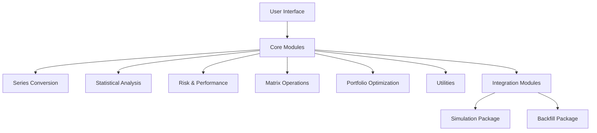
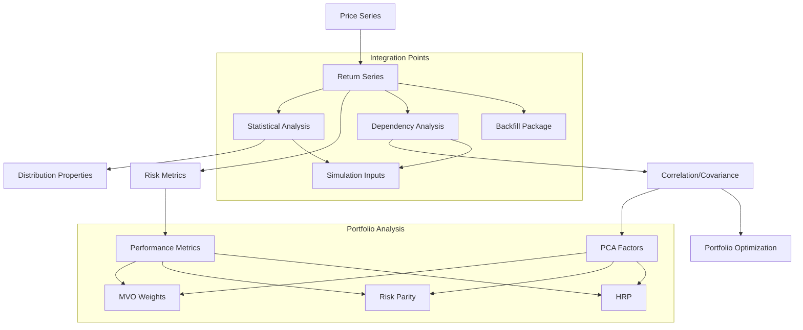
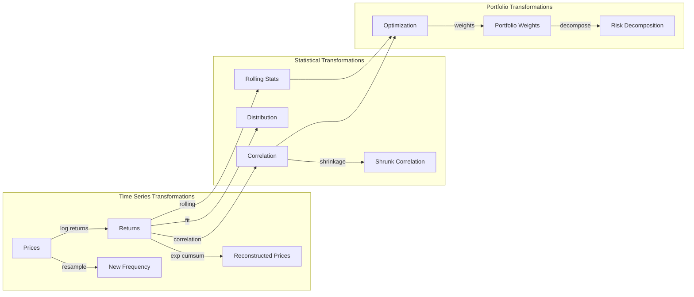
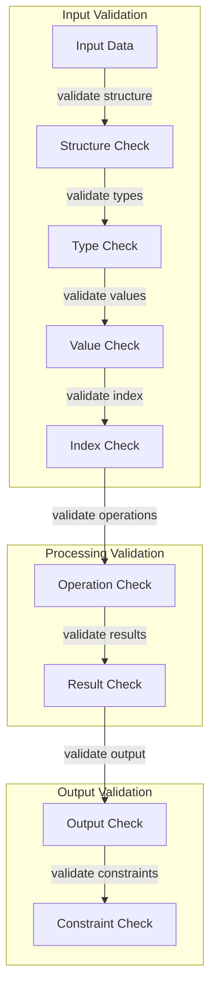
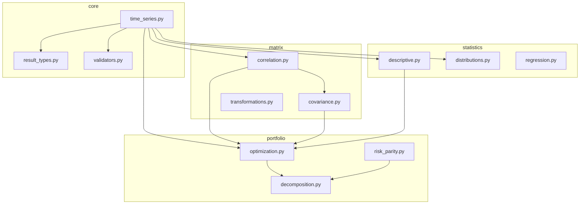

# Financial Time Series (FTS) Library - Specification & Architecture

## Table of Contents
1. [Introduction](#1-introduction)
2. [System Overview](#2-system-overview)
3. [Architecture](#3-architecture)
    - [3.1 High-Level Architecture](#31-high-level-architecture)
    - [3.2 Module Structure](#32-module-structure)
    - [3.3 Data Structures](#33-data-structures)
    - [3.4 External Dependencies](#34-external-dependencies)
    - [3.5 Performance Optimization Considerations](#35-performance-optimization-considerations)
4. [Functional Specifications](#4-functional-specifications)
    - [4.1 Function Groups](#41-function-groups)
        - [4.1.1 Series Conversion Functions](#411-series-conversion-functions)
        - [4.1.2 Statistical Analysis Functions](#412-statistical-analysis-functions)
        - [4.1.3 Risk and Performance Functions](#413-risk-and-performance-functions)
        - [4.1.4 Time-Varying Statistics Functions](#414-time-varying-statistics-functions)
        - [4.1.5 Correlation and Dependency Functions](#415-correlation-and-dependency-functions)
        - [4.1.6 Matrix Transformation Functions](#416-matrix-transformation-functions)
        - [4.1.7 Distribution Fitting Functions](#417-distribution-fitting-functions)
        - [4.1.8 Copula Functions](#418-copula-functions)
        - [4.1.9 Portfolio Optimization Functions](#419-portfolio-optimization-functions)
        - [4.1.10 Utility Functions](#410-utility-functions)
        - [4.1.11 Interest Rate Utility Functions](#411-interest-rate-utility-functions)
        - [4.1.12 Discounted Cash Flow Functions](#412-discounted-cash-flow-functions)
5. [Data Flow Specifications](#5-data-flow-specifications)
    - [5.1 Core Data Flow](#51-core-data-flow)
    - [5.2 Data Transformation Flows](#52-data-transformation-flows)
    - [5.3 Data Validation and Error Handling](#53-data-validation-and-error-handling)
6. [Module Integration and Data Flow](#6-module-integration-and-data-flow)
7. [Examples Directory Structure](#7-examples-directory-structure)
    - [7.1 Example Scripts](#71-example-scripts)
    - [7.2 Example Notebooks](#72-example-notebooks)
8. [Testing Strategy](#8-testing-strategy)
9. [Conclusion](#9-conclusion)
10. [Appendix](#10-appendix)
    - [10.1 Glossary](#101-glossary)
    - [10.2 References](#102-references)

---

## 1. Introduction

This document details the **Specification and Architecture** for the **Financial Time Series (FTS) Library**, a Python-based tool designed for comprehensive financial time series analysis. It serves as an intermediary phase, bridging user requirements and the subsequent implementation planning, ensuring clarity for both business stakeholders and developers.

### 2.1 Key Features
- Comprehensive financial time series analysis supporting large datasets (5000+ securities)
- Modular architecture with clear separation of concerns
- Immutable data structures ensuring thread safety and predictable behavior
- Advanced statistical analysis including distribution fitting and factor analysis (PCA, Distribution moments to use for simulations)
- Sophisticated portfolio optimization techniques (MVO, Risk Parity, HRP, HERC) #might need to add HERCE functions
- Integration capabilities with simulation and backfill packages
- Extensive caching mechanisms for performance optimization
- Support for various risk and performance metrics (Sharpe ratio, Sortino ratio, Drawdown Analysis etc.)


## 2. System Overview

The FTS Library is engineered to efficiently handle extensive financial datasets, supporting up to 5,000+ securities with historical data spanning 30 years on a monthly basis and 10 years on a daily basis. It is optimized to operate within typical workstation resources (32GB RAM) and facilitates daily updates and concurrent analyses for multiple portfolios or strategies.

## 3. Architecture

### 3.1 High-Level Architecture

The FTS Library adopts a modular architecture, emphasizing **object-oriented design** with a preference for **composition over inheritance**. Each functional domain is encapsulated within dedicated modules, promoting single-responsibility and enhancing maintainability.



I'll provide a complete, enhanced module structure documentation section that should replace the current Section 3.2:

### 3.2 Module Structure

The library is organized into distinct modules, each with specific responsibilities and clear separation of concerns. Below is the detailed module structure with descriptions of each component:

```plaintext
src/
└── fts/
    ├── core/                         # Core functionality and primary interfaces
    │   ├── __init__.py
    │   ├── time_series.py           # Primary FinancialTimeSeries class implementation
    │   │                            # Handles data management and operation orchestration
    │   ├── result_types.py          # Dataclass definitions for all results
    │   │                            # Ensures consistent result structure across modules
    │   └── validators.py            # Data validation framework
    │                                # Centralizes input validation logic
    │
    ├── statistics/                   # Statistical analysis capabilities
    │   ├── __init__.py
    │   ├── descriptive.py           # Basic statistical computations
    │   │                            # Moments, volatility, basic risk metrics
    │   ├── distributions.py         # Distribution fitting and analysis
    │   │                            # Normal, Student-t, skewed distributions
    │   └── regression.py            # Regression analysis tools
    │                                # Linear regression, factor modeling
    │
    ├── risk/                        # Risk analysis and metrics
    │   ├── __init__.py
    │   ├── metrics.py               # Core risk measurements
    │   │                            # VaR, CVaR, volatility calculations
    │   ├── drawdown.py              # Drawdown analysis
    │   │                            # Maximum drawdown, recovery periods
    │   └── performance.py           # Performance metrics
    │                                # Sharpe ratio, Sortino ratio, information ratio
    │
    ├── matrix/                      # Matrix operations and analysis
    │   ├── __init__.py
    │   ├── correlation.py           # Correlation analysis
    │   │                            # Pearson, Spearman, Kendall correlations
    │   ├── covariance.py            # Covariance analysis
    │   │                            # Covariance estimation, shrinkage methods
    │   └── transformations.py       # Matrix operations
    │                                # PCA, factor decomposition
    │
    ├── portfolio/                   # Portfolio analysis and optimization
    │   ├── __init__.py
    │   ├── optimization.py          # Portfolio optimization
    │   │                            # Mean-variance, Black-Litterman methods
    │   ├── risk_parity.py           # Risk parity implementation
    │   │                            # Equal risk contribution, hierarchical risk parity
    │   └── decomposition.py         # Risk decomposition
    │                                # Factor attribution, risk attribution
    │
    └── utils/                       # Utility functions and helpers
        ├── __init__.py
        ├── conversion.py            # Data conversion utilities
        │                            # Price-return conversions, rate conversions
        └── validation.py            # Input validation utilities
                                    # Type checking, range validation, format validation
```

#### 3.2.1 Module Dependencies and Interactions

Each module has specific dependencies and interaction patterns:

1. **Core Module Dependencies**
   - `time_series.py` → All other modules (orchestrates operations)
   - `result_types.py` → Used by all modules for result structure
   - `validators.py` → Used by all modules for input validation

2. **Statistics Module Dependencies**
   - `descriptive.py` → `core.time_series`, `core.result_types`
   - `distributions.py` → `descriptive.py`, `core.result_types`
   - `regression.py` → `descriptive.py`, `core.result_types`

3. **Risk Module Dependencies**
   - `metrics.py` → `statistics.descriptive`, `core.result_types`
   - `drawdown.py` → `metrics.py`, `core.result_types`
   - `performance.py` → `metrics.py`, `core.result_types`

4. **Matrix Module Dependencies**
   - `correlation.py` → `statistics.descriptive`, `core.result_types`
   - `covariance.py` → `correlation.py`, `core.result_types`
   - `transformations.py` → `covariance.py`, `core.result_types`

5. **Portfolio Module Dependencies**
   - `optimization.py` → `matrix.covariance`, `core.result_types`
   - `risk_parity.py` → `matrix.covariance`, `core.result_types`
   - `decomposition.py` → `matrix.transformations`, `core.result_types`

#### 3.2.2 Module Access Patterns

```python
# Example of typical module access patterns
from fts.core.time_series import FinancialTimeSeries
from fts.core.result_types import StatisticalResults, PortfolioWeights
from fts.statistics.descriptive import compute_moments
from fts.portfolio.optimization import mean_variance_optimization

# Core class usage orchestrates access to other modules
ts = FinancialTimeSeries(data, series_type, frequency)
stats = ts.compute_statistics()  # Internally uses statistics module
weights = ts.optimize_portfolio()  # Internally uses portfolio module

```

#### 3.2.3 Module Implementation Guidelines

1. **Encapsulation**
   - Each module should expose only necessary public interfaces
   - Internal implementation details should be private
   - Use leading underscore for private functions/methods

2. **Error Handling**
   - Each module should define its specific exceptions
   - Errors should be caught and re-raised with context
   - Validation should occur at module boundaries

3. **Documentation**
   - Each module should have a module-level docstring
   - All public functions should have complete docstrings
   - Include examples in function docstrings

4. **Testing**
   - Each module should have corresponding test file
   - Tests should be organized by functionality
   - Include edge cases and error conditions


### 3.3 Data Structures

Structured and well-defined data representations are crucial for maintaining consistency, integrity, and clarity throughout the Financial Time Series (FTS) Library. The FTS Library leverages Python's `dataclasses` to define immutable and easily instantiable data containers that encapsulate the results of various analyses and operations. Below is a comprehensive definition of all necessary `dataclasses` required for the implementation of the FTS Library, organized by their respective functional domains.

#### 3.3.1 Enumerations

Enumerations provide a clear and consistent way to handle predefined sets of values, enhancing code readability and reducing the likelihood of errors.

```python
from enum import Enum

class SeriesType(Enum):
    PRICE = "price"
    RETURNS = "returns"
    VOLATILITY = "volatility"
    CORRELATION = "correlation"
    BETA = "beta"
    ZSCORE = "zscore"
    DRAWDOWN = "drawdown"

class CorrelationMethod(Enum):
    PEARSON = "pearson"
    SPEARMAN = "spearman"
    KENDALL = "kendall"
```

#### 3.3.2 Statistical Results

These classes encapsulate the results of various statistical analyses performed on financial time series data.

```python
from dataclasses import dataclass, field
from typing import Dict, Any, Optional, Tuple, List
import pandas as pd
import numpy as np
from datetime import datetime

@dataclass(frozen=True)
class DistributionFit:
    """Statistical Distribution Fitting Results"""
    distribution_type: str  # 'normal', 'student_t', 'skewed_t', 'nig'
    parameters: Dict[str, float]  # Distribution parameters
    test_statistics: Dict[str, float]  # Goodness of fit statistics
    metadata: Dict[str, Any] = field(default_factory=dict)

@dataclass(frozen=True)
class RiskMetrics:
    """Risk Analysis Results"""
    volatility: float
    var_95: float
    cvar_95: float
    skewness: float
    kurtosis: float
    period: Tuple[datetime, datetime]
    metadata: Dict[str, Any] = field(default_factory=dict)

@dataclass(frozen=True)
class PerformanceMetrics:
    """Performance Analysis Results"""
    total_return: float
    annualized_return: float
    sharpe_ratio: float
    sortino_ratio: float
    information_ratio: Optional[float]
    alpha: Optional[float]
    beta: Optional[float]
    tracking_error: Optional[float]
    period: Tuple[datetime, datetime]
    metadata: Dict[str, Any] = field(default_factory=dict)
```

#### 3.3.3 Matrix Results

These classes handle the outcomes of matrix-related analyses, such as correlation and covariance computations.

```python
@dataclass(frozen=True)
class CorrelationAnalysis:
    """Correlation Analysis Results"""
    correlation_matrix: pd.DataFrame
    method: CorrelationMethod
    p_values: Optional[pd.DataFrame] = None
    shrinkage_applied: bool = False
    shrinkage_intensity: Optional[float] = None
    derived_from_covariance: bool = False  # Flag if converted from covariance
    metadata: Dict[str, Any] = field(default_factory=dict)

@dataclass(frozen=True)
class CovarianceAnalysis:
    """Covariance Analysis Results"""
    covariance_matrix: pd.DataFrame
    shrinkage_applied: bool = False
    shrinkage_intensity: Optional[float] = None
    metadata: Dict[str, Any] = field(default_factory=dict)

@dataclass(frozen=True)
class CorrelationCluster:
    """Correlation Clustering Results"""
    clusters: List[List[str]]  # List of clusters, each containing asset names
    linkage_matrix: np.ndarray
    metadata: Dict[str, Any] = field(default_factory=dict)
```

#### 3.3.4 Portfolio Analysis Results

These classes represent the outcomes of portfolio optimization and risk decomposition processes.

```python
@dataclass(frozen=True)
class PortfolioWeights:
    """Portfolio Weight Allocations"""
    weights: pd.Series
    asset_names: List[str]
    optimization_method: str
    constraints: Dict[str, Any]
    metadata: Dict[str, Any] = field(default_factory=dict)

@dataclass(frozen=True)
class PortfolioRiskDecomposition:
    """Portfolio Risk Decomposition Results"""
    marginal_risk: pd.Series
    component_risk: pd.Series
    total_risk: float
    risk_method: str  # 'volatility', 'var', 'cvar'
    metadata: Dict[str, Any] = field(default_factory=dict)

@dataclass(frozen=True)
class RiskParityResult:
    """Risk Parity Analysis Results"""
    weights: pd.Series
    risk_contributions: pd.Series
    convergence_achieved: bool
    n_iterations: int
    metadata: Dict[str, Any] = field(default_factory=dict)
```

#### 3.3.5 Time Series Analysis Results

These classes capture the outcomes of time series-specific analyses, including drawdown and rolling statistics.

```python
@dataclass(frozen=True)
class DrawdownAnalysis:
    """Drawdown Analysis Results"""
    max_drawdown: float
    drawdown_series: pd.Series
    drawdown_periods: List[Dict[str, Union[datetime, float]]]
    recovery_times: pd.Series
    metadata: Dict[str, Any] = field(default_factory=dict)

@dataclass(frozen=True)
class RollingAnalysis:
    """Rolling Statistics Results"""
    rolling_series: pd.DataFrame  # Can contain multiple statistics
    window_size: int
    statistic_types: List[str]  # Types of statistics included
    metadata: Dict[str, Any] = field(default_factory=dict)
```

#### 3.3.6 Factor Analysis Results

These classes handle the results from factor analysis methodologies such as PCA and factor returns.

```python
@dataclass(frozen=True)
class FactorLoadings:
    """Factor Analysis Results"""
    loadings: pd.DataFrame  # Assets x Factors
    r_squared: pd.Series
    factor_names: List[str]
    methodology: str
    metadata: Dict[str, Any] = field(default_factory=dict)

@dataclass(frozen=True)
class FactorReturns:
    """Factor Returns Analysis"""
    factor_returns: pd.DataFrame
    factor_volatilities: pd.Series
    factor_correlations: pd.DataFrame
    metadata: Dict[str, Any] = field(default_factory=dict)
```

#### 3.3.7 Dependency Structure Results

These classes represent the dependency structures derived from copula models and rank correlations.

```python
@dataclass(frozen=True)
class CopulaFit:
    """Copula Fitting Results"""
    copula_type: str  # 'gaussian', 'student_t', 'clayton'
    parameters: Dict[str, Union[float, np.ndarray]]
    dependence_measures: Dict[str, Union[float, np.ndarray]]
    metadata: Dict[str, Any] = field(default_factory=dict)

@dataclass(frozen=True)
class RankCorrelation:
    """Rank Correlation Analysis Results"""
    rank_correlation: pd.DataFrame
    method: Enum  # 'spearman' or 'kendall'
    p_values: Optional[pd.DataFrame] = None
    metadata: Dict[str, Any] = field(default_factory=dict)
```

#### 3.3.8 Regression Results

This class encapsulates the outcomes of regression analyses conducted on the financial data.

```python
@dataclass(frozen=True)
class RegressionResult:
    """Regression Analysis Results"""
    coefficients: pd.Series
    t_statistics: pd.Series
    p_values: pd.Series
    r_squared: float
    adjusted_r_squared: float
    residuals: pd.Series
    metadata: Dict[str, Any] = field(default_factory=dict)
```

#### 3.3.9 Simulation Results

This class captures the results from Monte Carlo simulations and other stochastic modeling techniques.

```python
@dataclass(frozen=True)
class SimulationResult:
    """Monte Carlo Simulation Results"""
    simulated_paths: pd.DataFrame
    simulation_parameters: Dict[str, Any]
    summary_statistics: Dict[str, float]
    metadata: Dict[str, Any] = field(default_factory=dict)
```

#### 3.3.10 Utility and Validation Results

These classes handle various utility functions and validation outcomes essential for data integrity.

```python
@dataclass(frozen=True)
class ValidationResult:
    """Validation Results for Input Data"""
    structure_valid: bool
    types_valid: bool
    values_valid: bool
    index_valid: bool
    errors: List[str] = field(default_factory=list)
    metadata: Dict[str, Any] = field(default_factory=dict)

@dataclass(frozen=True)
class ConversionResult:
    """Data Conversion Results"""
    original_data_type: SeriesType
    converted_data_type: SeriesType
    data: pd.DataFrame
    metadata: Dict[str, Any] = field(default_factory=dict)
```

#### 3.3.11 Interest Rate Utility Results

These classes represent the results from interest rate computations and conversions.

```python
@dataclass(frozen=True)
class InterestRateConversion:
    """Interest Rate Conversion Results"""
    original_rate: float
    from_frequency: str
    to_frequency: str
    converted_rate: float
    metadata: Dict[str, Any] = field(default_factory=dict)

@dataclass(frozen=True)
class BondPricing:
    """Bond Pricing Results"""
    face_value: float
    coupon_rate: float
    yield_rate: float
    maturity: int
    bond_price: float
    metadata: Dict[str, Any] = field(default_factory=dict)

@dataclass(frozen=True)
class TimeValueOfMoney:
    """Time Value of Money Calculations"""
    present_value: float
    future_value: float
    rate: float
    periods: int
    metadata: Dict[str, Any] = field(default_factory=dict)
```

#### 3.3.12 Discounted Cash Flow Results

These classes capture the outcomes of discounted cash flow analyses such as NPV and IRR calculations.

```python
@dataclass(frozen=True)
class DiscountedCashFlowResult:
    """Discounted Cash Flow Analysis Results"""
    npv: float
    wacc: float
    xirr: Optional[float]
    cash_flows: pd.Series
    metadata: Dict[str, Any] = field(default_factory=dict)
```

#### 3.3.13 Comprehensive Result Types

To streamline the handling of results from various analyses, comprehensive result classes aggregate multiple related outputs.

```python
@dataclass(frozen=True)
class StatisticalResults:
    """Aggregated Statistical Analysis Results"""
    distribution_fit: DistributionFit
    risk_metrics: RiskMetrics
    performance_metrics: PerformanceMetrics
    drawdown_analysis: DrawdownAnalysis
    rolling_analysis: RollingAnalysis
    regression_result: Optional[RegressionResult]
    metadata: Dict[str, Any] = field(default_factory=dict)

@dataclass(frozen=True)
class MatrixResults:
    """Aggregated Matrix Analysis Results"""
    correlation_analysis: CorrelationAnalysis
    covariance_analysis: CovarianceAnalysis
    correlation_cluster: Optional[CorrelationCluster]
    metadata: Dict[str, Any] = field(default_factory=dict)

@dataclass(frozen=True)
class PortfolioAnalysisResults:
    """Aggregated Portfolio Analysis Results"""
    portfolio_weights: PortfolioWeights
    portfolio_risk_decomposition: PortfolioRiskDecomposition
    risk_parity_result: Optional[RiskParityResult]
    metadata: Dict[str, Any] = field(default_factory=dict)
```

#### 3.3.14 Supporting Classes

Additional supporting classes provide utility and flexibility to handle various aspects of the library's functionality.

```python
@dataclass(frozen=True)
class SimulationParameters:
    """Parameters for Simulation Processes"""
    num_simulations: int
    start_date: datetime
    end_date: datetime
    seed: Optional[int] = None
    metadata: Dict[str, Any] = field(default_factory=dict)

@dataclass(frozen=True)
class OptimizationConstraints:
    """Constraints for Portfolio Optimization"""
    max_weight: Optional[float] = None
    min_weight: Optional[float] = None
    allowed_short: bool = False
    metadata: Dict[str, Any] = field(default_factory=dict)
```

#### 3.3.15 Integration with FinancialTimeSeries Class

The `FinancialTimeSeries` class serves as the primary interface for interacting with the FTS Library. It utilizes the defined `dataclasses` to return structured and comprehensive analysis results.

```python
from dataclasses import dataclass, field
from typing import Any, Dict, Optional, Tuple
import pandas as pd

@dataclass
class FinancialTimeSeries:
    """
    Primary interface for financial time series analysis.
    
    Attributes:
        data (pd.DataFrame): Time series data
        series_type (SeriesType): Type of series ('price' or 'returns')
        frequency (str): Data frequency (e.g., 'daily', 'monthly')
        metadata (Dict[str, Any]): Additional information
    """
    data: pd.DataFrame
    series_type: SeriesType
    frequency: str
    metadata: Dict[str, Any] = field(default_factory=dict)
    
    def compute_correlation(self, 
                            method: CorrelationMethod = CorrelationMethod.PEARSON,
                            min_periods: Optional[int] = None,
                            apply_shrinkage: bool = False,
                            shrinkage_target: Optional[pd.DataFrame] = None,
                            shrinkage_intensity: Optional[float] = None) -> CorrelationAnalysis:
        """
        Compute correlation analysis with optional shrinkage.
        """
        if apply_shrinkage and shrinkage_intensity is None:
            # Implement optimal shrinkage intensity calculation
            shrinkage_intensity = self._calculate_optimal_shrinkage()
        
        corr_matrix = self.data.corr(method=method.value, min_periods=min_periods)
        
        if apply_shrinkage:
            if shrinkage_target is None:
                shrinkage_target = pd.DataFrame(
                    np.eye(len(corr_matrix)),
                    index=corr_matrix.index,
                    columns=corr_matrix.columns
                )
            corr_matrix = (1 - shrinkage_intensity) * corr_matrix + \
                          shrinkage_intensity * shrinkage_target

        return CorrelationAnalysis(
            correlation_matrix=corr_matrix,
            method=method,
            shrinkage_applied=apply_shrinkage,
            shrinkage_intensity=shrinkage_intensity,
            derived_from_covariance=False,
            metadata={
                'min_periods': min_periods,
                'period': (self.data.index[0], self.data.index[-1])
            }
        )
    
    def compute_covariance(self,
                           apply_shrinkage: bool = False,
                           shrinkage_target: Optional[pd.DataFrame] = None,
                           shrinkage_intensity: Optional[float] = None) -> CovarianceAnalysis:
        """
        Compute covariance analysis with optional shrinkage.
        """
        cov_matrix = self.data.cov()
        
        if apply_shrinkage:
            if shrinkage_intensity is None:
                shrinkage_intensity = self._calculate_optimal_shrinkage()
            if shrinkage_target is None:
                # Default to constant correlation matrix
                volatilities = np.sqrt(np.diag(cov_matrix))
                avg_corr = self.data.corr().values[np.triu_indices(len(self.data.columns), k=1)].mean()
                constant_corr = np.full_like(cov_matrix, avg_corr)
                np.fill_diagonal(constant_corr, 1.0)
                shrinkage_target = pd.DataFrame(
                    constant_corr * np.outer(volatilities, volatilities),
                    index=self.data.columns,
                    columns=self.data.columns
                )
            
            cov_matrix = (1 - shrinkage_intensity) * cov_matrix + \
                         shrinkage_intensity * shrinkage_target

        return CovarianceAnalysis(
            covariance_matrix=cov_matrix,
            shrinkage_applied=apply_shrinkage,
            shrinkage_intensity=shrinkage_intensity,
            metadata={
                'period': (self.data.index[0], self.data.index[-1])
            }
        )
    
    def _calculate_optimal_shrinkage(self) -> float:
        """
        Placeholder method for calculating optimal shrinkage intensity.
        """
        # Implement optimal shrinkage calculation logic
        return 0.5  # Example default value
```

#### 3.3.16 Summary of Data Structures

The following table summarizes all defined `dataclasses`, their purposes, and key attributes:

| **Dataclass**                 | **Purpose**                                       | **Key Attributes**                                      |
|-------------------------------|---------------------------------------------------|--------------------------------------------------------|
| `DistributionFit`             | Encapsulates distribution fitting results         | `distribution_type`, `parameters`, `test_statistics`   |
| `RiskMetrics`                 | Holds risk analysis metrics                       | `volatility`, `var_95`, `cvar_95`, `skewness`, `kurtosis`|
| `PerformanceMetrics`          | Stores performance analysis metrics               | `total_return`, `annualized_return`, `sharpe_ratio`, etc.|
| `CorrelationAnalysis`         | Contains correlation matrix and related info       | `correlation_matrix`, `method`, `shrinkage_applied`    |
| `CovarianceAnalysis`          | Contains covariance matrix and related info        | `covariance_matrix`, `shrinkage_applied`              |
| `CorrelationCluster`          | Represents correlation clustering results           | `clusters`, `linkage_matrix`                           |
| `PortfolioWeights`            | Stores portfolio weight allocations                | `weights`, `asset_names`, `optimization_method`        |
| `PortfolioRiskDecomposition`  | Holds portfolio risk decomposition results         | `marginal_risk`, `component_risk`, `total_risk`        |
| `RiskParityResult`            | Contains risk parity optimization results          | `weights`, `risk_contributions`, `convergence_achieved`|
| `DrawdownAnalysis`            | Captures drawdown analysis results                 | `max_drawdown`, `drawdown_series`, `drawdown_periods`  |
| `RollingAnalysis`             | Holds rolling statistics results                   | `rolling_series`, `window_size`, `statistic_types`     |
| `FactorLoadings`              | Stores factor analysis loadings                    | `loadings`, `r_squared`, `factor_names`                |
| `FactorReturns`               | Contains factor returns analysis results           | `factor_returns`, `factor_volatilities`, `factor_correlations`|
| `CopulaFit`                   | Encapsulates copula fitting results               | `copula_type`, `parameters`, `dependence_measures`      |
| `RankCorrelation`             | Holds rank correlation analysis results            | `rank_correlation`, `method`, `p_values`               |
| `RegressionResult`            | Stores regression analysis results                | `coefficients`, `t_statistics`, `p_values`, `r_squared`|
| `SimulationResult`            | Contains Monte Carlo simulation results            | `simulated_paths`, `simulation_parameters`, `summary_statistics`|
| `ValidationResult`            | Captures validation outcomes for input data        | `structure_valid`, `types_valid`, `values_valid`       |
| `ConversionResult`            | Holds data conversion outcomes                     | `original_data_type`, `converted_data_type`, `data`    |
| `InterestRateConversion`      | Stores interest rate conversion results           | `original_rate`, `from_frequency`, `to_frequency`, `converted_rate`|
| `BondPricing`                 | Encapsulates bond pricing results                 | `face_value`, `coupon_rate`, `yield_rate`, `bond_price`|
| `TimeValueOfMoney`            | Holds time value of money calculation results      | `present_value`, `future_value`, `rate`, `periods`     |
| `DiscountedCashFlowResult`    | Contains discounted cash flow analysis results     | `npv`, `wacc`, `xirr`, `cash_flows`                   |
| `StatisticalResults`          | Aggregates various statistical analysis results    | `distribution_fit`, `risk_metrics`, `performance_metrics`|
| `MatrixResults`               | Aggregates matrix analysis results                 | `correlation_analysis`, `covariance_analysis`, `correlation_cluster`|
| `PortfolioAnalysisResults`    | Aggregates portfolio analysis results              | `portfolio_weights`, `portfolio_risk_decomposition`, `risk_parity_result`|
| `SimulationParameters`        | Defines parameters for simulations                 | `num_simulations`, `start_date`, `end_date`, `seed`    |
| `OptimizationConstraints`     | Defines constraints for optimization processes     | `max_weight`, `min_weight`, `allowed_short`            |


**Explanation:**

1. **Enumerations (`SeriesType`, `CorrelationMethod`):**
   - **Purpose:** Standardize the types of series and correlation methods used across the library.
   - **Attributes:** Enumerated values representing different series types and correlation calculation methods.

2. **Statistical Results (`DistributionFit`, `RiskMetrics`, `PerformanceMetrics`):**
   - **Purpose:** Capture the results from statistical analyses such as distribution fitting, risk assessment, and performance evaluation.
   - **Attributes:** Include metrics like volatility, skewness, kurtosis, Sharpe ratio, alpha, beta, etc.

3. **Matrix Results (`CorrelationAnalysis`, `CovarianceAnalysis`, `CorrelationCluster`):**
   - **Purpose:** Store results from matrix-based analyses including correlation and covariance matrices, as well as clustering outcomes.
   - **Attributes:** Contain matrices, methods used, shrinkage information, and clustering details.

4. **Portfolio Analysis Results (`PortfolioWeights`, `PortfolioRiskDecomposition`, `RiskParityResult`):**
   - **Purpose:** Represent the outcomes of portfolio optimization and risk decomposition strategies.
   - **Attributes:** Include weight allocations, risk contributions, optimization methods, and convergence information.

5. **Time Series Analysis Results (`DrawdownAnalysis`, `RollingAnalysis`):**
   - **Purpose:** Detail the results from time series-specific analyses like drawdown assessments and rolling statistics computations.
   - **Attributes:** Cover maximum drawdown, drawdown periods, rolling window sizes, and types of rolling statistics.

6. **Factor Analysis Results (`FactorLoadings`, `FactorReturns`):**
   - **Purpose:** Capture the results from factor analysis methodologies such as PCA.
   - **Attributes:** Include factor loadings, R-squared values, factor names, and factor returns.

7. **Dependency Structure Results (`CopulaFit`, `RankCorrelation`):**
   - **Purpose:** Store the outcomes of dependency analyses using copula models and rank correlation methods.
   - **Attributes:** Encompass copula types, parameters, dependence measures, and rank correlation matrices.

8. **Regression Results (`RegressionResult`):**
   - **Purpose:** Encapsulate the results from regression analyses.
   - **Attributes:** Include coefficients, statistical tests, R-squared values, and residuals.

9. **Simulation Results (`SimulationResult`):**
   - **Purpose:** Represent the results from Monte Carlo simulations and other stochastic processes.
   - **Attributes:** Cover simulated paths, simulation parameters, and summary statistics.

10. **Utility and Validation Results (`ValidationResult`, `ConversionResult`):**
    - **Purpose:** Handle outcomes from data validation and conversion processes.
    - **Attributes:** Include validation statuses, errors, original and converted data types, and converted data.

11. **Interest Rate Utility Results (`InterestRateConversion`, `BondPricing`, `TimeValueOfMoney`):**
    - **Purpose:** Capture results from interest rate computations and conversions.
    - **Attributes:** Encompass rates, frequencies, bond pricing metrics, and time value calculations.

12. **Discounted Cash Flow Results (`DiscountedCashFlowResult`):**
    - **Purpose:** Store the results from discounted cash flow analyses such as NPV and IRR computations.
    - **Attributes:** Include Net Present Value, Weighted Average Cost of Capital, and Extended Internal Rate of Return.

13. **Comprehensive Result Types (`StatisticalResults`, `MatrixResults`, `PortfolioAnalysisResults`):**
    - **Purpose:** Aggregate multiple related results into cohesive structures for streamlined handling.
    - **Attributes:** Combine various result classes to provide comprehensive analysis outputs.

14. **Supporting Classes (`SimulationParameters`, `OptimizationConstraints`):**
    - **Purpose:** Define parameters and constraints used in simulations and optimizations.
    - **Attributes:** Include the number of simulations, date ranges, optimization constraints like maximum weights and short selling allowances.

15. **Integration with `FinancialTimeSeries` Class:**
    - **Purpose:** Demonstrate how the defined `dataclasses` integrate with the primary interface of the library.
    - **Attributes:** `FinancialTimeSeries` utilizes methods that return instances of the defined `dataclasses` to provide structured and comprehensive analysis results.

**Key Considerations:**

- **Immutability:** All `dataclasses` are marked as `frozen=True` to ensure that instances are immutable after creation, promoting data integrity.
  
- **Default Factories:** `metadata` fields use `default_factory=dict` to ensure that each instance has its own separate metadata dictionary, preventing unintended data sharing between instances.
  
- **Optional Fields:** Fields that may not always be present are marked as `Optional`, allowing for flexible and context-specific data encapsulation.
  
- **Type Annotations:** Comprehensive type annotations facilitate type checking and improve code readability and maintenance.
  
- **Documentation:** Each `dataclass` includes a docstring that succinctly describes its purpose and key attributes, aiding both developers and users in understanding the data structures.

#### 3.3.17 Standard Metadata Structure

All dataclass results include a standardized metadata dictionary structure:

```python
@dataclass(frozen=True)
class MetadataBase:
    """Base structure for metadata in all result types."""
    computed_at: datetime
    version: str
    parameters: Dict[str, Any]
    warnings: List[str]
    computation_time: float
    additional_info: Dict[str, Any]

# Example usage in result types
@dataclass(frozen=True)
class StatisticalResults:
    distribution_fit: DistributionFit
    risk_metrics: RiskMetrics
    performance_metrics: PerformanceMetrics
    metadata: MetadataBase
```


### 3.4 External Dependencies

The FTS Library relies on several external libraries to perform statistical calculations, optimization, and data manipulation. Dependencies are categorized by module and function to ensure clarity and maintainability.

**Core Dependencies:**

- **Data Manipulation:** `numpy`, `pandas`
- **Data Validation:** `pydantic`

**Statistics Module:**

- **Descriptive Statistics:** `scipy.stats`
- **Regression Analysis:** `statsmodels`

**Risk Module:**

- **Risk Metrics:** `numpy`, `scipy.stats`

**Matrix Module:**

- **Correlation & Covariance:** `numpy.linalg`, `scipy.stats`
- **PCA & Factor Analysis:** `scikit-learn`

**Portfolio Module:**

- **Optimization:** `scipy.optimize`
- **Risk Decomposition:** `numpy`

**Utilities Module:**

- **Data Conversion:** `pandas`
- **Validation:** `pydantic`

**Additional Dependencies for Advanced Features:**

- **Copula Modeling:** [`copulas`](https://github.com/nicholaschis/copulas)
- **Parallel Computing:** `dask`
- **Caching:** `cachetools`
- **Performance Optimization:** `numba`

**Example Dependency Specification:**

| Module        | Function                      | External Dependency                                | Purpose                                    |
|---------------|-------------------------------|----------------------------------------------------|--------------------------------------------|
| statistics    | return_series_skew            | `scipy.stats.skew`                                  | Calculate skewness of return series        |
| statistics    | fit_gaussian                  | `scipy.stats.norm.fit`                              | Fit Gaussian distribution to data          |
| correlation   | compute_correlation           | `numpy.corrcoef`                                    | Compute correlation matrix                 |
| portfolio     | mean_variance_optimization    | `scipy.optimize.minimize`                          | Optimize portfolio weights using MVO       |
| copula        | fit_gaussian_copula           | `copulas.multivariate.GaussianCopula`               | Fit Gaussian copula to data                |
| performance   | compute_sharpe_ratio          | `numpy.mean`, `numpy.std`                           | Calculate Sharpe ratio                     |
| statistical_analysis | log_return_to_cumulative | `numpy.exp`, `numpy.cumsum`                        | Convert log returns to cumulative returns  |
| utility       | price_to_return_series        | `pandas`                                            | Convert price series to return series      |
| utility       | return_to_price_series        | `pandas`                                            | Convert return series to price series      |
| matrix        | shrink_correlation_matrix     | `scipy.stats`                                       | Apply shrinkage to correlation matrix      |
| portfolio     | risk_parity_optimization      | `numpy`, `scipy.optimize`                           | Calculate risk parity weights              |
| matrix        | pca_decomposition             | `scikit-learn.decomposition.PCA`                    | Perform PCA analysis                       |

### 3.5 Performance Optimization Considerations

While detailed performance optimizations will be addressed in the **Implementation Planning** phase, the following considerations are outlined to guide development:

- **Caching:**
  - Implement memoization for expensive computations using `cachetools` or `functools.lru_cache`.
  - Cache frequently accessed statistical results to reduce redundant calculations.

- **Concurrency:**
  - Utilize `dask` for parallel processing of large datasets.
  - Employ `concurrent.futures` for multithreading where I/O-bound tasks exist.

- **Pre-compiled Extensions:**
  - Leverage `numba` for just-in-time compilation of performance-critical functions.
  - Consider `Cython` for compiling Python code to C for further speed enhancements.

- **Data Handling:**
  - Optimize `pandas` DataFrame operations by selecting appropriate data types.
  - Explore `polars` for ultra-fast DataFrame manipulations if scalability demands increase.

- **Matrix Operations:**
  - Utilize `numpy.linalg` for efficient linear algebra computations.
  - Implement matrix operations in a vectorized manner to exploit low-level optimizations.


#### 3.5.1 Performance Targets

| Operation | Dataset Size | Target Performance | Memory Usage |
|-----------|-------------|-------------------|--------------|
| Data Loading | 1000 securities, 10 years daily | < 1s | < 2GB |
| Basic Statistics | 1000 securities | < 100ms | < 1GB |
| Correlation/Covariance | 1000 x 1000 matrix | < 500ms | < 4GB |
| Portfolio Optimization | 1000 securities | < 1s | < 8GB |
| Full Analysis Chain | 1000 securities | < 5s | < 16GB |

#### 3.5.2 Optimization Strategies

1. **Computation Optimization**
   - Use NumPy vectorized operations
   - Implement parallel processing for independent calculations
   - Utilize Numba for computation-intensive loops
    
   ```python
   from numba import jit
   
   @jit(nopython=True)
   def compute_rolling_volatility(returns: np.ndarray, window: int) -> np.ndarray:
       """Example of Numba-optimized computation."""
       # Implementation
   ```

2. **Memory Management**
   - Implement chunked processing for large datasets
   - Use memory-mapped files for very large datasets
   - Clear cache automatically when memory threshold reached
   - 
   ```python
   class FinancialTimeSeries:
       def _check_memory_usage(self):
           """Monitor memory usage and clear cache if needed."""
           if self._get_memory_usage() > MEMORY_THRESHOLD:
               self.clear_cache()
   ```

3. **Caching Strategy**

   ```python
   from functools import lru_cache
   
   class FinancialTimeSeries:
       @lru_cache(maxsize=128)
       def get_correlation_matrix(self) -> CorrelationAnalysis:
           """Cached correlation computation."""
           # Implementation
   ```


### 3.6 Edge Case Handling

#### 3.6.1 Data Edge Cases

| Scenario | Handling Strategy |
|----------|------------------|
| Missing Values | Raise ValidationError if > 20% missing, otherwise impute |
| Zero Variance | Replace with small epsilon for numerical stability |
| Extreme Outliers | Log warning, optionally filter based on z-score |
| Non-Stationary Data | Issue warning, provide detrending options |

#### 3.6.2 Computation Edge Cases

| Scenario | Handling Strategy |
|----------|------------------|
| Singular Matrices | Use pseudo-inverse with warning |
| Optimization Non-Convergence | Return best result with warning |
| Insufficient Data | Raise MinimumDataError |
| Numerical Instability | Apply stabilization techniques |

#### 3.6.3 Implementation Example

```python
def compute_covariance(self) -> CovarianceAnalysis:
    """
    Compute covariance matrix with edge case handling.
    """
    try:
        # Check for sufficient data
        if len(self.data) < MIN_SAMPLES:
            raise MinimumDataError(
                f"Requires at least {MIN_SAMPLES} samples"
            )
            
        # Check for zero variance
        if (self.data.std() < EPSILON).any():
            warnings.warn("Near-zero variance detected")
            
        # Compute covariance
        cov_matrix = np.cov(self.data, rowvar=False)
        
        # Check for numerical stability
        if np.condition_number(cov_matrix) > MAX_CONDITION_NUMBER:
            cov_matrix = stabilize_matrix(cov_matrix)
            
        return CovarianceAnalysis(
            covariance_matrix=cov_matrix,
            metadata=MetadataBase(
                computed_at=pd.Timestamp.now(),
                warnings=self._warnings
            )
        )
    except LinAlgError:
        raise ComputationError("Covariance computation failed")
```


### 4. Functional Specifications

#### 4.1 Function Groups

The FTS Library organizes its functionalities into distinct function groups, each encapsulated within specific modules. Below are the detailed specifications for each function group, including their modules, functions, external dependencies, purposes, priorities, inputs, and outputs.


I'll restart with the full table format, including external dependencies. I'll do the first two function groups and then wait for your confirmation before proceeding with the others.

#### 4.1.1 Series Conversion Functions

| Function | Module Path | Purpose | Input | Output | External Dependencies | Priority |
|----------|-------------|---------|-------|--------|---------------------|-----------|
| price_to_return_series | utils/conversion.py | Convert price to returns | FinancialTimeSeries<br>Parameters:<br>- return_type: Literal['log', 'simple'] | FinancialTimeSeries<br>(series_type=SeriesType.RETURNS) | pandas | Critical |
| return_to_price_series | utils/conversion.py | Convert returns to price | FinancialTimeSeries<br>Parameters:<br>- initial_price: Optional[pd.Series] | FinancialTimeSeries<br>(series_type=SeriesType.PRICE) | pandas | Critical |
| excess_returns | core/time_series.py | Calculate excess returns | FinancialTimeSeries<br>Parameters:<br>- risk_free_rate: Union[float, pd.Series] | FinancialTimeSeries<br>metadata: ExcessReturnMetadata | numpy, pandas | Critical |
| alpha_returns | core/time_series.py | Calculate relative returns | FinancialTimeSeries<br>Parameters:<br>- benchmark: FinancialTimeSeries | FinancialTimeSeries<br>metadata: AlphaReturnMetadata | numpy, pandas | High |
| synthetic_benchmark | core/time_series.py | Generate benchmark series | FactorLoadings<br>FactorReturns | FinancialTimeSeries<br>metadata: SyntheticBenchmarkMetadata | numpy, pandas | Medium |
| synthetic_returns | core/time_series.py | Generate return series | FactorLoadings<br>FactorReturns | FinancialTimeSeries<br>metadata: SyntheticReturnMetadata | numpy, pandas | Medium |

#### 4.1.2 Statistical Analysis Functions

| Function | Module Path | Purpose | Input | Output | External Dependencies | Priority |
|----------|-------------|---------|-------|--------|---------------------|-----------|
| return_series_volatility | statistics/descriptive.py | Calculate annualized volatility | FinancialTimeSeries | RiskMetrics | numpy, scipy.stats | Critical |
| return_series_vol_vol | statistics/descriptive.py | Calculate volatility of volatility | FinancialTimeSeries<br>Parameters:<br>- window: int | RiskMetrics | numpy, pandas | Medium |
| return_series_skew | statistics/descriptive.py | Calculate skewness | FinancialTimeSeries | RiskMetrics | scipy.stats | High |
| return_series_kurtosis | statistics/descriptive.py | Calculate kurtosis | FinancialTimeSeries | RiskMetrics | scipy.stats | High |
| return_series_mean | statistics/descriptive.py | Calculate mean return | FinancialTimeSeries | RiskMetrics | numpy | Critical |
| return_series_median | statistics/descriptive.py | Calculate median return | FinancialTimeSeries | RiskMetrics | numpy | High |
| return_series_stats | statistics/descriptive.py | Calculate comprehensive statistics | FinancialTimeSeries | StatisticalResults | numpy, scipy.stats | High |
| log_return_to_cumulative | utils/conversion.py | Convert log returns to cumulative | FinancialTimeSeries<br>Parameters:<br>- type: Literal['simple', 'log'] | FinancialTimeSeries<br>metadata: CumulativeReturnMetadata | numpy | Critical |
| histogram | statistics/distributions.py | Generate return distribution histogram | FinancialTimeSeries<br>Parameters:<br>- buckets: int | DistributionHistogram | numpy, matplotlib | Medium |


I'll continue with the next function groups in the same format.

#### 4.1.3 Risk and Performance Functions

| Function | Module Path | Purpose | Input | Output | External Dependencies | Priority |
|----------|-------------|---------|-------|--------|---------------------|-----------|
| sharpe_ratio | risk/performance.py | Calculate Sharpe ratio | FinancialTimeSeries<br>Parameters:<br>- risk_free_rate: Union[float, pd.Series] | PerformanceMetrics | numpy | Critical |
| sharpe_ratio_adjusted | risk/performance.py | Adjust Sharpe for higher moments | FinancialTimeSeries<br>Parameters:<br>- risk_free_rate: float<br>- RiskMetrics | PerformanceMetrics | numpy, scipy.stats | Medium |
| sortino_ratio | risk/performance.py | Calculate Sortino ratio | FinancialTimeSeries | PerformanceMetrics | numpy | High |
| maximum_drawdown | risk/drawdown.py | Calculate maximum drawdown | FinancialTimeSeries | DrawdownAnalysis | numpy | Critical |
| drawdown_duration | risk/drawdown.py | Calculate drawdown duration | FinancialTimeSeries | DrawdownAnalysis | numpy, pandas | High |
| drawdown_stats | risk/drawdown.py | Calculate comprehensive drawdown stats | FinancialTimeSeries | DrawdownAnalysis | numpy, pandas | High |
| information_ratio | risk/performance.py | Calculate information ratio | FinancialTimeSeries<br>Parameters:<br>- benchmark: FinancialTimeSeries | PerformanceMetrics | numpy | High |

#### 4.1.4 Time-Varying Statistics Functions

| Function | Module Path | Purpose | Input | Output | External Dependencies | Priority |
|----------|-------------|---------|-------|--------|---------------------|-----------|
| rolling_volatility | statistics/time_varying.py | Calculate rolling volatility | FinancialTimeSeries<br>Parameters:<br>- window: int | RollingAnalysis | numpy, pandas | Critical |
| rolling_correlation | statistics/time_varying.py | Calculate rolling correlation | FinancialTimeSeries<br>Parameters:<br>- window: int<br>- other_series: FinancialTimeSeries | RollingAnalysis | numpy, pandas | High |
| rolling_beta | statistics/time_varying.py | Calculate rolling beta | FinancialTimeSeries<br>Parameters:<br>- market_series: FinancialTimeSeries<br>- window: int | RollingAnalysis | numpy, pandas | High |
| rolling_sharpe | statistics/time_varying.py | Calculate rolling Sharpe ratio | FinancialTimeSeries<br>Parameters:<br>- risk_free_rate: Union[float, pd.Series]<br>- window: int | RollingAnalysis | numpy, pandas | Medium |

#### 4.1.5 Correlation and Dependency Functions

| Function | Module Path | Purpose | Input | Output | External Dependencies | Priority |
|----------|-------------|---------|-------|--------|---------------------|-----------|
| correlation | matrix/correlation.py | Calculate correlation matrix | FinancialTimeSeries<br>Parameters:<br>- method: CorrelationMethod | CorrelationAnalysis | numpy | Critical |
| rank_correlation | matrix/correlation.py | Calculate rank correlation | FinancialTimeSeries<br>Parameters:<br>- method: Literal['spearman', 'kendall'] | RankCorrelation | scipy.stats | High |
| correlation_to_covariance | matrix/correlation.py | Convert correlation to covariance | CorrelationAnalysis<br>RiskMetrics | CovarianceAnalysis | numpy | Critical |
| covariance_to_correlation | matrix/correlation.py | Convert covariance to correlation | CovarianceAnalysis | CorrelationAnalysis | numpy | Critical |
| semi_covariance | matrix/correlation.py | Calculate semi-covariance matrix | FinancialTimeSeries<br>Parameters:<br>- threshold: float | CovarianceAnalysis | numpy | Medium |
| dtw_correlation | matrix/correlation.py | Dynamic time warping correlation | FinancialTimeSeries<br>Parameters:<br>- other_series: FinancialTimeSeries | CorrelationAnalysis | dtaidistance | Low |


I'll continue with the next set of function groups.

#### 4.1.6 Matrix Transformation Functions

| Function | Module Path | Purpose | Input | Output | External Dependencies | Priority |
|----------|-------------|---------|-------|--------|---------------------|-----------|
| correlation_cluster | matrix/transformations.py | Identify correlation clusters | CorrelationAnalysis<br>Parameters:<br>- threshold: float | CorrelationCluster | scipy.cluster.hierarchy<br>numpy | Medium |
| shrink_covariance | matrix/transformations.py | Apply covariance shrinkage | CovarianceAnalysis<br>Parameters:<br>- shrinkage_target: Optional[pd.DataFrame]<br>- shrinkage_intensity: Optional[float] | CovarianceAnalysis | numpy, scipy.stats | High |
| pca_decomposition | matrix/transformations.py | Perform PCA analysis | CovarianceAnalysis<br>Parameters:<br>- n_components: Optional[int] | FactorLoadings | sklearn.decomposition<br>numpy | Critical |
| factor_analysis | matrix/transformations.py | Extract statistical factors | FinancialTimeSeries<br>Parameters:<br>- n_factors: int | FactorLoadings | sklearn.decomposition<br>numpy | High |

#### 4.1.7 Distribution Fitting Functions

| Function | Module Path | Purpose | Input | Output | External Dependencies | Priority |
|----------|-------------|---------|-------|--------|---------------------|-----------|
| fit_gaussian | statistics/distributions.py | Fit Gaussian distribution | FinancialTimeSeries | DistributionFit | scipy.stats | High |
| fit_student_t | statistics/distributions.py | Fit Student-t distribution | FinancialTimeSeries | DistributionFit | scipy.stats | High |
| fit_skewed_t | statistics/distributions.py | Fit skewed Student-t | FinancialTimeSeries | DistributionFit | scipy.stats | Medium |
| fit_nig | statistics/distributions.py | Fit Normal Inverse Gaussian | FinancialTimeSeries | DistributionFit | scipy.stats | Low |
| distribution_test | statistics/distributions.py | Test distribution goodness of fit | FinancialTimeSeries<br>Parameters:<br>- distribution_type: str | DistributionFit | scipy.stats | Medium |

#### 4.1.8 Copula Functions

| Function | Module Path | Purpose | Input | Output | External Dependencies | Priority |
|----------|-------------|---------|-------|--------|---------------------|-----------|
| fit_gaussian_copula | matrix/copulas.py | Fit Gaussian copula | FinancialTimeSeries | CopulaFit | copulas | High |
| fit_student_t_copula | matrix/copulas.py | Fit Student-t copula | FinancialTimeSeries | CopulaFit | copulas | High |
| fit_clayton_copula | matrix/copulas.py | Fit Clayton copula | FinancialTimeSeries | CopulaFit | copulas | Medium |
| copula_dependency | matrix/copulas.py | Calculate copula dependency measures | CopulaFit<br>FinancialTimeSeries | CopulaFit | copulas<br>numpy | Medium |

#### 4.1.9 Portfolio Optimization Functions

| Function                    | Module Path | Purpose                        | Input | Output | External Dependencies | Priority |
|-----------------------------|-------------|--------------------------------|-------|--------|---------------------|-----------|
| mean_variance_optimization  | portfolio/optimization.py | Calculate MVO weights          | FinancialTimeSeries<br>Parameters:<br>- constraints: OptimizationConstraints | PortfolioWeights | scipy.optimize<br>numpy | Critical |
| black_litterman             | portfolio/optimization.py | Black-Litterman optimization   | FinancialTimeSeries<br>Parameters:<br>- views: Dict[str, float]<br>- confidences: Dict[str, float] | PortfolioWeights | numpy<br>scipy.optimize | High |
| risk_parity_optimization    | portfolio/risk_parity.py | Calculate risk parity weights  | FinancialTimeSeries | RiskParityResult | scipy.optimize<br>numpy | High |
| hierarchical_risk_parity    | portfolio/risk_parity.py | Calculate HRP weights          | FinancialTimeSeries | PortfolioWeights | scipy.cluster<br>numpy | Medium |
| herc                        | portfolio/risk_parity.py | Calculate herc weights         | FinancialTimeSeries | PortfolioWeights | scipy.cluster<br>numpy | Medium |
| marginal_risk_contribution  | portfolio/decomposition.py | Calculate marginal risk        | PortfolioWeights<br>CovarianceAnalysis | PortfolioRiskDecomposition | numpy | High |
| component_risk_contribution | portfolio/decomposition.py | Calculate component risk       | PortfolioWeights<br>CovarianceAnalysis | PortfolioRiskDecomposition | numpy | High |
| portfolio_volatility        | portfolio/performance.py | Calculate portfolio volatility | PortfolioWeights<br>CovarianceAnalysis | RiskMetrics | numpy | Critical |
| expected_portfolio_return   | portfolio/performance.py | Calculate expected return      | PortfolioWeights<br>Parameters:<br>- expected_returns: pd.Series | PerformanceMetrics | numpy | Critical |

I'll continue with the final function groups.

#### 4.1.10 Utility Functions

| Function | Module Path | Purpose | Input | Output | External Dependencies | Priority |
|----------|-------------|---------|-------|--------|---------------------|-----------|
| validate_structure | utils/validation.py | Validate input data structure | Any<br>Parameters:<br>- expected_schema: Dict | ValidationResult | pydantic | High |
| validate_types | utils/validation.py | Validate data types | Any<br>Parameters:<br>- expected_types: Dict | ValidationResult | pydantic | High |
| validate_values | utils/validation.py | Validate data values | Any<br>Parameters:<br>- validation_rules: Dict | ValidationResult | pydantic | Medium |
| validate_index | utils/validation.py | Validate time series index | FinancialTimeSeries | ValidationResult | pandas | Medium |
| volatility_target | utils/conversion.py | Calculate volatility target | RiskMetrics<br>Parameters:<br>- target_vol: float | float | numpy | Medium |
| max_theoretical_drawdown | utils/conversion.py | Calculate theoretical max drawdown | PerformanceMetrics<br>RiskMetrics | float | numpy | Low |

#### 4.1.11 Interest Rate Utility Functions

| Function | Module Path | Purpose | Input | Output | External Dependencies | Priority |
|----------|-------------|---------|-------|--------|---------------------|-----------|
| compounding_conversion | utils/interest_rate.py | Convert between compounding frequencies | InterestRateConversion<br>Parameters:<br>- from_freq: str<br>- to_freq: str | InterestRateConversion | numpy | High |
| forward_rate | utils/interest_rate.py | Calculate forward rate | List[float]<br>Parameters:<br>- periods: List[int] | float | numpy | High |
| zero_coupon_rate | utils/interest_rate.py | Convert BEY to zero coupon | float<br>Parameters:<br>- period: float<br>- frequency: int | float | numpy | High |
| bey_coupon_rate | utils/interest_rate.py | Convert zero coupon to BEY | float<br>Parameters:<br>- period: float<br>- frequency: int | float | numpy | High |
| bond_price | utils/interest_rate.py | Calculate bond price | BondPricing | BondPricing | numpy | High |
| time_value_of_money | utils/interest_rate.py | Calculate future value | TimeValueOfMoney | TimeValueOfMoney | numpy | Medium |
| discount_rate | utils/interest_rate.py | Calculate discount rate | TimeValueOfMoney | float | numpy | Medium |
| present_value | utils/interest_rate.py | Calculate present value | TimeValueOfMoney | float | numpy | Medium |

#### 4.1.12 Discounted Cash Flow Functions

| Function | Module Path | Purpose | Input | Output | External Dependencies | Priority |
|----------|-------------|---------|-------|--------|---------------------|-----------|
| npv | utils/dcf.py | Calculate Net Present Value | pd.Series<br>Parameters:<br>- discount_rate: float<br>- type: str | DiscountedCashFlowResult | numpy | High |
| wacc | utils/dcf.py | Calculate WACC | Parameters:<br>- equity_cost: float<br>- debt_cost: float<br>- equity_weight: float<br>- debt_weight: float<br>- tax_rate: float | float | numpy | High |
| xirr | utils/dcf.py | Calculate irregular IRR | pd.Series<br>Parameters:<br>- dates: pd.DatetimeIndex<br>- guess: Optional[float] | DiscountedCashFlowResult | scipy.optimize<br>numpy | Medium |


### 4.2 Design Patterns and Usage

#### 4.2.1 Core Design Patterns

##### Immutable Instance Pattern
```python
class FinancialTimeSeries:
    def to_returns(self) -> 'FinancialTimeSeries':
        """
        Converts price series to return series.
        Returns a new FinancialTimeSeries instance.
        """
        if self.series_type == SeriesType.PRICE:
            returns_data = price_to_return_series(self.data)
            return FinancialTimeSeries(
                data=returns_data,
                series_type=SeriesType.RETURNS,
                frequency=self.frequency,
                metadata=self.metadata
            )
        return self  # Already returns
```

##### Factory Pattern
```python
@classmethod
def from_prices(cls, prices: pd.DataFrame, frequency: str, 
                metadata: Optional[Dict[str, Any]] = None) -> 'FinancialTimeSeries':
    """Factory method to create an instance from price data."""
    return cls(
        data=prices,
        series_type=SeriesType.PRICE,
        frequency=frequency,
        metadata=metadata
    )
```

##### Caching Pattern
```python
def compute_statistics(self) -> StatisticalResults:
    """Computes statistical analyses with caching."""
    if 'statistics' in self._cache:
        return self._cache['statistics']
        
    stats_results = self._compute_statistics()
    self._cache['statistics'] = stats_results
    return stats_results
```

#### 4.2.2 Method Chaining Pattern
The `FinancialTimeSeries` class supports method chaining for fluent analysis workflows. Each operation that transforms the data returns a new `FinancialTimeSeries` instance, maintaining immutability.

```python
# Basic method chaining example
result = (FinancialTimeSeries(price_data, SeriesType.PRICE, 'daily')
    .to_returns()                    # Returns new FinancialTimeSeries
    .compute_excess_returns(rf_rate) # Returns new FinancialTimeSeries
    .compute_statistics())           # Returns StatisticalResults

# Access results through dataclass attributes
print(f"Volatility: {result.risk_metrics.volatility}")
print(f"Sharpe Ratio: {result.performance_metrics.sharpe_ratio}")
```

#### 4.2.3 State Management

##### Cache Management
```python
class FinancialTimeSeries:
    def clear_cache(self):
        """Clears the internal cache of computed results."""
        self._cache.clear()
        
    def invalidate_cache(self, key: Optional[str] = None):
        """Invalidates specific or all cached results."""
        if key:
            self._cache.pop(key, None)
        else:
            self._cache.clear()
```

##### Validation Flow
```python
def __post_init__(self):
    """Post-initialization validation."""
    self.validate()

def validate(self):
    """Validates the internal data."""
    validator = TimeSeriesValidator(
        data=self.data,
        series_type=self.series_type,
        frequency=self.frequency
    )
    validator.validate()
```


#### 4.2.4 Usage Examples

##### Portfolio Analysis Flow
```python
# Portfolio optimization workflow
portfolio_results = (FinancialTimeSeries(price_data, SeriesType.PRICE, 'daily')
    .to_returns()
    .compute_correlation()                     # Returns CorrelationAnalysis
    .to_covariance()                          # Returns CovarianceAnalysis
    .apply_shrinkage(intensity=0.2)           # Returns CovarianceAnalysis
    .optimize_portfolio(                       # Returns PortfolioWeights
        constraints=OptimizationConstraints(
            max_weight=0.3,
            min_weight=0.01,
            allowed_short=False
        )
    ))

# Access optimization results
weights = portfolio_results.weights
risk_decomp = portfolio_results.calculate_risk_contributions()
```

##### Risk Analysis Flow
```python
# Risk analysis workflow
risk_results = (FinancialTimeSeries(return_data, SeriesType.RETURNS, 'daily')
    .compute_rolling_statistics(
        window=20,
        statistics=['volatility', 'sharpe_ratio']
    )                                         # Returns RollingAnalysis
    .compute_drawdown_analysis())             # Returns DrawdownAnalysis

# Access risk metrics
current_vol = risk_results.rolling_statistics['volatility'].iloc[-1]
max_drawdown = risk_results.max_drawdown
```

##### Distribution Analysis Flow
```python
# Distribution analysis workflow
dist_results = (FinancialTimeSeries(return_data, SeriesType.RETURNS, 'daily')
    .fit_distribution(dist_type='student_t')  # Returns DistributionFit
    .calculate_var_cvar(                      # Returns RiskMetrics
        confidence_level=0.95,
        method='parametric'
    ))

# Access distribution results
t_params = dist_results.distribution_fit.parameters
var_95 = dist_results.risk_metrics.var_95
```

#### 4.2.3 Result Composition Patterns

##### Combining Multiple Analyses
```python
# Perform multiple analyses and combine results
ts = FinancialTimeSeries(price_data, SeriesType.PRICE, 'daily')
returns_ts = ts.to_returns()

# Statistical analysis
stats_results = returns_ts.compute_statistics()

# Correlation analysis
corr_results = returns_ts.compute_correlation(method=CorrelationMethod.PEARSON)

# Portfolio optimization
portfolio_results = returns_ts.optimize_portfolio(
    constraints=OptimizationConstraints(max_weight=0.3)
)

# Combine results into comprehensive analysis
comprehensive_results = StatisticalResults(
    distribution_fit=stats_results.distribution_fit,
    risk_metrics=stats_results.risk_metrics,
    performance_metrics=stats_results.performance_metrics,
    correlation_analysis=corr_results,
    portfolio_weights=portfolio_results
)
```

#### 4.2.4 Error Handling Patterns
```python
# Example with validation and error handling
try:
    result = (FinancialTimeSeries(price_data, SeriesType.PRICE, 'daily')
        .validate_data()              # Raises ValidationError if invalid
        .to_returns()
        .remove_outliers(
            method='zscore',
            threshold=3
        )
        .compute_statistics())
except ValidationError as e:
    logger.error(f"Validation failed: {e}")
except OutlierError as e:
    logger.error(f"Outlier removal failed: {e}")
except StatisticsError as e:
    logger.error(f"Statistical computation failed: {e}")
```

#### 4.2.5 Caching and Performance Patterns
```python
# Example using cached computations
ts = FinancialTimeSeries(price_data, SeriesType.PRICE, 'daily')

# First computation - calculated and cached
corr_matrix = ts.compute_correlation()

# Second access - retrieved from cache
corr_matrix_cached = ts.compute_correlation()

# Force recomputation if needed
corr_matrix_new = ts.compute_correlation(force_recompute=True)
```

### 4.3 Implementation Considerations

#### 4.3.1 Thread Safety
- The `FinancialTimeSeries` class is not inherently thread-safe
- Immutable design helps prevent many concurrency issues
- Users should implement synchronization mechanisms for multi-threaded contexts

#### 4.3.2 Performance Considerations
- Caching strategy for expensive computations
- Cache invalidation on data changes
- Memory management for large datasets

#### 4.3.3 Error Handling Strategy
- Validation at instance creation
- Operation-specific validation
- Clear error messages and appropriate exception types


## 5. Data Flow Specifications

### 5.1 Core Data Flow

The core data flow outlines how raw financial data is transformed into actionable insights through various analytical processes.



### 5.2 Data Transformation Flows

Data undergoes several transformations to facilitate analysis and optimization.



### 5.3 Data Validation and Error Handling

Centralized validation ensures data integrity and consistency across all processes.



**Error Handling Strategy:**

1. **Input Validation Errors:**
    - **Missing Data:** Trigger imputation strategies or raise descriptive errors.
    - **Invalid Types:** Attempt type conversion or raise errors.
    - **Invalid Values:** Clean data or raise errors.

2. **Processing Errors:**
    - **Computation Failures:** Retry operations or notify users.
    - **Convergence Issues:** Adjust algorithm parameters or escalate errors.

3. **Output Validation Errors:**
    - **Constraint Violations:** Adjust outputs to meet constraints or notify users.
    - **Numerical Instabilities:** Apply stabilization techniques or raise warnings.

---

## 6. Module Integration and Data Flow

### 6.1 Core Module Integration

The core module orchestrates interactions between various functional modules, ensuring seamless data flow and process execution.



### 6.2 Detailed Integration Flow

Below is an example of how modules interact within the `FinancialTimeSeries` class.

```python
# src/fts/core/time_series.py

import pandas as pd
from typing import Any, Dict, Optional, Tuple
from .result_types import StatisticalResults, DistributionFit, CorrelationAnalysis, PortfolioWeights
from .validators import TimeSeriesValidator, ValidationError

class FinancialTimeSeries:
    """
    Primary interface for financial time series analysis.
    
    Attributes:
        data (pd.DataFrame): Time series data
        series_type (str): Type of series ('price' or 'returns')
        frequency (str): Data frequency (e.g., 'daily', 'monthly')
        metadata (Dict[str, Any]): Additional information
    """
    
    def __init__(self, data: pd.DataFrame, series_type: str, frequency: str, metadata: Optional[Dict[str, Any]] = None):
        # Centralized validation
        self.validator = TimeSeriesValidator(data, series_type, frequency)
        self.validator.validate()
        
        self.data = data
        self.series_type = series_type
        self.frequency = frequency
        self.metadata = metadata or {}
        self._cache = {}
    
    # Conversion Methods
    def to_returns(self) -> 'FinancialTimeSeries':
        from ..utils.conversion import price_to_return_series
        returns_data = price_to_return_series(self.data)
        return FinancialTimeSeries(returns_data, 'returns', self.frequency, self.metadata)
    
    def to_prices(self, initial_prices: Optional[pd.Series] = None) -> 'FinancialTimeSeries':
        from ..utils.conversion import return_to_price_series
        prices_data = return_to_price_series(self.data, initial_prices)
        return FinancialTimeSeries(prices_data, 'price', self.frequency, self.metadata)
    
    # Statistical Analysis
    def compute_statistics(self) -> StatisticalResults:
        from ..statistics import descriptive, distributions
        
        # Compute descriptive statistics
        moments = descriptive.compute_moments(self.data)
        
        # Fit distribution
        dist_fit = distributions.fit_distribution(self.data, dist_type='normal')
        
        return StatisticalResults(
            mean=moments['mean'],
            volatility=moments['volatility'],
            skewness=moments['skewness'],
            kurtosis=moments['kurtosis'],
            rolling_stats=moments['rolling_stats']
        )
    
    # Matrix Analysis
    def compute_correlation(self, method: str = 'pearson') -> CorrelationAnalysis:
        from ..matrix import correlation
        
        corr_matrix = correlation.compute_correlation(self.data, method=method)
        shrunk_corr = correlation.shrink_correlation_matrix(corr_matrix, intensity=0.5)
        
        return CorrelationAnalysis(
            correlation_matrix=corr_matrix,
            shrunk_correlation_matrix=shrunk_corr
        )
    
    # Portfolio Optimization
    def optimize_portfolio(self, constraints: Optional[Dict[str, Any]] = None) -> PortfolioWeights:
        from ..portfolio import optimization
        
        corr_analysis = self.compute_correlation()
        cov_analysis = correlation.correlation_to_covariance(corr_analysis, self.data)
        
        weights = optimization.mean_variance_optimization(self.data, cov_analysis.covariance_matrix, constraints)
        
        return PortfolioWeights(weights=weights)
```

**Explanation:**

1. **Initialization (`__init__`):**
    - Validates input data centrally using `TimeSeriesValidator`.
    - Initializes core attributes and caches.

2. **Conversion Methods:**
    - `to_returns`: Converts price series to return series using utility functions.
    - `to_prices`: Converts return series back to price series.

3. **Statistical Analysis:**
    - `compute_statistics`: Computes descriptive statistics and fits distributions using the `statistics` module.

4. **Matrix Analysis:**
    - `compute_correlation`: Computes correlation matrices and applies shrinkage using the `matrix` module.

5. **Portfolio Optimization:**
    - `optimize_portfolio`: Optimizes portfolio weights using the `portfolio` module, integrating correlation and covariance analyses.

---

## 5. Examples Directory Structure

To facilitate user understanding and provide practical usage insights, the FTS Library includes example scripts and Jupyter notebooks.

### 5.1 Example Scripts

Located under `/examples/scripts`, these scripts demonstrate typical workflows and use cases.

```plaintext
/examples/
├── scripts/
│   ├── portfolio_analysis.py        # Example script for portfolio optimization
│   ├── risk_metrics_calculation.py  # Example script for computing risk metrics
│   └── distribution_fitting.py      # Example script for fitting distributions
```

**Outline Examples:**

- **portfolio_analysis.py**
    ```python
    from fts.core.time_series import FinancialTimeSeries
    import pandas as pd

    # Load price data
    price_data = pd.read_csv('data/price_data.csv', index_col='Date', parse_dates=True)
    fts = FinancialTimeSeries(price_data, 'price', 'daily')

    # Convert to returns
    returns = fts.to_returns()

    # Optimize portfolio
    constraints = {'max_weight': 0.3}
    weights = returns.optimize_portfolio(constraints=constraints)

    print(weights)
    ```

- **risk_metrics_calculation.py**
    ```python
    from fts.core.time_series import FinancialTimeSeries
    import pandas as pd

    # Load return data
    return_data = pd.read_csv('data/return_data.csv', index_col='Date', parse_dates=True)
    fts = FinancialTimeSeries(return_data, 'returns', 'daily')

    # Compute risk metrics
    stats = fts.compute_statistics()

    print(stats)
    ```

### 5.2 Example Notebooks

Located under `/examples/notebooks`, these Jupyter notebooks provide interactive demonstrations and exploratory analyses.

```plaintext
/examples/
├── notebooks/
│   ├── Introduction.ipynb           # Overview and basic usage
│   ├── Portfolio_Optimization.ipynb # Interactive portfolio optimization
│   └── Statistical_Analysis.ipynb    # In-depth statistical analysis
```

**Outline Examples:**

- **Introduction.ipynb**
    - **Sections:**
        - Library Overview
        - Loading Data
        - Basic Time Series Conversion
        - Simple Statistical Analysis

    ```markdown
    # Introduction to FTS Library

    ## Loading Price Data
    ```python
    import pandas as pd
    from fts.core.time_series import FinancialTimeSeries

    price_data = pd.read_csv('data/price_data.csv', index_col='Date', parse_dates=True)
    fts = FinancialTimeSeries(price_data, 'price', 'daily')
    ```

    ## Converting to Returns
    ```python
    returns = fts.to_returns()
    ```

    ## Computing Statistics
    ```python
    stats = returns.compute_statistics()
    print(stats)
    ```
    ```

- **Portfolio_Optimization.ipynb**
    - **Sections:**
        - Setting Up the Time Series
        - Optimization Constraints
        - Running Optimization
        - Analyzing Results

    ```markdown
    # Portfolio Optimization with FTS Library

    ## Setting Up the Time Series
    ```python
    import pandas as pd
    from fts.core.time_series import FinancialTimeSeries

    return_data = pd.read_csv('data/return_data.csv', index_col='Date', parse_dates=True)
    fts = FinancialTimeSeries(return_data, 'returns', 'daily')
    ```

    ## Defining Constraints
    ```python
    constraints = {
        'max_weight': 0.25,
        'min_weight': 0.05
    }
    ```

    ## Running Optimization
    ```python
    weights = fts.optimize_portfolio(constraints=constraints)
    print(weights)
    ```

    ## Analyzing Results
    ```python
    import matplotlib.pyplot as plt

    weights.weights.plot(kind='bar')
    plt.title('Optimized Portfolio Weights')
    plt.show()
    ```
    ```

---

## 6. Testing Strategy

While detailed testing procedures will be elaborated in the **Implementation Planning** phase, the following high-level strategy ensures the reliability and robustness of the FTS Library:

- **Unit Testing:**
    - **Scope:** Cover all individual functions and methods within each module.
    - **Framework:** Utilize `pytest` for writing and executing tests.
    - **Coverage:** Aim for at least 80% code coverage to ensure most code paths are tested.

- **Integration Testing:**
    - **Scope:** Test interactions between modules to verify seamless data flow and process execution.
    - **Approach:** Write tests that mimic real-world workflows, ensuring that integrated components function as intended.

- **Performance Testing:**
    - **Scope:** Benchmark critical functions to ensure they meet performance requirements.
    - **Tools:** Use profiling tools like `cProfile` and `line_profiler` to identify and optimize bottlenecks.

- **Test Scripts and Notebooks:**
    - **Location:** Place under `/tests/` for automated testing and `/examples/notebooks/` for interactive testing.
    - **Types:** Include both automated test scripts and manual exploratory notebooks to validate functionality.

---

I'll draft a new section for the specification document that provides clear interface specifications to bridge to implementation. This should be added after the current sections and before the conclusion:

### 7. Interface Specifications

#### 7.1 Core Class Interfaces

##### 7.1.1 FinancialTimeSeries Interface
```python
class FinancialTimeSeries:
    """
    Primary interface for financial time series analysis.
    All transformation methods return new instances to maintain immutability.
    """
    
    def __init__(self, 
                 data: pd.DataFrame, 
                 series_type: SeriesType, 
                 frequency: str, 
                 metadata: Optional[Dict[str, Any]] = None) -> None:
        """
        Initialize a new FinancialTimeSeries instance.

        Args:
            data: Time series data with DatetimeIndex and float64 values
            series_type: Type of series (PRICE or RETURNS)
            frequency: Data frequency (e.g., 'daily', 'monthly')
            metadata: Optional metadata dictionary

        Raises:
            ValidationError: If data format or types are invalid
        """
        raise NotImplementedError

    @property
    def data(self) -> pd.DataFrame:
        """Access the underlying time series data."""
        raise NotImplementedError

    @property
    def series_type(self) -> SeriesType:
        """Get the series type enum."""
        raise NotImplementedError

    @property
    def frequency(self) -> str:
        """Get the data frequency string."""
        raise NotImplementedError

    @property
    def metadata(self) -> Dict[str, Any]:
        """Access the metadata dictionary."""
        raise NotImplementedError

    def validate(self) -> ValidationResult:
        """
        Validate the time series data and configuration.
        
        Returns:
            ValidationResult containing validation status and any error messages
        
        Raises:
            ValidationError: If validation fails
        """
        raise NotImplementedError

    def clear_cache(self) -> None:
        """Clear the internal computation cache."""
        raise NotImplementedError
```

##### 7.1.2 Required Abstract Base Classes
```python
class TimeSeriesValidator(ABC):
    """Abstract base class for time series validation."""
    
    @abstractmethod
    def validate(self) -> ValidationResult:
        """Perform validation checks."""
        raise NotImplementedError

class TimeSeriesConverter(ABC):
    """Abstract base class for time series conversions."""
    
    @abstractmethod
    def convert(self, 
                data: pd.DataFrame, 
                from_type: SeriesType, 
                to_type: SeriesType) -> pd.DataFrame:
        """Convert between series types."""
        raise NotImplementedError
```

#### 7.2 Module Interface Specifications

##### 7.2.1 Core Module Interfaces
```python
class StatisticsModule(ABC):
    """Interface for statistics module functionality."""
    
    @abstractmethod
    def compute_moments(self, data: pd.DataFrame) -> RiskMetrics:
        """Compute statistical moments."""
        raise NotImplementedError
    
    @abstractmethod
    def fit_distribution(self, 
                        data: pd.DataFrame, 
                        dist_type: str) -> DistributionFit:
        """Fit statistical distribution."""
        raise NotImplementedError

class MatrixModule(ABC):
    """Interface for matrix operations module."""
    
    @abstractmethod
    def compute_correlation(self, 
                          data: pd.DataFrame, 
                          method: CorrelationMethod) -> CorrelationAnalysis:
        """Compute correlation matrix."""
        raise NotImplementedError
    
    @abstractmethod
    def compute_covariance(self, 
                          data: pd.DataFrame, 
                          shrinkage: Optional[float] = None) -> CovarianceAnalysis:
        """Compute covariance matrix."""
        raise NotImplementedError
```

##### 7.2.2 Portfolio Module Interfaces
```python
class PortfolioOptimizer(ABC):
    """Interface for portfolio optimization."""
    
    @abstractmethod
    def optimize(self, 
                returns: pd.DataFrame,
                constraints: OptimizationConstraints) -> PortfolioWeights:
        """Perform portfolio optimization."""
        raise NotImplementedError
    
    @abstractmethod
    def compute_risk_contributions(self,
                                 weights: pd.Series,
                                 covariance: pd.DataFrame) -> PortfolioRiskDecomposition:
        """Compute risk contributions."""
        raise NotImplementedError
```

#### 7.3 Integration Points

##### 7.3.1 External Package Integration
```python
class SimulationInterface(ABC):
    """Interface for simulation package integration."""
    
    @abstractmethod
    def prepare_simulation_inputs(self, 
                                ts: FinancialTimeSeries) -> SimulationResult:
        """Prepare inputs for simulation package."""
        raise NotImplementedError

class BackfillInterface(ABC):
    """Interface for backfill package integration."""
    
    @abstractmethod
    def prepare_backfill_request(self, 
                               ts: FinancialTimeSeries) -> Dict[str, Any]:
        """Prepare data for backfill package."""
        raise NotImplementedError
```

#### 7.4 Implementation Requirements

1. **Type Hints**
   - All function parameters and return values must be type-hinted
   - Use typing module for complex types
   - Support Python 3.8+ type hint syntax

2. **Documentation**
   - All public methods must have docstrings
   - Use Google docstring format
   - Include Examples section for complex methods

3. **Validation**
   - Input validation at public interface boundaries
   - Type checking using runtime type checking decorators
   - Value range validation where applicable

4. **Error Handling**
   - Custom exceptions for different error categories
   - Proper exception chaining
   - Contextual error messages

5. **Testing Requirements**
   - Unit tests for all public methods
   - Integration tests for module interactions
   - Property-based tests for mathematical operations


## 8. Implementation Planning Reference

This specification document serves as input to the subsequent Implementation Planning phase. The Implementation Plan will cover:

### 8.1 Implementation Plan Structure Overview

```plaintext
implementation_plan/
├── 1_development_phases/
│   ├── phase1_core_structures.md       # Core data structures and basic operations
│   ├── phase2_statistical.md          # Statistical and risk metrics
│   ├── phase3_portfolio.md            # Portfolio optimization and analysis
│   └── phase4_integration.md          # External package integration
├── 2_detailed_specifications/
│   ├── algorithms/                    # Specific algorithm implementations
│   ├── optimizations/                 # Performance optimization approaches
│   └── edge_cases/                    # Edge case handling specifications
└── 3_testing_framework/
    ├── test_data/                     # Test data specifications
    ├── unit_tests/                    # Unit test requirements
    └── integration_tests/             # Integration test scenarios
```

### 8.2 Key Implementation Plan Components

1. **Algorithm Details**
   - Specific mathematical implementations
   - Numerical stability considerations
   - Performance optimization strategies
   - Memory management approaches

2. **Development Sequence**
   ```mermaid
   graph TD
       A[Core Data Structures] --> B[Basic Operations]
       B --> C[Statistical Functions]
       C --> D[Matrix Operations]
       D --> E[Portfolio Optimization]
       E --> F[Integration Points]
   ```

3. **Testing Framework**
   - Unit test specifications
   - Integration test scenarios
   - Performance benchmarks
   - Coverage requirements

4. **Code Organization**
   - Detailed file structure
   - Import organization
   - Documentation requirements
   - Type hint specifications

### 8.3 Implementation Plan Usage

The Implementation Plan will provide:
- Detailed technical specifications for each component
- Step-by-step implementation guidance
- Specific code templates and examples
- Test cases and validation criteria
- Performance requirements and benchmarks

Developers should refer to the Implementation Plan for:
- Exact algorithmic implementations
- Specific code structure and organization
- Test requirements and coverage targets
- Performance optimization guidelines

The Implementation Plan document can be found at: `implementation_plan.md`


## 9. Conclusion

The **Financial Time Series (FTS) Library** is meticulously architected to provide a robust, scalable, and efficient tool for financial time series analysis. By adhering to structured data handling, centralized validation, and clear module integrations, the library ensures both maintainability and extensibility. This specification and architecture document lays a solid foundation for the upcoming **Implementation Planning** phase, guiding developers towards a successful and high-quality delivery.


## 10. Appendix

### 10.1 Glossary

- **FTS:** Financial Time Series
- **MVO:** Mean-Variance Optimization
- **HRP:** Hierarchical Risk Parity
- **HERC** hierarchical Equal Contribution to Risk
- **WACC:** Weighted Average Cost of Capital
- **BEY:** Bond Equivalent Yield
- **PCR:** Principal Component Regression
- **PCA:** Principal Component Analysis
- **DCF:** Discounted Cash Flow

### 10.2 References

- [PEP 8 - Style Guide for Python Code](https://peps.python.org/pep-0008/)
- [PDM - Python Development Master](https://pdm.fming.dev/)
- [Scipy - Scientific Computing](https://www.scipy.org/)
- [Statsmodels - Statistical Modeling](https://www.statsmodels.org/)
- [Scikit-learn - Machine Learning](https://scikit-learn.org/)
- [Copulas Library](https://github.com/nicholaschis/copulas)
- [Dask - Parallel Computing](https://dask.org/)
- [Cachetools - Caching Utilities](https://cachetools.readthedocs.io/)
- [Numba - JIT Compiler](https://numba.pydata.org/)
```