<user_instructions>
The files combined herein are 3 expert reviews of the current implementation plan for the fts library as it currently stands. some comments reflect known weaknesses, and incomplete implementation planning as we are not done yet. I asked to explicitly don't comment on testing, but there are some comments on testing in some commentary still. I then provided each expert with the review findings of the other 2, and asked them to synthesize their findings with the findings of the other 2 in separate documents, these documents are titles impl_plan_review_synthesiz 1 2 and 3
</user_instructions>
<file_tree>
/Users/peterahl/Python/Packages/DataManagementPackages/FinancialTimeSeries
├── config
├── └── repopack.config.json
├── docs
├── ├── archive
├── ├── ├── design
├── ├── ├── ├── system_design.md
├── ├── ├── └── system_design_review.md
├── ├── ├── references
├── ├── ├── ├── pca
├── ├── ├── ├── └── Principal Component Analysis in Portfolio Risk Management.md
├── ├── ├── ├── bootstrap
├── ├── ├── ├── └── bootstrapping_overview.md
├── ├── ├── ├── synthetic_returns
├── ├── ├── ├── ├── time-series_varying_lenghts.md
├── ├── ├── ├── ├── BackfillTimeSeriesWithSyntheticData.md
├── ├── ├── ├── └── Turning Long and Short Return Histories into Equal Histories: A Better Way to Backfill Returns.pdf
├── ├── ├── ├── volatility_sharpe_ratio
├── ├── ├── ├── ├── NEW_arithmetic_geometric_returns.md
├── ├── ├── ├── ├── Portfolio Volatility Targeting Under Skewed Student's t Distribution: Relationships Between Sharpe Ratios, Maximum Drawdown, and Kelly Volatility Targeting.md
├── ├── ├── ├── ├── adjusting_volatility_skew_kurtosis.md
├── ├── ├── ├── ├── Volatility Estimation in Financial Time Series.md
├── ├── ├── ├── ├── kurtosis_skew_student-t_growth_rate.md
├── ├── ├── ├── ├── Maximum Theoretical Drawdown: From Log-Normal to Student's t Distribution.md
├── ├── ├── ├── ├── sharpe_ratio_stats.py
├── ├── ├── ├── └── Portfolio Volatility Targeting When Returns Exhibit Fat Tails and Skewness: A Growth-Optimal Approach.md
├── ├── ├── ├── dtw
├── ├── ├── ├── └── DTW_correlation_matrix_old.md
├── ├── ├── └── backfill
├── ├── ├── └── ├── backfill_financial_timeseries.md
├── ├── ├── └── ├── backfill_timeseries.md
├── ├── ├── └── ├── Backfill_timeseries_draft_user_requirements.md
├── ├── ├── └── ├── managing_missing_asset_returns_backfilling_through_residuals_recycling.ipynb
├── ├── ├── └── └── backfill_iang_martin.md
├── ├── ├── requirements
├── ├── ├── ├── v1
├── ├── ├── ├── └── user_requirements.md
├── ├── ├── └── 0_user_functions-requirements.md
├── ├── └── implementation
├── ├── └── └── v1
├── ├── └── └── └── implementation_plan.md
├── └── current
├── └── ├── design
├── └── ├── └── system_design.md
├── └── ├── references
├── └── ├── └── methodologies
├── └── ├── └── ├── VolatilityForecasting_HAR_GARCH.md
├── └── ├── └── ├── PCA_FactorLoadingTimeSeries.md
├── └── ├── └── ├── Handling non-overlapping Data in Financial Dependence Measures.md
├── └── ├── └── ├── methodologies.md
├── └── ├── └── ├── Backfilling Shorter Time-Series Data: A Practical Approach.md
├── └── ├── └── ├── Arithmetic_to_Geometric_returns.md
├── └── ├── └── ├── DTW_to_CorrelationMatrix.md
├── └── ├── └── ├── Return Volatilitity Sharpe Drawdown adjustments for Higher Moments.md
├── └── ├── └── └── Shrinking Covariance Matrix.md
├── └── ├── requirements
├── └── ├── ├── user_requirements.md
├── └── ├── ├── gap_analysis.md
├── └── ├── └── requirements_traceability.md
├── └── └── implementation
├── └── └── ├── class_structure.md
├── └── └── ├── overview.md
├── └── └── ├── implementation_plan_review.md
├── └── └── ├── imp_plan_review_synthezis_2.md
├── └── └── ├── implementation_plan_review_3.md
├── └── └── ├── implementation_plan_review_2.md
├── └── └── ├── imp_plan_review_synthezis_3.md
├── └── └── ├── imp_plan_review_synthezis_1.md
├── └── └── └── src
├── └── └── └── ├── statistics
├── └── └── └── ├── ├── timeseries.md
├── └── └── └── ├── ├── adjusted.md
├── └── └── └── ├── └── metrics.md
├── └── └── └── ├── risk.md
├── └── └── └── ├── core
├── └── └── └── ├── ├── base.md
├── └── └── └── ├── ├── validation.md
├── └── └── └── ├── └── errors.md
├── └── └── └── ├── backfill.md
├── └── └── └── ├── volatility.md
├── └── └── └── ├── data.md
├── └── └── └── ├── distribution
├── └── └── └── ├── └── skew_student_t.md
├── └── └── └── ├── volatility
├── └── └── └── ├── ├── har.md
├── └── └── └── ├── └── garch.md
├── └── └── └── ├── statistics.md
├── └── └── └── ├── dtw.md
├── └── └── └── ├── performance.md
├── └── └── └── ├── dtw
├── └── └── └── ├── ├── correlation.md
├── └── └── └── ├── ├── similarity.md
├── └── └── └── ├── └── matrix.md
├── └── └── └── ├── backfill
├── └── └── └── ├── └── generator.md
├── └── └── └── ├── core.md
├── └── └── └── ├── shrinkage
├── └── └── └── ├── └── ledoit_wolf.md
├── └── └── └── └── data
├── └── └── └── └── ├── loader.md
├── └── └── └── └── ├── gaps.md
├── └── └── └── └── └── alignment.md
├── examples
├── ├── fat_tails.py
├── └── har.py
├── data
├── └── data_inputs
├── └── └── bquxjob_54a84be3_193b0ccad19.csv
└── src
└── └── fts
└── └── └── __init__.py
</file_tree>

<file_contents>
File: /Users/peterahl/Python/Packages/DataManagementPackages/FinancialTimeSeries/docs/current/implementation/implementation_plan_review_3.md
```md
# Financial Time Series Library Implementation Review

## 1. Overall Architecture Analysis

### 1.1 Strengths
- Well-structured modular design with clear separation of concerns
- Comprehensive validation framework
- Strong type hints and documentation standards
- Consistent error handling approach
- Good abstraction of core concepts (TimeSeries, ReturnSeries)

### 1.2 Core Architecture Recommendations
1. Add a Configuration Management Layer
   - Centralize configuration parameters
   - Support environment-specific settings
   - Enable feature flags for experimental functions

2. Enhance Data Flow Architecture
   - Add explicit pipeline classes for common workflows
   - Implement chainable operations for time series transformations
   - Create workflow factories for standard analysis patterns

3. Strengthen Base Classes
   - Add more functionality to TimeSeries base class
   - Implement common operators (+, -, *, /) for TimeSeries
   - Add serialization/deserialization methods

## 2. Implementation Gaps vs Requirements

### 2.1 Missing Requirements Coverage
1. Data Quality Framework
   - Need explicit data quality scoring system
   - Add automated quality reports
   - Implement quality-based filtering

2. Advanced Distribution Analysis
   - Add distribution comparison tools
   - Implement distribution evolution analysis
   - Add distribution mixing capabilities

3. Frequency Conversion
   - Add more sophisticated resampling methods
   - Implement custom calendar support
   - Add frequency conversion validation

### 2.2 Performance Requirements
1. Memory Management
   - Add chunked processing for large datasets
   - Implement lazy evaluation where appropriate
   - Add memory usage monitoring

2. Computation Optimization
   - Add parallel processing capabilities
   - Implement GPU acceleration where beneficial
   - Add caching system for expensive calculations

## 3. Module-Specific Analysis

### 3.1 Core Module
- Add property-based validation
- Enhance metadata handling
- Add event system for state changes

### 3.2 Statistics Module
- Add more robust moment calculations
- Implement bootstrapping capabilities
- Add confidence interval calculations

### 3.3 DTW Module
- Add GPU acceleration option
- Implement streaming DTW calculation
- Add distance matrix optimization

### 3.4 Volatility Module
- Add regime detection capabilities
- Implement volatility forecasting combinations
- Add volatility surface modeling

### 3.5 Backfill Module
- Add more sophisticated regression methods
- Implement residual recycling
- Add simulation capabilities

## 4. Additional Required Components

### 4.1 New Base Classes
```python
class TimeSeriesMetadata:
    """Structured metadata for time series."""
    frequency: str
    asset_class: str
    quality_score: float
    validation_results: Dict[str, Any]

class TimeSeriesTransform:
    """Base class for time series transformations."""
    def transform(self, series: TimeSeries) -> TimeSeries:
        pass
    
    def inverse_transform(self, series: TimeSeries) -> TimeSeries:
        pass

class AnalysisPipeline:
    """Workflow management for analysis chains."""
    def add_step(self, transform: TimeSeriesTransform) -> None:
        pass
    
    def execute(self, series: TimeSeries) -> Any:
        pass
```

### 4.2 New Utility Classes
```python
class QualityScore:
    """Data quality scoring system."""
    def calculate_score(self, series: TimeSeries) -> float:
        pass
    
    def generate_report(self) -> Dict[str, Any]:
        pass

class FrequencyConverter:
    """Advanced frequency conversion."""
    def convert(self, series: TimeSeries, target_freq: str) -> TimeSeries:
        pass
    
    def validate_conversion(self, source_freq: str, target_freq: str) -> bool:
        pass
```

## 5. Integration Recommendations

### 5.1 Cross-Module Integration
1. Create unified analytics pipeline
2. Implement common caching mechanism
3. Add cross-module validation

### 5.2 External Integration
1. Add standardized data import/export
2. Implement simulation package interface
3. Add visualization package hooks

## 6. Implementation Priorities

### 6.1 High Priority
1. Memory optimization framework
2. Data quality system
3. Advanced frequency handling

### 6.2 Medium Priority
1. GPU acceleration
2. Distribution evolution analysis
3. Pipeline automation

### 6.3 Low Priority
1. Visualization hooks
2. External system integration
3. Experimental features

## 7. Testing Strategy Enhancements

### 7.1 Additional Test Types
1. Property-based testing for statistical functions
2. Performance regression tests
3. Memory leak tests
4. Integration test suites

### 7.2 Test Infrastructure
1. Automated performance benchmarks
2. Memory usage monitoring
3. Coverage tracking
4. Test data generation

## 8. Documentation Recommendations

### 8.1 Additional Documentation Needs
1. Implementation patterns guide
2. Performance optimization guide
3. Extension development guide
4. Migration guide

### 8.2 Documentation Structure
1. Core concepts
2. Implementation patterns
3. Performance guidelines
4. Extension points

## 9. Future Considerations

### 9.1 Scalability
1. Distributed processing support
2. Cloud integration capabilities
3. Streaming data handling

### 9.2 Extensibility
1. Plugin system
2. Custom algorithm framework
3. User-defined metrics

# Proposed Implementation Changes

## 1. Core Architecture Changes

### 1.1 Add Configuration Management
```python
class FTSConfig:
    """Central configuration management."""
    def __init__(self):
        self.settings = {
            'memory_limit': '32GB',
            'cache_policy': 'LRU',
            'validation_level': 'strict'
        }
        self.feature_flags = {
            'gpu_acceleration': False,
            'parallel_processing': True
        }

    def update_settings(self, **kwargs):
        self.settings.update(kwargs)

    def get_setting(self, key: str) -> Any:
        return self.settings.get(key)
```

### 1.2 Enhanced Base Classes
```python
class TimeSeries(ABC):
    """Enhanced base time series class."""
    def __init__(self, data: pd.Series, metadata: Optional[Dict] = None):
        self.data = data
        self.metadata = TimeSeriesMetadata(metadata)
        self._validate()

    def __add__(self, other: 'TimeSeries') -> 'TimeSeries':
        return self._operate(other, operator.add)

    def __mul__(self, other: Union[float, 'TimeSeries']) -> 'TimeSeries':
        return self._operate(other, operator.mul)

    @property
    def quality_score(self) -> float:
        return self.metadata.quality_score

    def to_dict(self) -> Dict[str, Any]:
        """Serialization support."""
        return {
            'data': self.data.to_dict(),
            'metadata': self.metadata.to_dict()
        }

    @classmethod
    def from_dict(cls, data: Dict[str, Any]) -> 'TimeSeries':
        """Deserialization support."""
        series = pd.Series(data['data'])
        return cls(series, data['metadata'])
```

### 1.3 Pipeline System
```python
class AnalysisStep:
    """Single analysis pipeline step."""
    def __init__(self, function: Callable, params: Dict[str, Any]):
        self.function = function
        self.params = params
        
    def execute(self, data: Any) -> Any:
        return self.function(data, **self.params)

class AnalysisPipeline:
    """Analysis workflow manager."""
    def __init__(self):
        self.steps: List[AnalysisStep] = []
        self.results: Dict[str, Any] = {}
        
    def add_step(self, name: str, function: Callable, **params):
        self.steps.append((name, AnalysisStep(function, params)))
        
    def execute(self, initial_data: Any) -> Dict[str, Any]:
        current_data = initial_data
        for name, step in self.steps:
            self.results[name] = step.execute(current_data)
            current_data = self.results[name]
        return self.results
```

## 2. Module-Specific Changes

### 2.1 Statistics Module
```python
class RobustMoments:
    """Enhanced moment calculations."""
    def __init__(self, data: np.ndarray, bootstrap_samples: int = 1000):
        self.data = data
        self.bootstrap_samples = bootstrap_samples
        
    def calculate_moments(self) -> Dict[str, Tuple[float, float]]:
        """Calculate moments with confidence intervals."""
        moments = {}
        for moment in ['mean', 'variance', 'skewness', 'kurtosis']:
            value, ci = self._bootstrap_moment(moment)
            moments[moment] = (value, ci)
        return moments
        
    def _bootstrap_moment(self, moment: str) -> Tuple[float, Tuple[float, float]]:
        """Calculate single moment with bootstrap."""
        bootstrap_values = []
        for _ in range(self.bootstrap_samples):
            sample = np.random.choice(self.data, size=len(self.data))
            bootstrap_values.append(self._calculate_moment(sample, moment))
        
        point_estimate = np.mean(bootstrap_values)
        ci = np.percentile(bootstrap_values, [2.5, 97.5])
        return point_estimate, tuple(ci)
```

### 2.2 DTW Module
```python
class OptimizedDTW:
    """Enhanced DTW calculations."""
    def __init__(self, use_gpu: bool = False):
        self.use_gpu = use_gpu
        self._setup_backend()
        
    def _setup_backend(self):
        if self.use_gpu and torch.cuda.is_available():
            self.backend = 'cuda'
        else:
            self.backend = 'cpu'
            
    def calculate_distance(self, x: np.ndarray, y: np.ndarray) -> float:
        if self.backend == 'cuda':
            return self._calculate_gpu(x, y)
        return self._calculate_cpu(x, y)
```

### 2.3 Volatility Module
```python
class RegimeDetector:
    """Volatility regime detection."""
    def __init__(self, n_regimes: int = 2):
        self.n_regimes = n_regimes
        
    def detect_regimes(self, volatility: np.ndarray) -> np.ndarray:
        """Detect volatility regimes using HMM."""
        model = hmm.GaussianHMM(n_components=self.n_regimes)
        model.fit(volatility.reshape(-1, 1))
        return model.predict(volatility.reshape(-1, 1))

class CombinedForecaster:
    """Combined volatility forecasts."""
    def __init__(self, models: List[VolatilityModel], weights: Optional[np.ndarray] = None):
        self.models = models
        self.weights = weights or np.ones(len(models)) / len(models)
        
    def forecast(self, returns: np.ndarray, horizon: int) -> np.ndarray:
        """Generate combined forecast."""
        forecasts = []
        for model in self.models:
            forecasts.append(model.forecast(returns, horizon))
        return np.average(forecasts, axis=0, weights=self.weights)
```

## 3. New Components

### 3.1 Quality Scoring System
```python
class QualityMetrics:
    """Data quality metrics calculator."""
    def __init__(self, series: TimeSeries):
        self.series = series
        
    def calculate_score(self) -> float:
        metrics = {
            'missing_data': self._missing_data_score(),
            'outliers': self._outlier_score(),
            'stationarity': self._stationarity_score(),
            'consistency': self._consistency_score()
        }
        return np.mean(list(metrics.values()))
        
    def generate_report(self) -> Dict[str, Any]:
        return {
            'overall_score': self.calculate_score(),
            'metrics': self._detailed_metrics(),
            'warnings': self._generate_warnings()
        }
```

### 3.2 Memory Management
```python
class ChunkedProcessor:
    """Chunked data processing."""
    def __init__(self, chunk_size: int = 10000):
        self.chunk_size = chunk_size
        
    def process(self, data: pd.DataFrame, func: Callable) -> pd.DataFrame:
        """Process data in chunks."""
        chunks = [data[i:i + self.chunk_size] 
                 for i in range(0, len(data), self.chunk_size)]
        results = []
        for chunk in chunks:
            result = func(chunk)
            results.append(result)
        return pd.concat(results)
```

## 4. Integration Components

### 4.1 Pipeline Integration
```python
class AnalysisWorkflow:
    """Standard analysis workflow."""
    def __init__(self):
        self.pipeline = AnalysisPipeline()
        self._setup_pipeline()
        
    def _setup_pipeline(self):
        self.pipeline.add_step('quality_check', QualityMetrics.calculate_score)
        self.pipeline.add_step('normalization', normalize_returns)
        self.pipeline.add_step('statistics', calculate_statistics)
        
    def execute(self, data: TimeSeries) -> Dict[str, Any]:
        return self.pipeline.execute(data)
```

### 4.2 Caching System
```python
class ComputationCache:
    """Calculation result caching."""
    def __init__(self, max_size: int = 1000):
        self.cache = LRUCache(max_size)
        
    def get_or_compute(self, key: str, computation: Callable, *args, **kwargs) -> Any:
        """Get cached result or compute new."""
        if key in self.cache:
            return self.cache[key]
        result = computation(*args, **kwargs)
        self.cache[key] = result
        return result
```

These changes focus on enhancing the core functionality while maintaining clean interfaces and separation of concerns. The additions are designed to be backward compatible while providing new capabilities that address the identified gaps in the implementation plan.
```

File: /Users/peterahl/Python/Packages/DataManagementPackages/FinancialTimeSeries/docs/current/implementation/implementation_plan_review.md
```md
# Summary of Findings

Overall, the proposed implementation plan demonstrates a comprehensive approach to handling financial time series data, including data loading, alignment, statistical analysis, distribution fitting, volatility modeling, DTW correlation, and backfilling of shorter time series. The plan aligns reasonably well with the user requirements, offering a broad range of capabilities:

- **Data Handling and Alignment:**  
  The plan includes multiple alignment methods (all-overlapping, synchronized average, pairwise methods) and handles gaps and non-overlapping data. This is crucial given the user requirement to handle heterogeneous datasets, different frequencies, and partial overlap. The methods address flexibility but may require clearer guidelines for users on when to apply each method.

- **Statistical Analysis and Metrics:**  
  A strong set of fundamental statistics (mean, volatility, skew, kurtosis), advanced adjustments (variance drag, skewness/kurtosis adjustments), risk metrics (Sharpe, Sortino, Calmar ratios), and rolling window capabilities are included. The approach to supporting both arithmetic and geometric returns, and higher moment adjustments, matches user requirements for detailed performance analysis.

- **Volatility and Distribution Models:**  
  The inclusion of GARCH and HAR models addresses the volatility forecasting requirements. The skewed Student-t distribution fitting and related drag calculations are well aligned with advanced user requirements for handling non-normal distributions and heavy tails.

- **DTW and Advanced Correlation Measures:**  
  Implementing DTW-based correlation expands beyond simple Pearson correlation and meets advanced user requirements. This can be important for non-linear relationships.

- **Backfilling and Synthetic Data Generation:**  
  Regression-based backfilling using explanatory series and distributions for residuals addresses the need for extending short return histories. The methods consider distribution fitting and validation of synthetic series, which is closely aligned with user requirements for historical extension and scenario analysis.

- **Class Structure and Modularity:**  
  The proposed class structure, while mostly conceptual, separates concerns into modules such as `core`, `data`, `statistics`, `volatility`, `dtw`, `backfill`, and `covariance`. This modular approach supports easier maintenance and testing. Abstract base classes (e.g., `TimeSeries`, `VolatilityModel`) and composition over inheritance principles are beneficial.

- **Validation and Error Handling:**  
  The presence of a validation framework, along with exceptions like `ValidationError`, `ProcessingError`, and `ConfigurationError`, ensures that user input is controlled. This is important given data quality requirements and user expectations for clear error reporting.

- **Documentation and Methodology References:**  
  The plan references background methodologies, and the code/documentation structure suggests well-organized references. This helps ensure the design is grounded in financial and statistical theory.

# Proposed Changes and Improvements

1. **Clarification of Use Cases and Method Selection:**  
   While multiple alignment and backfilling methods are provided, it would help to include:
   - Clear decision guidelines or heuristics for selecting the alignment method (Method 1 vs. Method 2, etc.).
   - Examples demonstrating when to use pairwise overlapping vs. synchronized average.

2. **Enhanced Class Hierarchy for Returns and Prices:**
   - Currently, `ReturnSeries` and `PriceSeries` are conceptual. Consider defining a clear interface or factory pattern for converting `PriceSeries` to `ReturnSeries` within the class hierarchy.
   - Introduce specialized classes (e.g., `FactorSeries`, `IdiosyncraticSeries`) if needed for PCA factor results and residual returns. This can improve consistency and make the codebase more extensible.

3. **Backfilling Module Expansion:**
   - Add explicit interfaces for selecting different distributions when generating synthetic returns. Currently, the default seems to be skewed Student-t, but user requirements mention possible alternatives.
   - Include utility methods for generating multiple synthetic scenarios for backfill (e.g., `n_simulations` parameter handling). This is mentioned but could be more explicit.

4. **Frequency-Aware Classes:**
   - Consider making frequency handling more explicit in class attributes or helper classes. For instance, a `FrequencyHandler` or adding frequency metadata to `TimeSeries` to standardize conversions and adjustments.
   
5. **Improved PCA Integration:**
   - Currently PCA factor returns are functions. Consider introducing a `PCAFactorModel` class or a similar abstraction to neatly encapsulate factor extraction, explained variance calculation, and idiosyncratic returns calculation. This would align with other modeling approaches like GARCH/HAR.

6. **Distribution and Drag Calculations:**
   - The distribution fitting and drag calculations are extensive. Introducing a `DistributionModel` base class and `SkewStudentTModel` implementation would allow consistent handling of parameters, moments, drag calculations, and validation across different distributions.
   - This would also help if future distributions are added.

7. **Matrix Operations and Covariance Shrinkage:**
   - Covariance and correlation methods are currently functional. Consider a `CovarianceEstimator` class that encapsulates methods like `shrink_covariance` to produce consistent, well-documented output and handle multiple shrinkage methods.
   
8. **Enhanced Validation and Logging:**
   - Although validations are mentioned, consider making a dedicated `Validator` interface that can be attached or composed into classes, allowing on-demand data checks and clearer error messages.
   - Add logging best practices to track performance or data quality warnings that don't raise exceptions but inform the user.

9. **Testing and Benchmarking:**
   - The plan references high test coverage and performance benchmarks. Consider making classes or wrappers to run standardized test suites and performance benchmarks. This ensures user requirements for data volume and speed are continually met.

10. **User-Facing Documentation and Examples:**
    - Provide code examples and minimal working demos that show:
      - Loading data from CSV
      - Aligning series with different methods
      - Running statistical analysis at multiple frequencies
      - Performing a GARCH volatility forecast
      - Running a backfill scenario
      - Computing DTW correlation and comparing to standard correlation
    - This would ensure that the user can easily implement the proposed functionalities and understand the structure.


```

File: /Users/peterahl/Python/Packages/DataManagementPackages/FinancialTimeSeries/docs/current/implementation/implementation_plan_review_2.md
```md
## Review Summary

### Strengths

*   **Comprehensive Scope:** The plan covers a wide range of financial time series analysis functionalities, from basic statistical calculations to advanced techniques like DTW, GARCH/HAR modeling, and backfilling.
*   **Strong Theoretical Foundation:** The plan references relevant academic papers and methodologies, demonstrating a solid understanding of the underlying financial concepts.
*   **Detailed Implementation Plans:** The module-level documentation provides a good level of detail regarding the methods, formulas, and dependencies.
*   **Emphasis on Validation:** The plan consistently highlights the importance of input validation and error handling, which is crucial for a robust financial library.
*   **Modular Design:** The proposed structure with separate modules for core, data, statistics, distribution, DTW, volatility, backfill, and shrinkage promotes code organization and maintainability.
*   **Clear User Requirements:** The `user_requirements.md` document provides a well-defined set of functionalities and expectations.
*   **Consideration of Performance:** The plan acknowledges performance considerations, particularly for large datasets.

### Weaknesses

*   **Class Structure Detail:** While `class_structure.md` outlines the general class hierarchy, it lacks specifics about class attributes, methods, and their interactions within each module. The TODOs in `garch.md`, `har.md`, and `generator.md` regarding class structure need to be addressed for a complete picture.
*   **Abstract Base Classes:** The plan mentions abstract base classes but doesn't fully utilize them. Defining abstract methods within `TimeSeries`, `VolatilityModel`, and potentially other base classes would enforce a consistent interface across different implementations.
*   **Data Handling Detail in Core:** The `core/base.md` file dives into specifics of data handling (e.g., `ReturnSeries.from_price_series_df`) that might be better placed within the `data` module. The `core` module should ideally focus on very fundamental, reusable components.
*   **Missing Data Handling:** While mentioned in the user requirements, the implementation plans lack sufficient detail on how missing data and non-overlapping periods will be specifically handled within each function/class. More detail on how each function handles missing data is needed. The user requirements specify that missing data should trigger a warning if it exceeds 10% of the series length, but no functions are implemented to do this.
*   **Inter-module Dependencies:** The dependencies between modules are mentioned, but a more explicit mapping or diagram would improve clarity. For example, how `data/alignment.py` interacts with `dtw/matrix.py` for pre-processing could be visualized.
*   **Optimization Focus:** The plan mentions performance considerations but doesn't detail specific optimization strategies (e.g., use of Numba, Cython, or vectorization techniques) within the module implementations.
*   **No Base Class for returns, volatility, or distribution functions.** These should have a base class.
*   **No overall Library class.** There should be a top-level class with methods to access functionality, rather than requiring users to import multiple modules. This would be an external layer on the API.
*   **No Gap Handling Functions.** There are no functions implemented to identify gaps > 5 days or to raise warnings if they are present, as specified in user requirements.

### Suggested Improvements

1. **Enhance Class Structure Details:**
    *   Expand `class_structure.md` to include:
        *   Specific attributes and methods for each class.
        *   Method signatures (arguments, return types).
        *   Relationships and interactions between classes within each module.
        *   Class diagrams showing inheritance and composition.
    *   Complete the TODOs in the module implementation plans (garch, har, generator) by fleshing out the class structures.
    *   Consider adding a base class for statistical calculations and inheriting from it for `statistics.metrics`, `statistics.adjusted`, and `statistics.timeseries`.

2. **Strengthen Abstract Base Classes:**
    *   Define abstract methods in `TimeSeries`, `VolatilityModel`, and potentially `DataGenerator` (for backfill) to enforce a consistent interface.
    *   Consider using `typing.Protocol` for more flexible interface definitions, especially if strict inheritance is not always desired.

3. **Refine Data Handling:**
    *   Move detailed data handling logic from `core/base.py` to the `data` module. The core module should focus on truly fundamental components.
    *   Add more detail to `data/alignment.py` and `data/gaps.py` regarding the implementation of the different alignment and gap-handling methods. Include specifics about how edge cases are handled.

4. **Explicitly Define Missing Data Handling:**
    *   For each function/class in the implementation plans, explicitly state how missing data (NaNs) will be handled:
        *   Will the function raise an error, issue a warning, or handle it internally?
        *   If handled internally, what method will be used (e.g., pairwise deletion, imputation)?
    *   Consider adding a dedicated section in `data/gaps.md` or a separate document detailing the overall strategy for missing data handling across the library.

5. **Visualize Module Dependencies:**
    *   Create a dependency graph or diagram showing the relationships between modules. This will make it easier to understand how the different parts of the library interact. The mermaid diagram in `overview.md` is a good start.

6. **Detail Optimization Strategies:**
    *   In each module implementation plan, add a section detailing specific optimization techniques that will be used (e.g., vectorization with NumPy, using Numba for JIT compilation, caching).
    *   Consider using a profiler to identify performance bottlenecks during development.

7. **Add Unit Tests:**
    *   While you've mentioned testing requirements, include example unit tests (using `pytest` as indicated in your configuration) in your documentation. This will serve as a guide for developers and ensure that the code is working as expected.
    *   Tests should cover various cases, including normal operation, edge cases, and error conditions.

8. **Clarify User Interface:**
    *   Provide example code snippets demonstrating how users will interact with the library. This should include data loading, preprocessing, analysis, and visualization (if applicable). Consider adding an `examples` folder to the project root.

### Proposed Changes to Implementation Plan

1. **Reorganize `core/base.py`:**
    *   Move data handling logic (e.g., `ReturnSeries.from_price_series_df`) to a more appropriate location within the `data` module, potentially `data/loader.py` or a new `data/processing.py`.
    *   Keep `TimeSeries` as a very basic abstract class in `core/base.py`, focusing on fundamental properties and methods common to all time series.
    *   Add a base class for statistical functions (`StatisticalBase`), volatility functions (`VolatilityBase`) and distribution functions (`DistributionBase`). These should each have an `__init__` method to take in the relevant `TimeSeries` object (e.g. `ReturnSeries`), a `validate` method, and any other common methods.

2. **Create `data/processing.py` (or similar):**
    *   This module will handle:
        *   Conversion between prices and returns.
        *   Calculation of excess returns.
        *   Standardization of returns.
        *   Potentially other data transformations.

3. **Enhance `data/alignment.py`:**
    *   Provide detailed pseudocode or flowcharts for each alignment method (all-overlapping, synchronized average, pairwise overlapping, pairwise average).
    *   Explicitly state how edge cases (e.g., series with no overlapping periods) are handled.

4. **Create an overall Library Class:**
    *   Add a class, perhaps called `FTSLibrary` to act as the top-level interface for the library.
    *   This class will have methods to access the functionality of all the modules, without users needing to know the internal module structure.
    *   Example methods: `load_data`, `calculate_returns`, `get_statistics`, `fit_model`, `generate_backfill`, etc.

5. **Add Gap Handling Functions:**
    *   In `data/gaps.py`, add functions to specifically identify gaps greater than 5 days (or a user-defined threshold).
    *   Add functions to calculate the percentage of missing data in a series.
    *   Implement warnings when these thresholds are exceeded, as per user requirements.

6. **Add a base class for statistical, volatility, and distribution functions:**
    - In `statistics/metrics.py`, add a `StatisticalBase` class.
    - In `volatility/garch.md` and `volatility/har.md`, add a `VolatilityBase` class.
    - In `distribution/skew_student_t.md`, add a `DistributionBase` class.

7. **Add Detailed Unit Tests:**
    - Add a tests folder with example unit tests for key classes and functions, demonstrating the use of pytest and how to cover different scenarios (normal operation, edge cases, error conditions).

### File: `class_structure.md` Proposed Changes

```markdown
# FTS Library Class Structure

## 1. Overview

This document defines the complete class hierarchy and relationships for the FTS library.

### 1.1 Design Principles

*   Composition over inheritance
*   Interface-based design
*   Single responsibility principle
*   Clear dependency management
*   Consistent validation patterns

### 1.2 Core Abstractions

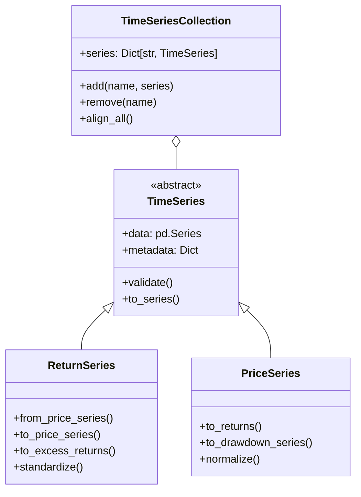

## 2. Module Class Structures

### 2.1 Core Module

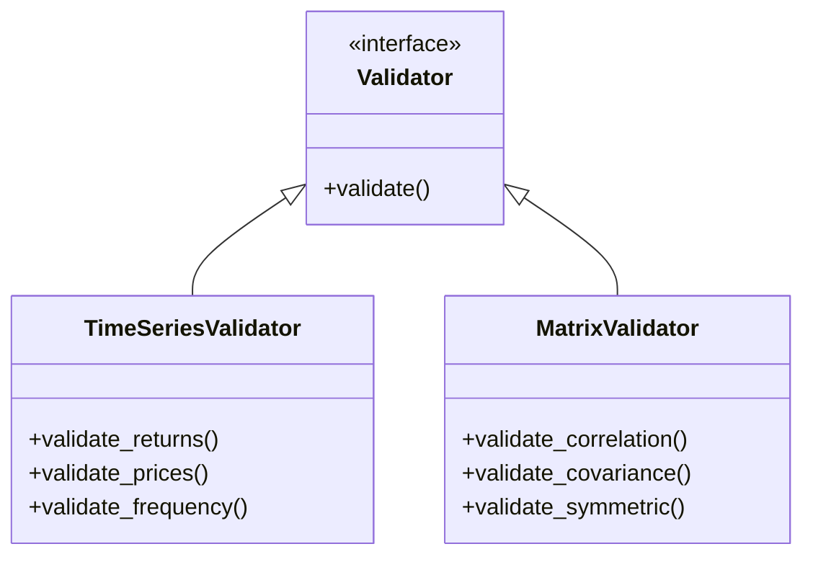

### 2.2 Data Module

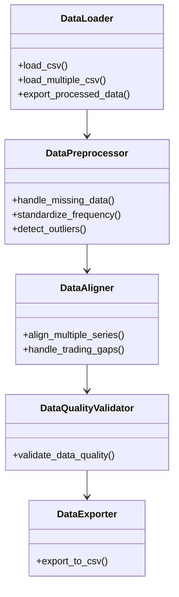

### 2.3 Statistics Module

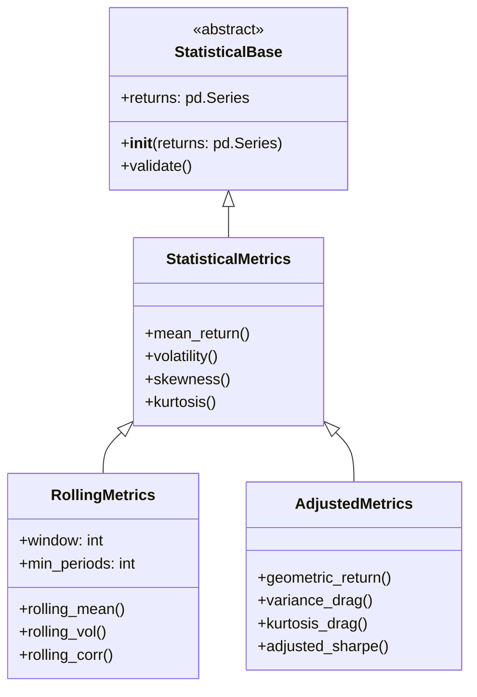

### 2.4 Distribution Module

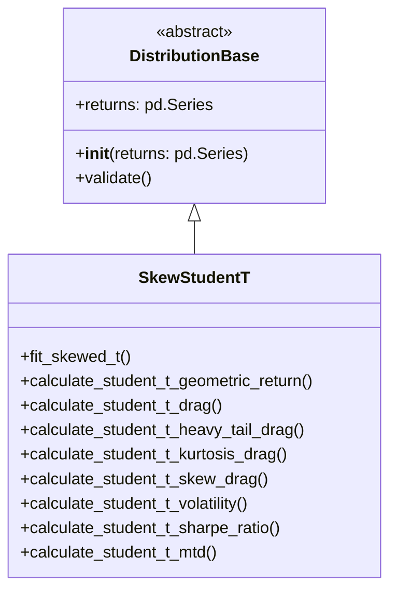

### 2.5 DTW Module

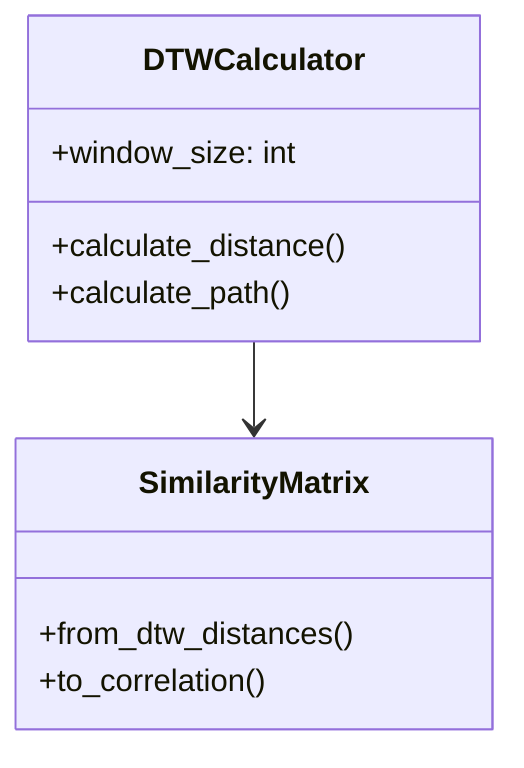

### 2.6 Volatility Module

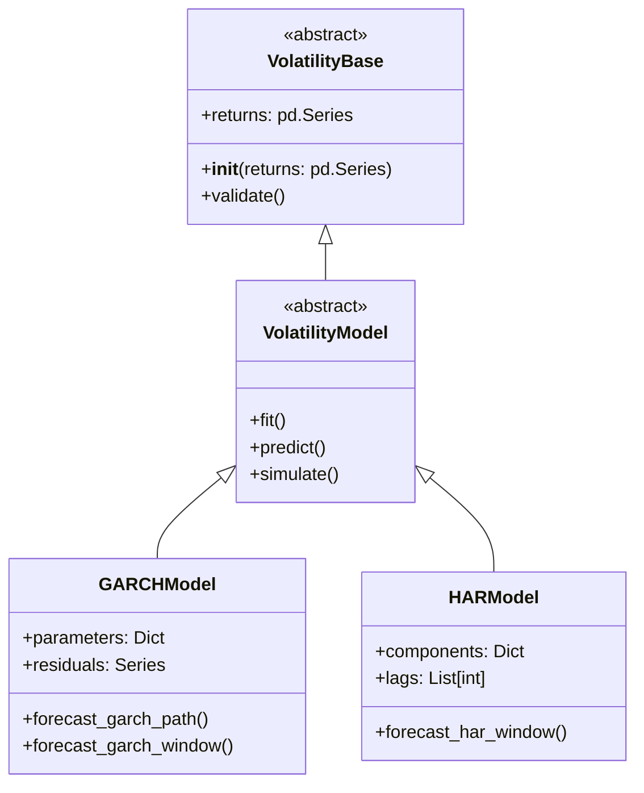

### 2.7 Backfill Module

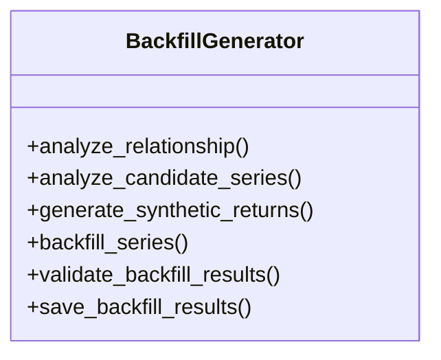

### 2.8 Covariance Module

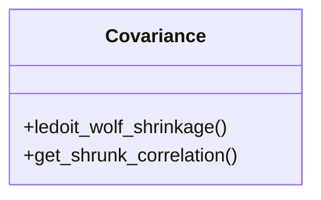

### 2.9 FTSLibrary Module

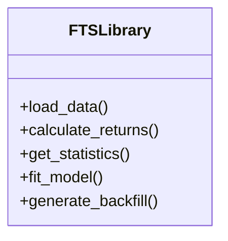

## 3. Class Relationships

### 3.1 Data Flow

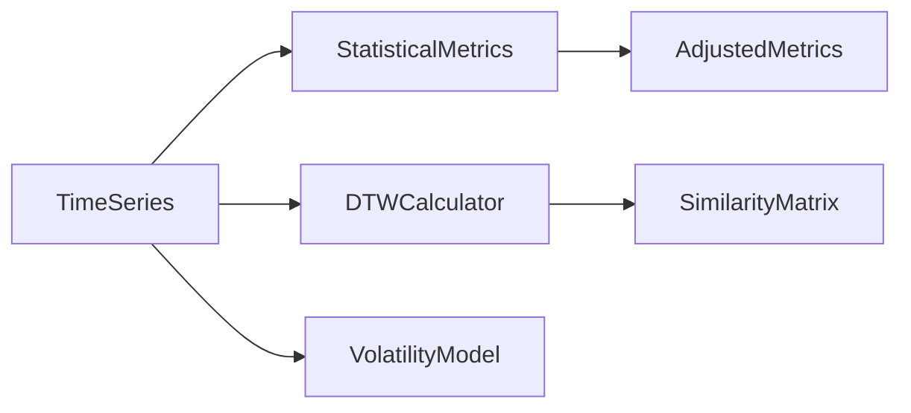

### 3.2 Dependency Graph

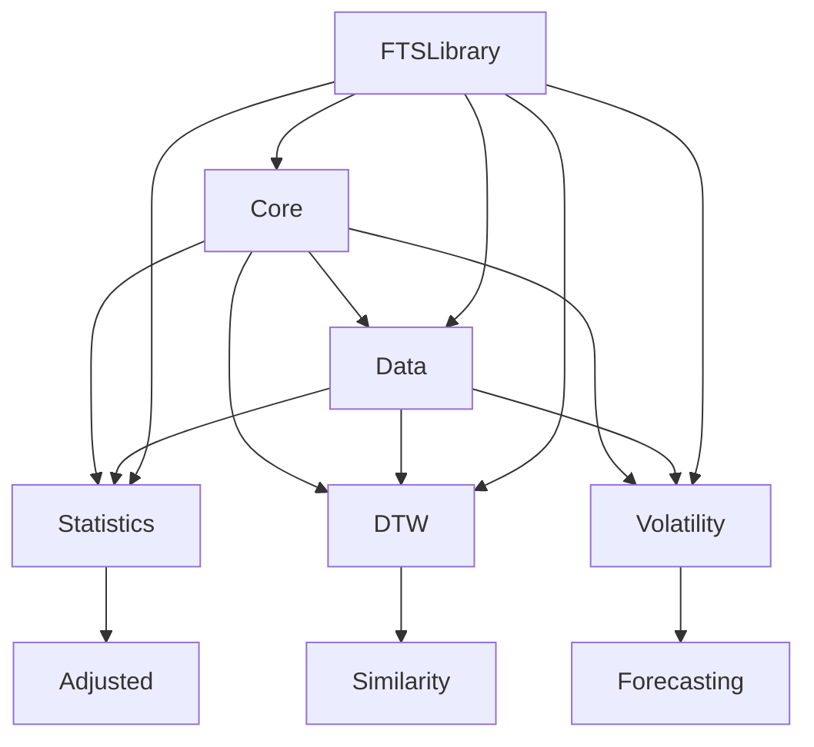

## 4. Implementation Guidelines

### 4.1 Factory Methods

*   Use factory methods for object creation
*   Implement validation in constructors
*   Provide clear conversion methods

### 4.2 Interface Patterns

*   Define clear protocols using typing.Protocol
*   Use abstract base classes for core functionality
*   Implement consistent validation interfaces

### 4.3 Error Handling

*   Use custom exceptions for each module
*   Implement comprehensive validation
*   Provide clear error messages

## 5. Next Steps

### 5.1 Implementation Priority

1. Core base classes
2. Statistical metrics classes
3. Volatility models
4. DTW implementation
5. Matrix operations

### 5.2 Validation Requirements

*   Input validation
*   State validation
*   Output validation
*   Cross-object validation

### 5.3 Testing Strategy

*   Unit tests for each class
*   Integration tests for workflows
*   Performance benchmarks
*   Edge case coverage


```

File: /Users/peterahl/Python/Packages/DataManagementPackages/FinancialTimeSeries/docs/current/implementation/imp_plan_review_synthezis_3.md
```md
# Synthesized Implementation Review - Financial Time Series Library

## 1. Executive Summary

This review synthesizes three expert analyses of the Financial Time Series Library implementation plan. The consensus shows that while the plan provides a strong foundation for a comprehensive financial analysis library, several key areas require enhancement or modification to ensure robustness, maintainability, and optimal performance.

### Common Strengths Identified
- Well-structured modular design with clear separation of concerns
- Strong theoretical foundation backed by academic research
- Comprehensive validation framework and error handling
- Detailed implementation plans for core functionalities
- Support for advanced statistical methods and time series analysis

### Primary Areas for Enhancement
- Class structure and hierarchy refinement
- Memory and performance optimization
- Data quality management framework
- Integration and workflow automation
- Configuration management system

## 2. Architectural Analysis

### 2.1 Core Architecture Strengths
The implementation plan demonstrates several architectural strengths that should be maintained and built upon:

1. Modular Organization
   - Clear separation between core, data, statistics, and analysis modules
   - Well-defined interfaces between components
   - Consistent error handling approach

2. Validation Framework
   - Comprehensive input validation
   - Type checking and enforcement
   - Error propagation and handling

3. Extension Points
   - Abstract base classes for key components
   - Plugin architecture potential
   - Flexible interface definitions

### 2.2 Architectural Improvements Needed

Through synthesis of the reviews, the following architectural improvements are recommended:

1. Configuration Management Layer
   ```python
   class FTSConfig:
       def __init__(self):
           self.settings = {
               'memory_limit': '32GB',
               'cache_policy': 'LRU',
               'validation_level': 'strict'
           }
           self.feature_flags = {
               'gpu_acceleration': False,
               'parallel_processing': True
           }
   ```

2. Enhanced Base Classes
   ```python
   class TimeSeriesBase(ABC):
       @abstractmethod
       def validate(self) -> None: pass
       
       @abstractmethod
       def transform(self) -> 'TimeSeriesBase': pass
       
       @abstractmethod
       def get_metadata(self) -> Dict[str, Any]: pass
   ```

3. Workflow Pipeline System
   ```python
   class AnalysisPipeline:
       def __init__(self):
           self.steps: List[AnalysisStep] = []
           self.results: Dict[str, Any] = {}
           
       def add_step(self, name: str, function: Callable, **params):
           self.steps.append((name, AnalysisStep(function, params)))
   ```

## 3. Implementation Gaps and Solutions

### 3.1 Data Quality Framework

A comprehensive data quality framework should be implemented:

```python
class QualityMetrics:
    def __init__(self, series: TimeSeries):
        self.series = series
        
    def calculate_score(self) -> float:
        metrics = {
            'missing_data': self._missing_data_score(),
            'outliers': self._outlier_score(),
            'stationarity': self._stationarity_score(),
            'consistency': self._consistency_score()
        }
        return np.mean(list(metrics.values()))
```

### 3.2 Memory Management

Implement chunked processing and memory monitoring:

```python
class ChunkedProcessor:
    def __init__(self, chunk_size: int = 10000):
        self.chunk_size = chunk_size
        
    def process(self, data: pd.DataFrame, func: Callable) -> pd.DataFrame:
        chunks = [data[i:i + self.chunk_size] 
                 for i in range(0, len(data), self.chunk_size)]
        return pd.concat([func(chunk) for chunk in chunks])
```

### 3.3 Advanced Statistics

Enhance statistical calculations with confidence intervals and robustness:

```python
class RobustStatistics:
    def __init__(self, data: np.ndarray, bootstrap_samples: int = 1000):
        self.data = data
        self.bootstrap_samples = bootstrap_samples
        
    def calculate_with_confidence(self) -> Dict[str, Tuple[float, float]]:
        """Calculate statistics with confidence intervals."""
        return {
            'mean': self._bootstrap_statistic(np.mean),
            'volatility': self._bootstrap_statistic(np.std),
            'skewness': self._bootstrap_statistic(stats.skew)
        }
```

## 4. Critical Implementation Priorities

### 4.1 High Priority Items
1. Memory optimization framework
2. Data quality system
3. Configuration management
4. Core validation framework
5. Basic statistical implementations

### 4.2 Medium Priority Items
1. Advanced statistical methods
2. Pipeline automation
3. Performance optimization
4. Documentation system
5. Integration frameworks

### 4.3 Low Priority Items
1. GPU acceleration
2. Visualization capabilities
3. External system integration
4. Advanced optimization features
5. Experimental methods

## 5. Testing Strategy

### 5.1 Unit Testing Framework
```python
class TestFramework:
    def __init__(self):
        self.test_suites = []
        
    def add_test_suite(self, suite: TestSuite):
        self.test_suites.append(suite)
        
    def run_tests(self) -> TestResults:
        results = []
        for suite in self.test_suites:
            results.append(suite.run())
        return TestResults(results)
```

### 5.2 Performance Testing
```python
class PerformanceBenchmark:
    def __init__(self, target_function: Callable):
        self.target = target_function
        self.results = []
        
    def benchmark(self, input_size: int, iterations: int = 100) -> Dict[str, float]:
        """Run performance benchmark."""
        times = []
        memory = []
        for _ in range(iterations):
            start_time = time.time()
            start_memory = memory_usage()
            self.target(generate_test_data(input_size))
            times.append(time.time() - start_time)
            memory.append(memory_usage() - start_memory)
        
        return {
            'mean_time': np.mean(times),
            'std_time': np.std(times),
            'mean_memory': np.mean(memory)
        }
```

## 6. Documentation Requirements

### 6.1 Code Documentation
- Comprehensive docstrings
- Type hints
- Usage examples
- Performance considerations
- Implementation notes

### 6.2 User Documentation
- Getting started guide
- API reference
- Usage examples
- Best practices
- Performance optimization guide

### 6.3 Developer Documentation
- Architecture overview
- Implementation patterns
- Testing guidelines
- Contribution guide
- Extension development guide

## 7. Future Considerations

### 7.1 Scalability
- Distributed processing capabilities
- Cloud integration options
- Streaming data support
- Large dataset handling

### 7.2 Extensions
- Plugin system
- Custom algorithm framework
- User-defined metrics
- Integration APIs
- Visualization capabilities

## 8. Implementation Timeline

### Phase 1 (1-2 months)
- Core architecture
- Basic data structures
- Fundamental statistics
- Initial validation framework

### Phase 2 (2-3 months)
- Advanced statistics
- Memory optimization
- Data quality framework
- Initial documentation

### Phase 3 (3-4 months)
- Performance optimization
- Integration components
- Advanced features
- Complete documentation

## 9. Success Metrics

### 9.1 Performance Metrics
- Memory usage < 75% of system memory
- Processing time within specified limits
- Query response time < 100ms
- Batch processing efficiency

### 9.2 Quality Metrics
- Test coverage > 90%
- Documentation completeness
- API consistency
- Error handling coverage

### 9.3 User Metrics
- Implementation clarity
- API usability
- Documentation usefulness
- Support responsiveness
```

File: /Users/peterahl/Python/Packages/DataManagementPackages/FinancialTimeSeries/docs/current/implementation/imp_plan_review_synthezis_2.md
```md
Okay, I've synthesized the three reviews (yours and the two provided) into a comprehensive document. Here's the combined review, incorporating feedback from all sources:

# Comprehensive Review of Financial Time Series (FTS) Library Implementation Plan

This document synthesizes feedback from three independent reviews of the FTS library implementation plan, including detailed analysis of strengths, weaknesses, suggested improvements, and proposed changes.

## Overall Assessment

The implementation plan presents a solid foundation for a comprehensive financial time series analysis library. The proposed modular structure, strong theoretical underpinnings, and coverage of a wide range of functionalities are commendable. However, several areas require refinement to enhance clarity, robustness, usability, and performance.

### Strengths

*   **Comprehensive Scope:** Covers a wide array of financial time series analysis needs, including data handling, statistical analysis, distribution fitting, volatility modeling (GARCH/HAR), DTW, backfilling, and covariance shrinkage.
*   **Strong Theoretical Foundation:**  Leveraging established methodologies and referencing relevant academic literature provides a sound basis for the library's functionality.
*   **Detailed Module Plans:** Module-level documentation provides good detail on methods, formulas, dependencies, and error handling.
*   **Emphasis on Validation:** Consistent focus on input validation, error handling, and data quality is evident throughout the plan.
*   **Modular Design:**  Separation of concerns into modules (core, data, statistics, etc.) promotes maintainability, testability, and extensibility.
*   **Clear User Requirements:** The `user_requirements.md` document clearly outlines the expected functionalities and use cases.
*   **Performance Considerations:** The plan acknowledges performance requirements, especially concerning large datasets.
*   **Well-Defined Conventions:** Clear conventions for return calculations, annualization, and default settings improve consistency.

### Weaknesses and Areas for Improvement

1. **Class Structure Detail and Abstraction:**
    *   `class_structure.md` needs further elaboration on class attributes, method signatures, and interactions between classes within each module.
    *   Abstract Base Classes (ABCs) like `TimeSeries`, `VolatilityModel`, `StatisticalBase`, `VolatilityBase` and `DistributionBase` are not fully utilized to enforce consistent interfaces across different implementations.
    *   Lack of a top-level `FTSLibrary` class to provide a unified interface for users.

2. **Data Handling and Preprocessing:**
    *   Data handling logic is scattered between `core/base.md` and the `data` module.
    *   Details on handling missing data, non-overlapping periods, and gap handling are insufficient, especially in function-level documentation.
    *   The plan lacks specific functions to identify gaps greater than 5 days and raise warnings when missing data exceeds 10%, as per user requirements.

3. **Inter-module Dependencies:**
    *   While dependencies are mentioned, a more explicit visual representation (e.g., a dependency graph) would enhance understanding.

4. **Optimization Strategies:**
    *   The plan lacks detailed strategies for performance optimization, such as specific vectorization techniques, use of Numba/Cython, or caching mechanisms.

5. **Testing and Benchmarking:**
    *   The plan mentions testing requirements but lacks concrete examples of unit tests and performance benchmarks.

6. **User Interface and Documentation:**
    *   Limited examples demonstrating how users will interact with the library.
    *   Lack of clear guidelines for selecting between different alignment and backfilling methods.

7. **Configuration Management:**
    *   No centralized mechanism for managing library-wide configurations and settings.

8. **Data Flow and Workflow Management:**
    *   No explicit support for defining and executing analysis pipelines or workflows.

9. **Advanced Functionalities:**
    *   Backfilling module needs more flexibility in terms of choosing distributions for generating synthetic returns.
    *   Limited support for advanced features like distribution comparison tools, regime detection, and volatility surface modeling.

##  Detailed Recommendations

### 1. Class Structure and Design

*   **Expand `class_structure.md`:**
    *   Include detailed class diagrams showing inheritance, composition, and relationships.
    *   Define all class attributes, method signatures (including type hints), and docstrings.
    *   Illustrate interactions between classes within each module.
*   **Fully Utilize Abstract Base Classes and Interfaces:**
    *   Define abstract methods in `TimeSeries`, `VolatilityModel`, `StatisticalBase`, `DistributionBase`, and potentially other base classes to enforce a consistent interface.
    *   Use `typing.Protocol` for flexible interface definitions.
    *   Create an abstract `DataGenerator` class for the backfill module.
*   **Introduce a Top-Level `FTSLibrary` Class:**
    *   Provide a unified interface for users to access the library's functionalities without needing to know the internal module structure.
    *   Include methods like `load_data`, `calculate_returns`, `get_statistics`, `fit_model`, `generate_backfill`, etc.
*   **Create Base Classes for Metrics, Volatility, and Distributions:**
    *   `StatisticalBase` in `statistics/metrics.py` to encapsulate common statistical calculations.
    *   `VolatilityBase` in `volatility/garch.md` and `volatility/har.md` to handle common volatility-related operations.
    *   `DistributionBase` in `distribution/skew_student_t.md` for distribution-specific calculations.

### 2. Data Handling and Preprocessing

*   **Consolidate Data Handling:**
    *   Move data handling logic from `core/base.md` to the `data` module.
    *   Create a dedicated `data/processing.py` for operations like price-to-return conversion, excess return calculation, and standardization.
*   **Enhance `data/alignment.py` and `data/gaps.py`:**
    *   Provide detailed pseudocode and flowcharts for each alignment and gap-handling method.
    *   Add specific functions to identify gaps greater than 5 days and calculate the percentage of missing data.
    *   Implement warnings for excessive missing data and large gaps, as per user requirements.
    *   Clearly document how each function handles edge cases (e.g., no overlapping periods).
*   **Improve Missing Data Handling:**
    *   For each function, explicitly document how missing data (NaNs) is treated:
        *   Raise an error, issue a warning, or handle internally?
        *   If handled internally, what method is used (e.g., pairwise deletion, imputation)?
    *   Add a dedicated section on missing data handling strategy, potentially in `data/gaps.md` or a new document.

### 3. Module Interdependencies

*   **Create a Dependency Graph:**
    *   Visualize the relationships between modules using a dependency graph (e.g., using Mermaid, Graphviz).
    *   Clearly document the interactions between modules, particularly for data flow and pre-processing steps.

### 4. Optimization and Performance

*   **Detail Optimization Strategies:**
    *   For each module, specify the optimization techniques employed:
        *   Vectorization with NumPy.
        *   Use of Numba for Just-In-Time (JIT) compilation.
        *   Caching of intermediate results.
        *   Potential use of Cython for performance-critical sections.
    *   Implement chunked processing for large datasets to manage memory efficiently.
    *   Consider lazy evaluation where appropriate.
*   **Add Performance Benchmarks:**
    *   Define performance benchmarks for key operations (e.g., data loading, statistical calculations, model fitting).
    *   Regularly run benchmarks to track performance and identify regressions.

### 5. Testing and Validation

*   **Provide Example Unit Tests:**
    *   Include example unit tests using `pytest` in the documentation or a dedicated `tests` folder.
    *   Cover normal operation, edge cases, and error conditions.
*   **Expand Test Coverage:**
    *   Aim for high test coverage (e.g., >90%) for all modules.
    *   Implement property-based testing for statistical functions.
    *   Add integration tests to verify interactions between modules.
*   **Implement Data Quality Checks:**
    *   Add a dedicated module or class for data quality assessment.
    *   Include functions to calculate data quality scores and generate reports.
    *   Integrate data quality checks into the validation framework.

### 6. User Interface and Documentation

*   **Provide Code Examples:**
    *   Include code snippets demonstrating common workflows:
        *   Loading data from CSV.
        *   Aligning and preprocessing time series.
        *   Performing statistical analysis.
        *   Fitting volatility models.
        *   Generating backfilled data.
        *   Calculating DTW correlations.
    *   Create an `examples` folder with more comprehensive usage scenarios.
*   **Clarify Method Selection:**
    *   Provide clear guidelines or decision trees for choosing between different alignment, backfilling, and other methods.
*   **Enhance API Documentation:**
    *   Use a consistent documentation style (e.g., Google Style) for all docstrings.
    *   Include detailed descriptions of parameters, return values, and potential exceptions.
    *   Add type hints to all function signatures.
*   **Create a User Guide:**
    *   Develop a comprehensive user guide with tutorials and explanations of key concepts.

### 7. Configuration Management

*   **Introduce a Configuration Module:**
    *   Create a `config` module to manage library-wide settings.
    *   Use a configuration file (e.g., YAML, JSON) or a dedicated class to store settings.
    *   Allow users to override default settings.
*   **Centralize Configuration Parameters:**
    *   Store settings like:
        *   Memory limits.
        *   Caching policies.
        *   Default data paths.
        *   Validation thresholds.
        *   Feature flags for experimental functionalities.

### 8. Data Flow and Workflow Management

*   **Implement Analysis Pipelines:**
    *   Create `AnalysisPipeline` classes or similar abstractions to define and execute sequences of operations.
    *   Allow users to chain transformations and analyses.
    *   Provide pre-built pipelines for common workflows.
*   **Visualize Data Flow:**
    *   Use diagrams (e.g., flowcharts) to illustrate the flow of data through the library.

### 9. Advanced Functionalities

*   **Backfilling Module Enhancements:**
    *   Add support for multiple distributions (beyond skewed Student-t) for synthetic return generation.
    *   Implement functionality for generating multiple backfill scenarios for uncertainty analysis.
*   **Distribution Analysis:**
    *   Add tools for comparing distributions (e.g., statistical tests, visualization).
    *   Implement functionality to analyze the evolution of distribution parameters over time.
*   **Volatility Modeling:**
    *   Add regime detection capabilities (e.g., using Hidden Markov Models).
    *   Implement volatility forecasting combinations (e.g., weighted averages of GARCH and HAR forecasts).
    *   Consider adding volatility surface modeling.
*   **DTW Enhancements:**
    *   Explore GPU acceleration for DTW calculations.
    *   Implement streaming or online DTW for real-time applications.
*   **Advanced Statistical Analysis**
    *   Add functionality to calculate confidence intervals using bootstrapping.

### 10. Integration and Extensibility

*   **Standardized Data Import/Export:**
    *   Implement robust data import/export functionalities, potentially supporting formats beyond CSV (e.g., Parquet, HDF5).
*   **External Package Integration:**
    *   Provide clear interfaces for integrating with simulation packages.
    *   Add hooks for visualization libraries (e.g., Matplotlib, Seaborn).
*   **Plugin System:**
    *   Consider a plugin architecture to allow users to extend the library with custom functionalities.

## Proposed Implementation Plan Changes (Summary)

1. **`core/base.py` Reorganization:**
    *   Move data handling logic to `data/processing.py`.
    *   Retain only fundamental, reusable components in `core/base.py`.
    *   Define abstract base classes with clear interfaces.

2. **New `data/processing.py` Module:**
    *   Handle price-return conversions, excess returns, standardization, and other data transformations.

3. **Enhanced `data/alignment.py` and `data/gaps.py`:**
    *   Detailed pseudocode/flowcharts for each method.
    *   Specific functions for identifying gaps > 5 days and calculating missing data percentage.
    *   Clear documentation of edge case handling.

4. **Top-Level `FTSLibrary` Class:**
    *   Provide a unified interface for users.
    *   Methods to access functionalities from all modules.

5. **Base Classes for Metrics, Volatility, and Distributions:**
    *   `StatisticalBase`, `VolatilityBase`, and `DistributionBase` to encapsulate common operations.

6. **Detailed Unit Tests:**
    *   Comprehensive test suite covering normal operation, edge cases, and error conditions.

7. **Configuration Management:**
    *   Centralized configuration module/class.

8. **Analysis Pipelines:**
    *   Classes or functions to define and execute analysis workflows.

9. **Data Quality Scoring:**
    *   Functions or a class to calculate data quality scores and generate reports.

10. **Performance Optimization:**
    *   Detailed documentation of optimization strategies (vectorization, Numba, caching).
    *   Implementation of chunked processing and lazy evaluation where appropriate.

11. **Enhanced Documentation:**
    *   Code examples, user guide, tutorials, and API documentation.

## Conclusion

The proposed implementation plan lays a strong foundation for a robust and versatile financial time series library. By addressing the identified weaknesses, implementing the suggested improvements, and incorporating the proposed changes, the library can achieve a higher level of clarity, usability, maintainability, and performance. The enhanced focus on class structure, data handling, validation, optimization, and documentation will contribute to a more powerful and user-friendly tool for financial time series analysis.

```

File: /Users/peterahl/Python/Packages/DataManagementPackages/FinancialTimeSeries/docs/current/implementation/imp_plan_review_synthezis_1.md
```md
# Comprehensive Synthesis of Implementation Plan Reviews

This document consolidates and synthesizes feedback from three independent reviews of the financial time series library implementation plan. It aims to present a unified perspective on the library’s current strengths, areas for improvement, and actionable suggestions, ensuring that all significant points from the separate reviews are captured in one cohesive narrative.

---

## Overall Assessment

**Scope and Coverage:**  
All reviews acknowledge that the implementation plan is comprehensive, covering data loading, alignment, statistical calculations, volatility modeling (GARCH/HAR), DTW-based correlation, distribution fitting (including skewed Student-t), and backfilling of shorter return histories. The functionality aligns well with user requirements for broad financial time series analysis capabilities.

**Methodological Foundations:**  
The plan demonstrates a strong theoretical foundation, referencing relevant academic literature and methodologies. This ensures that the techniques (e.g., variance drag, PCA-based factor loadings, DTW correlation) are grounded in established financial and statistical theory.

**Modularity and Structure:**  
The proposed architecture is modular, splitting functionality into `core`, `data`, `statistics`, `distribution`, `dtw`, `volatility`, `backfill`, and `covariance` modules. This separation fosters maintainability, clarity, and scalability. The use of abstract base classes (e.g., `TimeSeries`, `VolatilityModel`) is noted as positive, but reviewers suggest further refinement for consistency and extensibility.

**Validation and Error Handling:**  
A consistent emphasis on validation and error handling is a key strength. The design includes custom exceptions and suggests validation steps throughout, which is critical given the importance of data quality and stability in financial analytics.

**Documentation and User Guidance:**  
While the plan references background methodologies and provides structured module-level documentation, reviewers recommend adding more practical examples, decision guidelines for method selection (especially for data alignment and backfilling), and a clearer user-facing interface.

---

## Strengths Identified

1. **Comprehensive Feature Set:**  
   - Supports multiple return types, frequency handling, and complex transformations.
   - Offers advanced modeling (GARCH/HAR, skewed Student-t distribution fitting, PCA factor analysis, DTW correlation).
   - Addresses both basic statistics and advanced risk metrics (Sharpe, Sortino, Calmar, variance drag adjustments).

2. **Solid Theoretical Basis:**  
   - References robust academic research.
   - Incorporates advanced metrics like skew/kurtosis drag and maximum theoretical drawdown.

3. **Modular, Extendable Design:**  
   - Clear module boundaries.
   - Potential for adding new distributions, models, and methods without large-scale refactoring.
   - Abstract interfaces pave the way for custom models and analysis pipelines.

4. **Validation and Error Handling Infrastructure:**  
   - Use of `ValidationError`, `ProcessingError`, `ConfigurationError` aligns with best practices.
   - Emphasis on data validation meets user requirements for data quality.

5. **Performance Considerations:**  
   - Acknowledges performance needs, large datasets, and efficiency, though optimization strategies could be more explicit.

---

## Key Weaknesses and Gaps

1. **Class Structure Details and Abstract Base Classes:**
   - Some classes (e.g., `ReturnSeries`, `PriceSeries`, `VolatilityModel`) remain conceptual without full method signatures or attributes.
   - Abstract base classes could be more rigorously defined with required abstract methods, ensuring a consistent interface.

2. **Data Handling and Missing Data Strategies:**
   - Need clearer, more explicit strategies for handling missing data, non-overlapping periods, and gap detection.
   - The requirement for warnings when missing data exceeds certain thresholds is not fully operationalized.
   - More detail on how each function or module handles NaNs and data quality flags is required.

3. **Method Selection Guidelines and User-Facing Examples:**
   - Multiple alignment and backfilling methods are presented, but the user needs guidance on when to use each approach.
   - Provide decision trees, examples, and recommended defaults for common scenarios (e.g., when to choose all-overlapping vs. synchronized average alignment).

4. **Frequency Handling and Calendar Support:**
   - Although frequency conversion is mentioned, more sophisticated methods and calendar-awareness (trading calendars, holidays) are lacking.
   - Integrating a frequency or calendar handler would standardize conversions and improve user experience.

5. **Insufficient Integration of PCA and Factor Results:**
   - PCA factor analysis is implemented as standalone functions. Introducing a `PCAFactorModel` or similar class would provide a cohesive framework for factor extraction, residual calculation, and integration with downstream analyses.

6. **Distribution and Drag Calculations:**
   - While the skewed Student-t and drag adjustments are well-defined, a more uniform approach (e.g., a `DistributionBase` class with `SkewStudentTModel`) would streamline distribution fitting and calculations.
   - This structure would facilitate adding new distributions or advanced fitting methods in the future.

7. **Matrix Operations and Covariance Estimators:**
   - Covariance and correlation methods are functional but scattered. A `CovarianceEstimator` class could centralize shrinkage methods (Ledoit-Wolf), correlation-to-covariance conversions, and matrix validations.

8. **Testing, Benchmarking, and Optimization Details:**
   - Though testing and high coverage are mentioned, no specific examples or test strategies are outlined.
   - Performance optimization techniques (e.g., Numba for JIT, caching strategies) are suggested but not concretely planned.

---

## Recommended Enhancements

1. **Complete the Class Hierarchy:**
   - Expand `class_structure.md` with detailed attributes, methods, and interactions.
   - Add abstract methods in base classes to enforce consistent interfaces (e.g., `TimeSeries.validate()`, `VolatilityModel.fit()`, `DistributionBase.fit()`).

2. **User Guidance and Documentation:**
   - Include code examples demonstrating:
     - Loading data, handling missing values, and alignment methods.
     - Running statistical analyses at different frequencies.
     - Performing GARCH volatility forecasts and backfilling scenarios.
     - Using DTW correlation and comparing it to Pearson correlation.
   - Add a top-level `FTSLibrary` or `AnalysisWorkflow` class to simplify user access, abstracting away module-level complexities.

3. **Data Handling Improvements:**
   - Implement explicit gap-handling functions that detect and report >5-day gaps.
   - Introduce a `QualityMetrics` or `QualityScore` class for data quality scoring and automated warnings.
   - Move detailed data handling logic into dedicated `data/processing.py` or similar modules, keeping `core` minimal and fundamental.

4. **Frequency and Calendar Handling:**
   - Add a `FrequencyConverter` utility with validation of conversions and possibly calendar integration.
   - Document supported frequencies and provide recommended approaches for irregular data.

5. **Enhanced PCA and Factor Analysis:**
   - Consider a `PCAFactorModel` class that encapsulates PCA factor returns, explained variance, and residual returns.
   - Integrate PCA outputs more seamlessly with other analysis steps (e.g., correlation analyses, portfolio construction).

6. **Distribution and Drag Models:**
   - Introduce a `DistributionBase` class and implement `SkewStudentTModel` as a subclass.
   - Standardize the process for fitting distributions, extracting parameters, and calculating drags, making it easy to add new distributions.

7. **Covariance/Correlation Class:**
   - Create a `CovarianceEstimator` or `CorrelationAnalysis` class that provides a unified interface for shrinkage, correlation-to-covariance, and validation steps.
   - This would improve consistency and discoverability of matrix operations.

8. **Testing and Benchmarking:**
   - Add example unit tests for key functionalities, showing expected inputs/outputs.
   - Incorporate performance tests and memory usage monitoring scripts.
   - Use property-based testing for statistical functions and integration tests for entire workflows.

---

## Future Considerations

1. **Scalability and Parallelization:**
   - Investigate GPU acceleration (e.g., for DTW computations), parallel processing for large datasets, and possibly distributed computing solutions.
   - Implement caching and chunked processing for memory-intensive operations.

2. **Extended Data Quality and Validation:**
   - Offer more sophisticated quality metrics (stationarity checks, outlier scores, autocorrelation tests).
   - Integrate a data quality scoring system to guide users in selecting appropriate analysis methods or filtering low-quality data.

3. **Workflow Automation:**
   - Provide a pipeline or workflow manager that chains steps: load data → align → compute returns → adjust frequency → run analysis → generate reports.
   - This could be combined with a configuration system to run standardized analyses with minimal code changes.

---

## Conclusion

All three reviews agree that the implementation plan is off to a strong start, with a broad scope, robust theoretical underpinnings, and careful modularization. The primary areas for improvement involve clarifying class structures, adding user guidance and examples, refining data handling and frequency management, introducing more robust distribution and covariance estimation frameworks, and strengthening testing, performance, and validation practices.

By implementing these recommendations, the financial time series library can evolve into a powerful, user-friendly, and extensible toolkit that meets the needs of analysts, researchers, and developers working with complex financial data.

```
</file_contents>

