## Review Summary

### Strengths

*   **Comprehensive Scope:** The plan covers a wide range of financial time series analysis functionalities, from basic statistical calculations to advanced techniques like DTW, GARCH/HAR modeling, and backfilling.
*   **Strong Theoretical Foundation:** The plan references relevant academic papers and methodologies, demonstrating a solid understanding of the underlying financial concepts.
*   **Detailed Implementation Plans:** The module-level documentation provides a good level of detail regarding the methods, formulas, and dependencies.
*   **Emphasis on Validation:** The plan consistently highlights the importance of input validation and error handling, which is crucial for a robust financial library.
*   **Modular Design:** The proposed structure with separate modules for core, data, statistics, distribution, DTW, volatility, backfill, and shrinkage promotes code organization and maintainability.
*   **Clear User Requirements:** The `user_requirements.md` document provides a well-defined set of functionalities and expectations.
*   **Consideration of Performance:** The plan acknowledges performance considerations, particularly for large datasets.

### Weaknesses

*   **Class Structure Detail:** While `class_structure.md` outlines the general class hierarchy, it lacks specifics about class attributes, methods, and their interactions within each module. The TODOs in `garch.md`, `har.md`, and `generator.md` regarding class structure need to be addressed for a complete picture.
*   **Abstract Base Classes:** The plan mentions abstract base classes but doesn't fully utilize them. Defining abstract methods within `TimeSeries`, `VolatilityModel`, and potentially other base classes would enforce a consistent interface across different implementations.
*   **Data Handling Detail in Core:** The `core/base.md` file dives into specifics of data handling (e.g., `ReturnSeries.from_price_series_df`) that might be better placed within the `data` module. The `core` module should ideally focus on very fundamental, reusable components.
*   **Missing Data Handling:** While mentioned in the user requirements, the implementation plans lack sufficient detail on how missing data and non-overlapping periods will be specifically handled within each function/class. More detail on how each function handles missing data is needed. The user requirements specify that missing data should trigger a warning if it exceeds 10% of the series length, but no functions are implemented to do this.
*   **Inter-module Dependencies:** The dependencies between modules are mentioned, but a more explicit mapping or diagram would improve clarity. For example, how `data/alignment.py` interacts with `dtw/matrix.py` for pre-processing could be visualized.
*   **Optimization Focus:** The plan mentions performance considerations but doesn't detail specific optimization strategies (e.g., use of Numba, Cython, or vectorization techniques) within the module implementations.
*   **No Base Class for returns, volatility, or distribution functions.** These should have a base class.
*   **No overall Library class.** There should be a top-level class with methods to access functionality, rather than requiring users to import multiple modules. This would be an external layer on the API.
*   **No Gap Handling Functions.** There are no functions implemented to identify gaps > 5 days or to raise warnings if they are present, as specified in user requirements.

### Suggested Improvements

1. **Enhance Class Structure Details:**
    *   Expand `class_structure.md` to include:
        *   Specific attributes and methods for each class.
        *   Method signatures (arguments, return types).
        *   Relationships and interactions between classes within each module.
        *   Class diagrams showing inheritance and composition.
    *   Complete the TODOs in the module implementation plans (garch, har, generator) by fleshing out the class structures.
    *   Consider adding a base class for statistical calculations and inheriting from it for `statistics.metrics`, `statistics.adjusted`, and `statistics.timeseries`.

2. **Strengthen Abstract Base Classes:**
    *   Define abstract methods in `TimeSeries`, `VolatilityModel`, and potentially `DataGenerator` (for backfill) to enforce a consistent interface.
    *   Consider using `typing.Protocol` for more flexible interface definitions, especially if strict inheritance is not always desired.

3. **Refine Data Handling:**
    *   Move detailed data handling logic from `core/base.py` to the `data` module. The core module should focus on truly fundamental components.
    *   Add more detail to `data/alignment.py` and `data/gaps.py` regarding the implementation of the different alignment and gap-handling methods. Include specifics about how edge cases are handled.

4. **Explicitly Define Missing Data Handling:**
    *   For each function/class in the implementation plans, explicitly state how missing data (NaNs) will be handled:
        *   Will the function raise an error, issue a warning, or handle it internally?
        *   If handled internally, what method will be used (e.g., pairwise deletion, imputation)?
    *   Consider adding a dedicated section in `data/gaps.md` or a separate document detailing the overall strategy for missing data handling across the library.

5. **Visualize Module Dependencies:**
    *   Create a dependency graph or diagram showing the relationships between modules. This will make it easier to understand how the different parts of the library interact. The mermaid diagram in `overview.md` is a good start.

6. **Detail Optimization Strategies:**
    *   In each module implementation plan, add a section detailing specific optimization techniques that will be used (e.g., vectorization with NumPy, using Numba for JIT compilation, caching).
    *   Consider using a profiler to identify performance bottlenecks during development.

7. **Add Unit Tests:**
    *   While you've mentioned testing requirements, include example unit tests (using `pytest` as indicated in your configuration) in your documentation. This will serve as a guide for developers and ensure that the code is working as expected.
    *   Tests should cover various cases, including normal operation, edge cases, and error conditions.

8. **Clarify User Interface:**
    *   Provide example code snippets demonstrating how users will interact with the library. This should include data loading, preprocessing, analysis, and visualization (if applicable). Consider adding an `examples` folder to the project root.

### Proposed Changes to Implementation Plan

1. **Reorganize `core/base.py`:**
    *   Move data handling logic (e.g., `ReturnSeries.from_price_series_df`) to a more appropriate location within the `data` module, potentially `data/loader.py` or a new `data/processing.py`.
    *   Keep `TimeSeries` as a very basic abstract class in `core/base.py`, focusing on fundamental properties and methods common to all time series.
    *   Add a base class for statistical functions (`StatisticalBase`), volatility functions (`VolatilityBase`) and distribution functions (`DistributionBase`). These should each have an `__init__` method to take in the relevant `TimeSeries` object (e.g. `ReturnSeries`), a `validate` method, and any other common methods.

2. **Create `data/processing.py` (or similar):**
    *   This module will handle:
        *   Conversion between prices and returns.
        *   Calculation of excess returns.
        *   Standardization of returns.
        *   Potentially other data transformations.

3. **Enhance `data/alignment.py`:**
    *   Provide detailed pseudocode or flowcharts for each alignment method (all-overlapping, synchronized average, pairwise overlapping, pairwise average).
    *   Explicitly state how edge cases (e.g., series with no overlapping periods) are handled.

4. **Create an overall Library Class:**
    *   Add a class, perhaps called `FTSLibrary` to act as the top-level interface for the library.
    *   This class will have methods to access the functionality of all the modules, without users needing to know the internal module structure.
    *   Example methods: `load_data`, `calculate_returns`, `get_statistics`, `fit_model`, `generate_backfill`, etc.

5. **Add Gap Handling Functions:**
    *   In `data/gaps.py`, add functions to specifically identify gaps greater than 5 days (or a user-defined threshold).
    *   Add functions to calculate the percentage of missing data in a series.
    *   Implement warnings when these thresholds are exceeded, as per user requirements.

6. **Add a base class for statistical, volatility, and distribution functions:**
    - In `statistics/metrics.py`, add a `StatisticalBase` class.
    - In `volatility/garch.md` and `volatility/har.md`, add a `VolatilityBase` class.
    - In `distribution/skew_student_t.md`, add a `DistributionBase` class.

7. **Add Detailed Unit Tests:**
    - Add a tests folder with example unit tests for key classes and functions, demonstrating the use of pytest and how to cover different scenarios (normal operation, edge cases, error conditions).

### File: `class_structure.md` Proposed Changes

```markdown
# FTS Library Class Structure

## 1. Overview

This document defines the complete class hierarchy and relationships for the FTS library.

### 1.1 Design Principles

*   Composition over inheritance
*   Interface-based design
*   Single responsibility principle
*   Clear dependency management
*   Consistent validation patterns

### 1.2 Core Abstractions

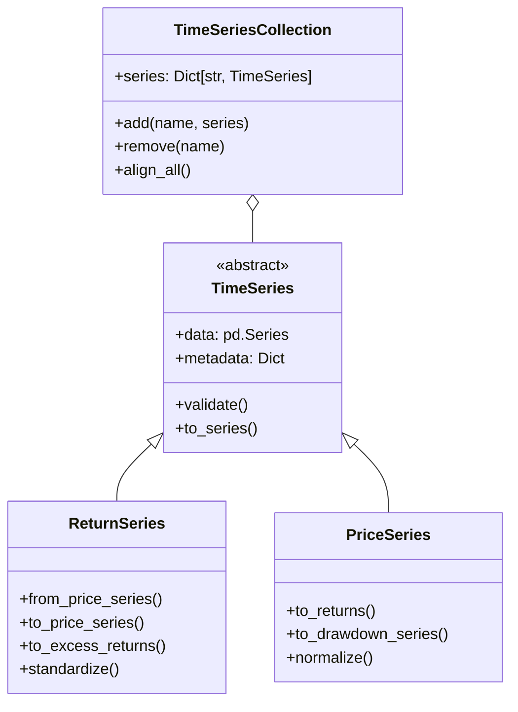

## 2. Module Class Structures

### 2.1 Core Module

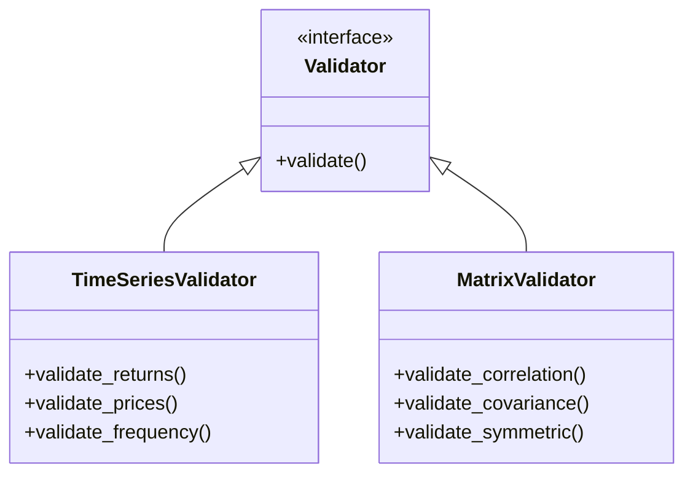

### 2.2 Data Module

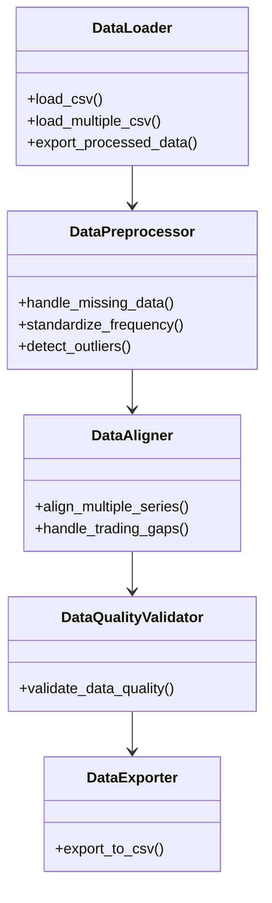

### 2.3 Statistics Module

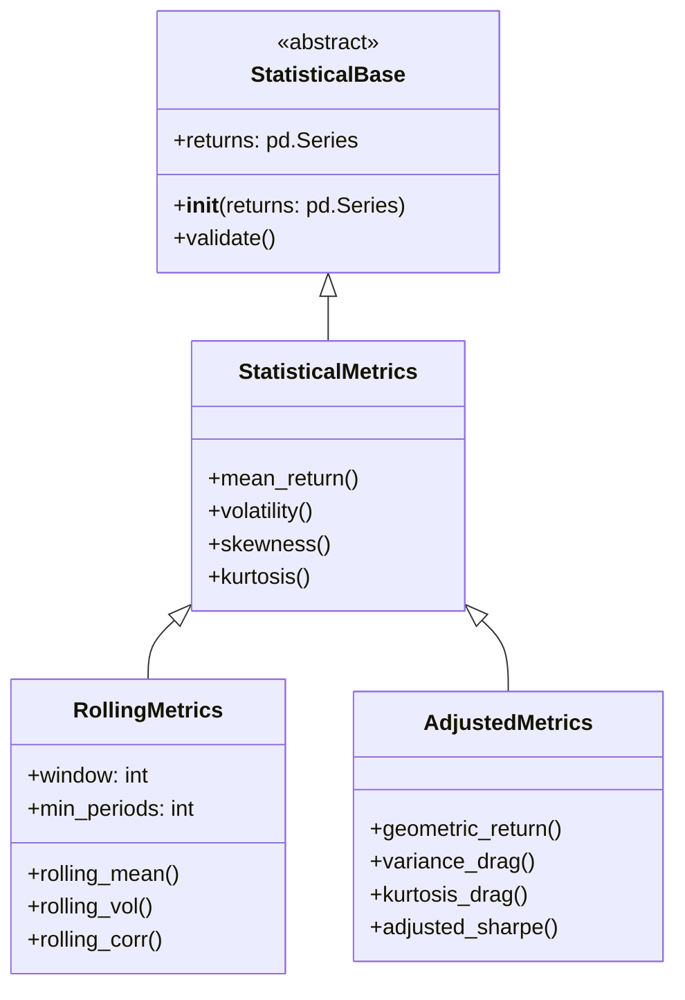

### 2.4 Distribution Module

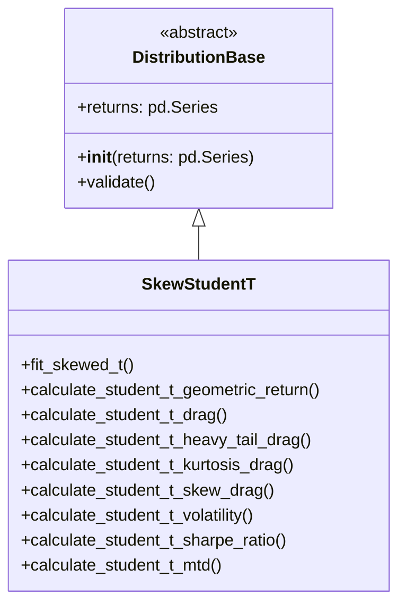

### 2.5 DTW Module

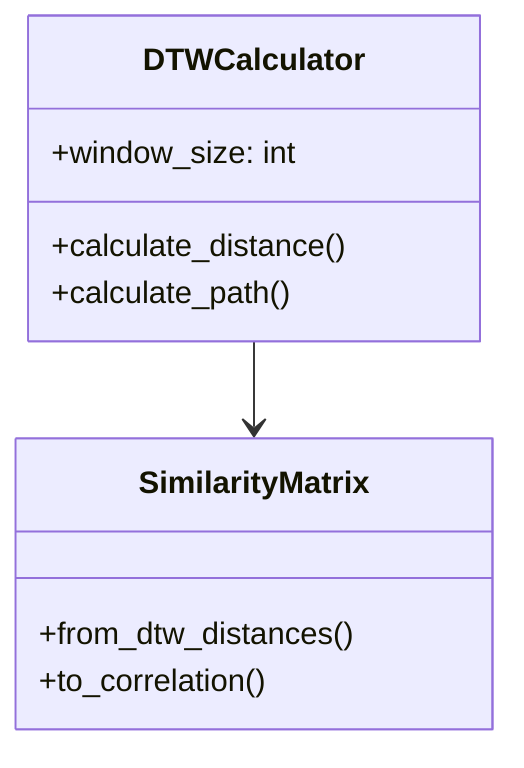

### 2.6 Volatility Module

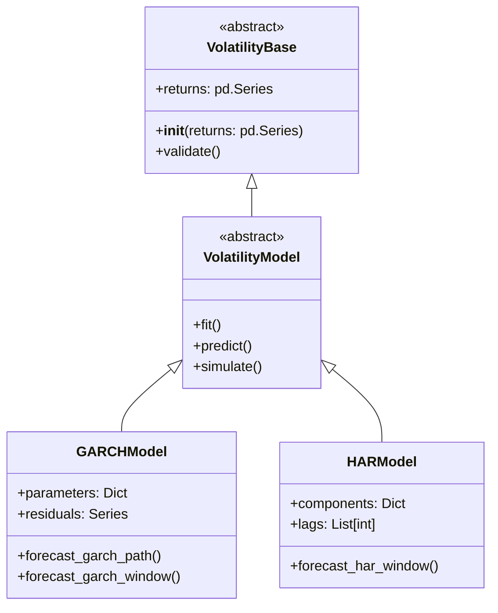

### 2.7 Backfill Module

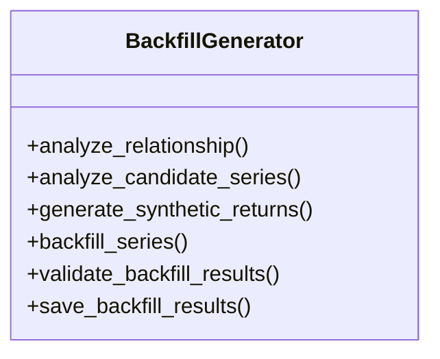

### 2.8 Covariance Module

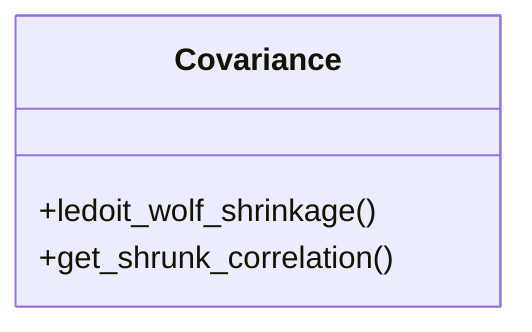

### 2.9 FTSLibrary Module

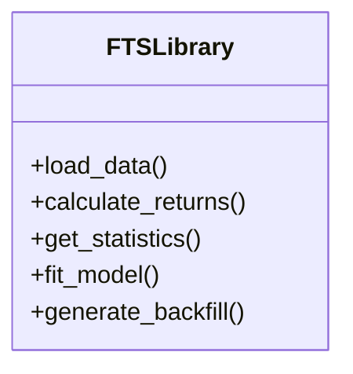

## 3. Class Relationships

### 3.1 Data Flow

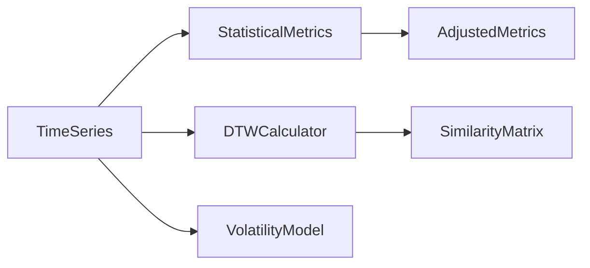

### 3.2 Dependency Graph

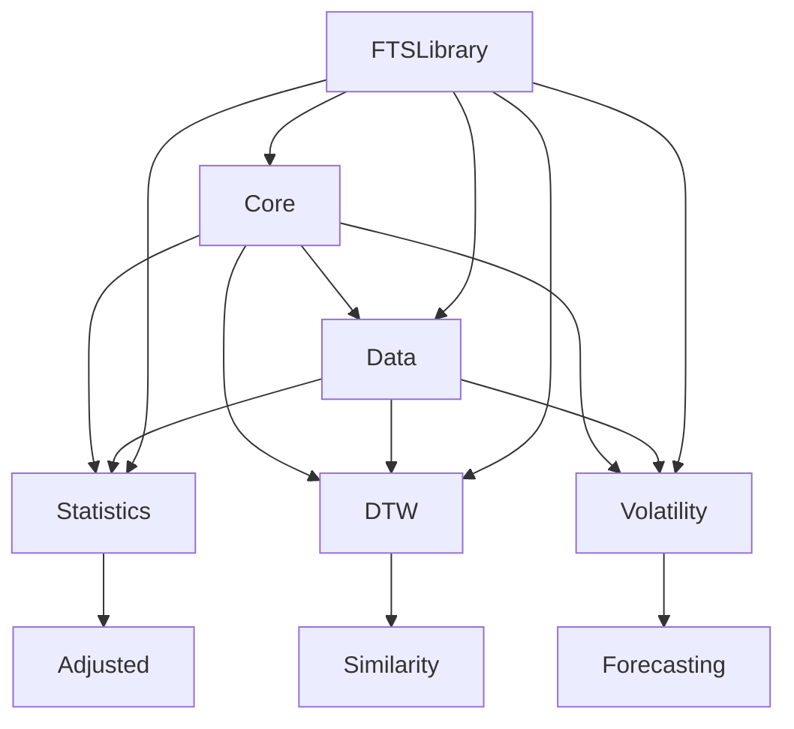

## 4. Implementation Guidelines

### 4.1 Factory Methods

*   Use factory methods for object creation
*   Implement validation in constructors
*   Provide clear conversion methods

### 4.2 Interface Patterns

*   Define clear protocols using typing.Protocol
*   Use abstract base classes for core functionality
*   Implement consistent validation interfaces

### 4.3 Error Handling

*   Use custom exceptions for each module
*   Implement comprehensive validation
*   Provide clear error messages

## 5. Next Steps

### 5.1 Implementation Priority

1. Core base classes
2. Statistical metrics classes
3. Volatility models
4. DTW implementation
5. Matrix operations

### 5.2 Validation Requirements

*   Input validation
*   State validation
*   Output validation
*   Cross-object validation

### 5.3 Testing Strategy

*   Unit tests for each class
*   Integration tests for workflows
*   Performance benchmarks
*   Edge case coverage

