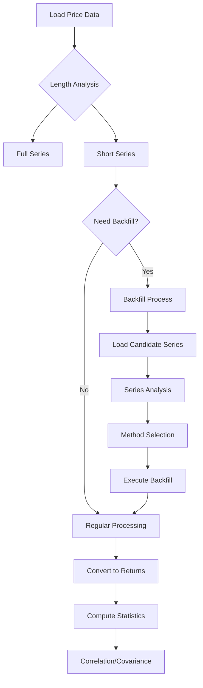
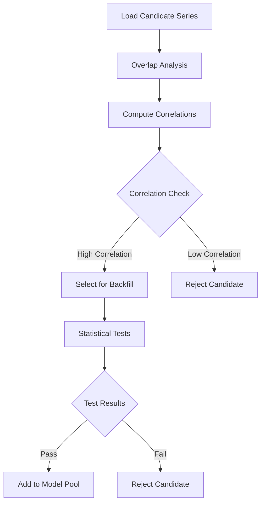
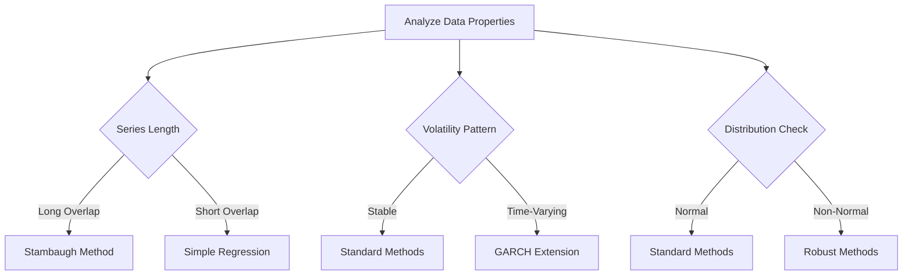

# Backfill Financial Time Series
## Draft User Requirements Document
### Version 1.0 - November 2024

## Table of Contents
1. [Introduction](#introduction)
2. [Process Workflows](#process-workflows)
3. [Functional Requirements](#functional-requirements)
4. [Key Features](#key-features)
5. [Configuration Requirements](#configuration-requirements)

## 1. Introduction

### 1.1 Purpose
This document outlines the requirements for implementing financial time series backfilling functionality within the existing price analysis framework. The system will provide automated and semi-automated methods for extending shorter time series using statistical relationships with longer series.

### 1.2 Scope
The functionality will integrate with existing price analysis capabilities and provide:
- Automated series length analysis
- Candidate series selection and validation
- Multiple backfilling methodologies
- Diagnostic tools and validation metrics
- Configuration options for method selection and validation

### 1.3 User Needs
- Identify and handle time series of different lengths
- Select appropriate reference series for backfilling
- Choose and apply suitable backfilling methods
- Validate backfilled data quality
- Maintain statistical properties of original series

## 2. Process Workflows

### 2.1 Main Process Flow

### 2.2 Candidate Analysis Flow

### 2.3 Method Selection Flow

## 3. Functional Requirements

### 3.1 Series Analysis Functions
| Function | Purpose | Input | Output |
|----------|---------|-------|--------|
| analyze_series_lengths | Identify series requiring backfill | dict[series_name: price_series] | dict[series_name: required_length] |
| identify_common_start | Find earliest common start date | dict[series_name: price_series] | datetime |
| calculate_overlap_periods | Calculate overlap between series | series1, series2 | int |
| detect_structural_breaks | Identify regime changes | price_series | list[break_points] |
| analyze_series_quality | Assess data quality metrics | price_series | dict[metric: value] |

### 3.2 Candidate Series Analysis Functions
| Function | Purpose | Input | Output |
|----------|---------|-------|--------|
| analyze_correlation_stability | Test correlation stability over time | target_series, candidate_series | dict[stability_metrics] |
| compute_prediction_power | Calculate R², adjusted R², F-stats | target_series, candidate_series | dict[prediction_metrics] |
| rank_candidate_series | Rank candidates by suitability | target_series, list[candidate_series] | list[ranked_candidates] |
| test_granger_causality | Test for Granger causality | target_series, candidate_series | dict[causality_metrics] |
| compute_information_criteria | Calculate AIC, BIC for model selection | model_results | dict[criteria_values] |

### 3.3 Method Selection Functions
| Function | Purpose | Input | Output |
|----------|---------|-------|--------|
| select_backfill_method | Choose appropriate backfill method | series_analysis, candidate_analysis | dict[method, parameters] |
| validate_method_assumptions | Test if method assumptions are met | method, target_series, candidate_series | dict[assumption_tests] |
| estimate_method_parameters | Estimate parameters for chosen method | method, target_series, candidate_series | dict[parameters] |
| compute_method_uncertainty | Calculate uncertainty metrics | method, parameters, data | dict[uncertainty_metrics] |

### 3.4 Diagnostic Functions
| Function | Purpose | Input | Output |
|----------|---------|-------|--------|
| compute_backfill_diagnostics | Calculate comprehensive diagnostics | original_series, backfilled_series | dict[diagnostics] |
| validate_distribution_match | Test if backfilled values match distribution | original_series, backfilled_series | dict[distribution_tests] |
| compute_confidence_intervals | Calculate confidence intervals | backfilled_series, method_uncertainty | dict[confidence_intervals] |
| assess_temporal_consistency | Check temporal consistency of backfill | backfilled_series | dict[consistency_metrics] |

## 4. Key Features

### 4.1 Automated Analysis
- Series length comparison
- Missing data pattern identification
- Statistical property analysis
- Method selection criteria

### 4.2 Validation Framework
- Correlation stability tests
- Distribution matching
- Temporal consistency checks
- Confidence interval generation

### 4.3 Method Selection
- Data-driven method selection
- Multiple method support
- Parameter optimization
- Uncertainty quantification

### 4.4 Integration Capabilities
- Seamless integration with existing functionality
- Matrix property preservation
- Comprehensive reporting
- Result validation

## 5. Configuration Requirements

### 5.1 Method Parameters
- Minimum correlation threshold
- Minimum R² requirement
- Overlap period requirements
- Maximum backfill length

### 5.2 Validation Parameters
- Distribution test significance levels
- Stability test parameters
- Confidence interval levels
- Quality metric thresholds

### 5.3 Processing Options
- Automatic/manual method selection
- Diagnostic test selection
- Output format specifications
- Report generation options

### 5.4 Integration Settings
- Matrix property requirements
- Correlation computation methods
- Output validation criteria
- Error handling preferences

## 6. Notes and Assumptions
1. Input data is properly formatted and cleaned
2. Sufficient computational resources are available
3. Required statistical libraries are accessible
4. User has basic understanding of statistical concepts
5. Integration with existing system is feasible

## 7. Future Considerations
1. Additional backfill methods
2. Machine learning integration
3. Real-time processing capabilities
4. Enhanced visualization tools
5. Automated parameter optimization
