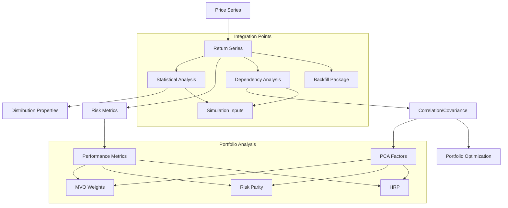

# Financial Time Series (FTS) Library - User Requirements

## 1. Overview & Objectives

### 1.1 Library Purpose
A Python library for financial time series analysis focusing on:
- Statistical analysis of return series
- Risk and performance metrics
- Portfolio optimization
- Multi-asset correlation and dependency analysis
- Integration capabilities with simulation and backfill packages

### 1.2 Core Capabilities
- Handle both price and return series data
- Support multiple return calculation methods (log, simple)
- Provide comprehensive statistical analysis
- Enable portfolio optimization with various closed form approaches
- Support different time frequencies (daily, weekly, monthly)
- Generate inputs required for external simulation packages
- Interface with specialized backfill package for handling missing data

### 1.3 Scope
The financial time series library performs all necessary calculations of price series to return series and provides comprehensive statistical, risk, and performance metrics. It includes functions for dependency analysis and portfolio optimization, supporting large datasets efficiently.

Key responsibilities:
- Price to returns conversion and analysis
- Statistical metrics calculation
- Risk and performance measurement
- Correlation and dependency analysis
- Portfolio optimization
- Distribution fitting and analysis
- Factor decomposition (PCA and fundamental)
- Generation of inputs for simulation packages

Out of scope (handled by separate packages):
- Missing data backfilling (separate specialized package)
- Return series simulation (separate simulation package)
- Advanced visualization
- Data sourcing and cleaning

### 1.4 Conventions
- All volatilities are annualized
- All Sharpe ratios and performance metrics are annualized
- Default return type is logarithmic
- Default frequency is daily
- Missing data handling is delegated to specialized package
- Distribution fitting is for parameter estimation only (simulation handled by separate package)

### 1.4 Expected Usage Patterns

1. Portfolio Analysis Workflow
   - Load multiple asset price series
   - Convert to returns and analyze statistical properties
   - Perform correlation analysis
   - Generate optimal portfolio weights
   - Monitor risk metrics

2. Risk Analysis Workflow
   - Load portfolio constituents
   - Calculate risk metrics and performance measures
   - Generate risk decomposition
   - Monitor drawdowns and volatility
   - Produce risk reports

3. Factor Analysis Workflow
   - Load large dataset of returns
   - Perform PCA decomposition
   - Generate factor loadings
   - Create synthetic benchmarks
   - Analyze factor contributions

4. Distribution Analysis Workflow
   - Analyze return series properties
   - Fit distributions
   - Generate inputs for simulation
   - Analyze dependencies through copulas

### 1.5 Data Volume Expectations
- Asset universe: Up to 5000+ securities
- History length: Up to 30 years monthly data, 10yrs for daily data
- Update frequency: Daily updates
- Concurrent calculations: Multiple portfolios/analyses simultaneously
- Memory constraints: Should handle typical workstation resources (32GB)

## 2. Core Data Flow

## 3. Function Groups

### 3.1 Series Conversion Functions

| Function               | Purpose                    | Input                           | Output               | Priority |
|------------------------|----------------------------|---------------------------------|----------------------|----------|
| price_to_return_series | Convert price to returns   | price_series, return_type       | return_series        | Critical |
| return_to_price_series | Convert returns to price   | return_series, initial_price    | price_series         | Critical |
| excess_returns         | Calculate excess returns   | return_series, risk_free_rate   | excess_return_series | Critical |
| alpha_returns          | Calculate relative returns | return_series, benchmark_series | alpha_return_series  | High     |
| synthetic_benchmark    | Generate benchmark series  | factor_loadings, factor_returns | benchmark_series     | Medium   |
| synthetic_returns      | Generate return series     | factor_loadings, factor_returns | return_series        | Medium   |

Would you like to review this first table before proceeding with the next function group?

### 3.2 Statistical Analysis Functions
| Function                 | Purpose                                | Input                  | Output             | Priority |
|--------------------------|----------------------------------------|------------------------|--------------------|----------|
| return_series_volatility | Calculate annualized volatility        | return_series          | volatility         | Critical |
| return_series_vol_vol    | Calculate volatility of volatility     | return_series, window  | vol_of_vol         | Medium   |
| return_series_skew       | Calculate skewness                     | return_series          | skewness           | High     |
| return_series_kurtosis   | Calculate kurtosis                     | return_series          | kurtosis           | High     |
| return_series_mean       | Calculate mean return                  | return_series          | mean               | Critical |
| return_series_median     | Calculate median return                | return_series          | median             | High     |
| return_series_stats      | Calculate comprehensive statistics     | return_series          | stats_dict         | High     |
| log_return_to_cumulative | Convert log returns to cumulative      | return_series, type    | cumulative_returns | Critical |
| histogram                | Generate return distribution histogram | return_series, buckets | histogram_data     | Medium   |

### 3.3 Risk and Performance Functions
| Function              | Purpose                                | Input                                         | Output            | Priority |
|-----------------------|----------------------------------------|-----------------------------------------------|-------------------|----------|
| sharpe_ratio          | Calculate Sharpe ratio                 | return_series, risk_free_rate                 | sharpe_ratio      | Critical |
| sharpe_ratio_adjusted | Adjust Sharpe for higher moments       | return_series, risk_free_rate, skew, kurtosis | adj_sharpe_ratio  | Medium   |
| sortino_ratio         | Calculate Sortino ratio                | return_series                                 | sortino_ratio     | High     |
| maximum_drawdown      | Calculate maximum drawdown             | return_series                                 | max_drawdown      | Critical |
| drawdown_duration     | Calculate drawdown duration            | return_series                                 | drawdown_duration | High     |
| drawdown_stats        | Calculate comprehensive drawdown stats | return_series                                 | drawdown_dict     | High     |
| information_ratio     | Calculate information ratio            | return_series, benchmark_series               | info_ratio        | High     |

### 3.4 Time-Varying Statistics Functions
| Function            | Purpose                        | Input                                  | Output                | Priority |
|---------------------|--------------------------------|----------------------------------------|-----------------------|----------|
| rolling_volatility  | Calculate rolling volatility   | return_series, window                  | rolling_vol_series    | Critical |
| rolling_correlation | Calculate rolling correlation  | return_series1, return_series2, window | rolling_corr_series   | High     |
| rolling_beta        | Calculate rolling beta         | return_series, market_series, window   | rolling_beta_series   | High     |
| rolling_sharpe      | Calculate rolling Sharpe ratio | return_series, risk_free_rate, window  | rolling_sharpe_series | Medium   |

### 3.5 Correlation and Dependency Functions
| Function                  | Purpose                           | Input                            | Output                  | Priority |
|---------------------------|-----------------------------------|----------------------------------|-------------------------|----------|
| correlation               | Calculate correlation matrix      | return_series                    | correlation_matrix      | Critical |
| rank_correlation          | Calculate rank correlation        | return_series, method            | rank_correlation_matrix | High     |
| correlation_to_covariance | Convert correlation to covariance | correlation_matrix, volatilities | covariance_matrix       | Critical |
| covariance_to_correlation | Convert covariance to correlation | covariance_matrix                | correlation_matrix      | Critical |
| semi_covariance           | Calculate semi-covariance matrix  | return_series, threshold         | semi_covariance_matrix  | Medium   |
| dtw_correlation           | Dynamic time warping correlation  | return_series1, return_series2   | dtw_correlation         | Low      |

### 3.6 Matrix Transformation Functions
| Function            | Purpose                       | Input                               | Output                             | Priority |
|---------------------|-------------------------------|-------------------------------------|------------------------------------|----------|
| correlation_cluster | Identify correlation clusters | correlation_matrix, threshold       | clusters                           | Medium   |
| shrink_covariance   | Apply covariance shrinkage    | covariance_matrix, shrinkage_target | shrunk_covariance_matrix           | High     |
| pca_decomposition   | Perform PCA analysis          | covariance_matrix                   | pca_components, explained_variance | Critical |
| factor_analysis     | Extract statistical factors   | return_series, n_factors            | factors, loadings                  | High     |

### 3.7 Distribution Fitting Functions
| Function          | Purpose                           | Input                            | Output       | Priority |
|-------------------|-----------------------------------|----------------------------------|--------------|----------|
| fit_gaussian      | Fit Gaussian distribution         | return_series                    | parameters   | High     |
| fit_student_t     | Fit Student-t distribution        | return_series                    | parameters   | High     |
| fit_skewed_t      | Fit skewed Student-t              | return_series                    | parameters   | Medium   |
| fit_nig           | Fit Normal Inverse Gaussian       | return_series                    | parameters   | Low      |
| distribution_test | Test distribution goodness of fit | return_series, distribution_type | test_results | Medium   |

### 3.8 Copula Functions
| Function             | Purpose                              | Input                      | Output             | Priority |
|----------------------|--------------------------------------|----------------------------|--------------------|----------|
| fit_gaussian_copula  | Fit Gaussian copula                  | return_series              | copula_params      | High     |
| fit_student_t_copula | Fit Student-t copula                 | return_series              | copula_params      | High     |
| fit_clayton_copula   | Fit Clayton copula                   | return_series              | copula_params      | Medium   |
| copula_dependency    | Calculate copula dependency measures | return_series, copula_type | dependency_metrics | Medium   |

### 3.9 Portfolio Optimization Functions
| Function                    | Purpose                        | Input                             | Output           | Priority |
|-----------------------------|--------------------------------|-----------------------------------|------------------|----------|
| mean_variance_optimization  | Calculate MVO weights          | return_series, constraints        | optimal_weights  | Critical |
| black_litterman             | Black-Litterman optimization   | return_series, views, confidences | optimal_weights  | High     |
| risk_parity_optimization    | Calculate risk parity weights  | return_series                     | weights          | High     |
| hierarchical_risk_parity    | Calculate HRP weights          | return_series                     | weights          | Medium   |
| marginal_risk_contribution  | Calculate marginal risk        | weights, covariance_matrix        | marginal_risks   | High     |
| component_risk_contribution | Calculate component risk       | weights, covariance_matrix        | component_risks  | High     |
| portfolio_volatility        | Calculate portfolio volatility | weights, covariance_matrix        | volatility       | Critical |
| expected_portfolio_return   | Calculate expected return      | weights, expected_returns         | portfolio_return | Critical |

### 3.10 Utility Functions
| Function                 | Purpose                            | Input                    | Output               | Priority |
|--------------------------|------------------------------------|--------------------------|----------------------|----------|
| volatility_target        | Calculate volatility target        | sharpe_ratio             | target_volatility    | High     |
| max_theoretical_drawdown | Calculate theoretical max drawdown | sharpe_ratio, volatility | theoretical_drawdown | Medium   |

### 3.11 Interest Rate Utility Functions
| Function               | Purpose                                 | Input                         | Output         | Priority |
|------------------------|-----------------------------------------|-------------------------------|----------------|----------|
| compounding_conversion | Convert between compounding frequencies | rate, from_freq, to_freq      | converted_rate | High     |
| forward_rate           | Calculate forward rate                  | spot_rates, periods           | forward_rate   | High     |
| zero_coupon_rate       | Convert BEY to zero coupon              | bey_rate, period              | zero_rate      | High     |
| bey_coupon_rate        | Convert zero coupon to BEY              | zero_rate, period             | bey_rate       | High     |
| bond_price             | Calculate bond price                    | cashflows, discount_rates     | price          | High     |
| time_value_of_money    | Calculate future value                  | principal, rate, time         | future_value   | Medium   |
| discount_rate          | Calculate discount rate                 | principal, future_value, time | rate           | Medium   |
| present_value          | Calculate present value                 | future_value, rate, time      | present_value  | Medium   |

### 3.12 Discounted Cash Flow Functions
| Function | Purpose                     | Input                                          | Output | Priority |
|----------|-----------------------------|------------------------------------------------|--------|----------|
| npv      | Calculate net present value | cash_flows, discount_rate, type                | npv    | High     |
| wacc     | Calculate WACC              | equity, debt, equity_cost, debt_cost, tax_rate | wacc   | High     |
| xirr     | Calculate irregular IRR     | cash_flows, dates, guess                       | xirr   | Medium   |

## 4. Integration Points

### 4.1 Simulation Package Integration
The library provides inputs required for external simulation packages:

| Input Type              | Description                                      | Source Functions               |
|-------------------------|--------------------------------------------------|--------------------------------|
| Distribution Parameters | Fitted distribution parameters for return series | fit_* functions                |
| Factor Structure        | PCA components and loadings                      | pca_decomposition              |
| Dependency Structure    | Copula parameters and correlation matrices       | correlation, fit_*_copula      |
| Risk Metrics            | Volatility, correlation, and other risk measures | Statistical analysis functions |

### 4.2 Backfill Package Integration
Missing data handling is delegated to a specialized package. The library provides:
- Standard data format interfaces
- Basic data validation
- Integration hooks for backfill operations
- Post-backfill statistical validation

## 5. Research References

### 5.1 Core Methodologies
- Stambaugh: Correlation and volatility analysis for different length histories
- Jorion: Bayes-Stein shrinkage estimation for returns and covariance
- Principal Component Regression (PCR) techniques
- Modern Portfolio Theory and extensions
- Risk-adjusted performance metrics

### 5.2 Advanced Topics
- Copula methods for dependency modeling
- Dynamic Time Warping for asynchronous series
- Hierarchical Risk Parity
- Black-Litterman portfolio optimization
- Higher moment adjustments for performance metrics

## 6. Implementation Considerations

### 6.1 Performance Requirements
- Efficient handling of large datasets (1000+ assets)
- Support for long historical series (20+ years daily data)
- Optimized matrix operations
- Caching of frequently accessed statistics

### 6.2 Numerical Considerations
- Numerical stability in optimization routines
- Precision in statistical calculations
- Handling of extreme values and outliers
- Robust correlation estimation

### 6.3 Integration Requirements
- Clean interfaces with simulation package
- Standardized data formats
- Efficient data transfer
- Consistent error handling

### 6.4 Validation Requirements
- Input data validation
- Statistical result validation
- Optimization constraint validation
- Integration point validation

