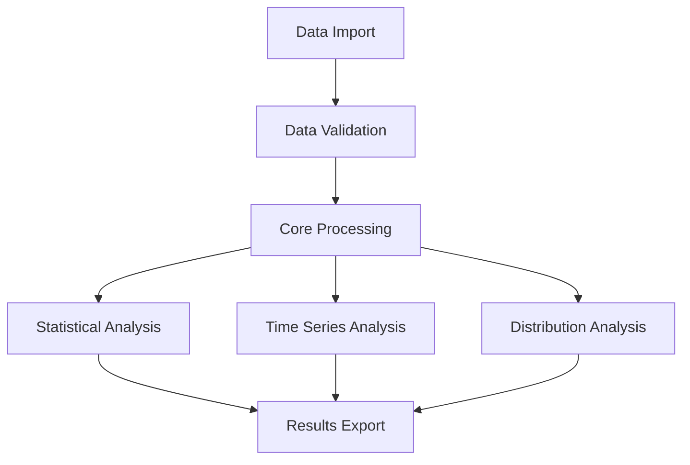
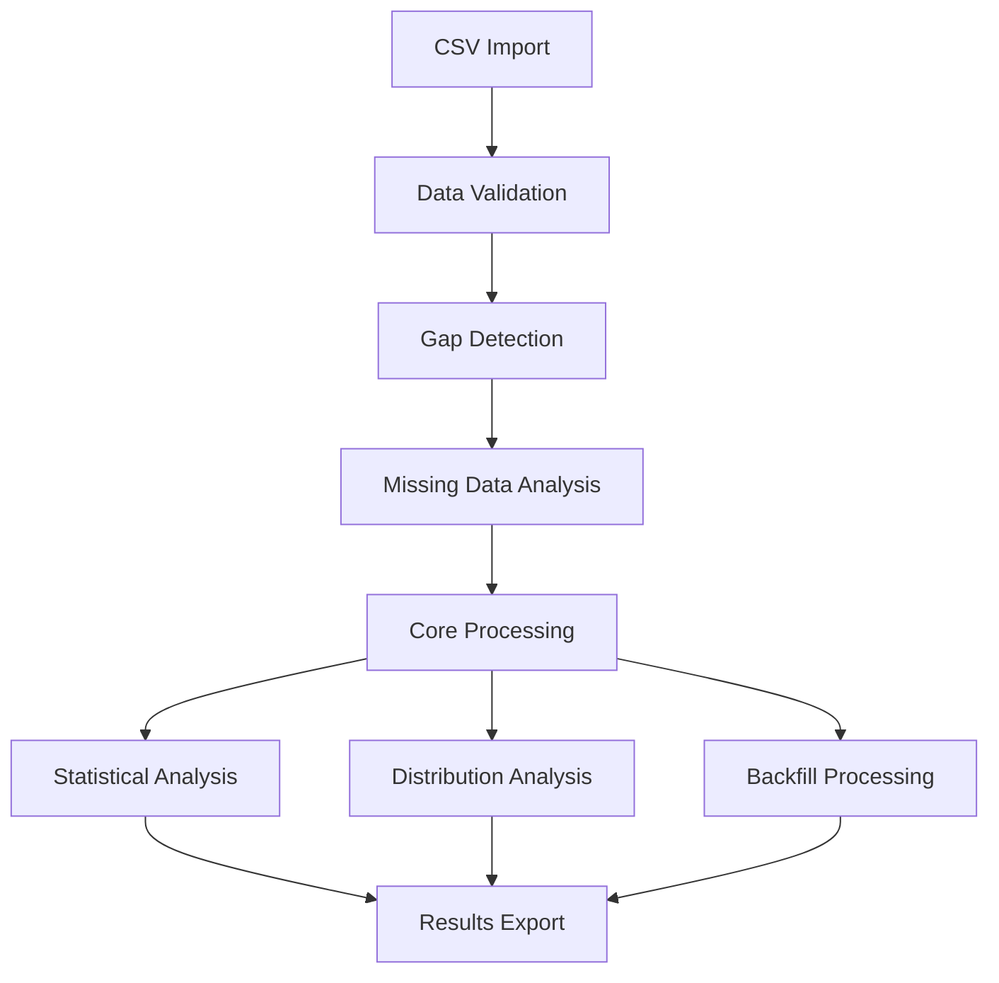
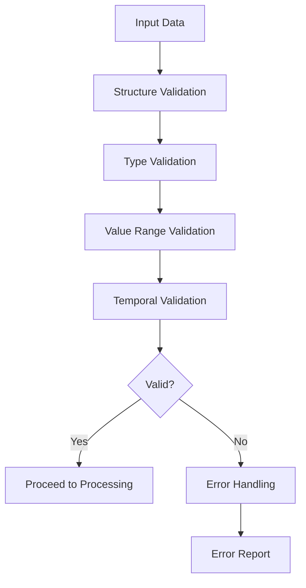
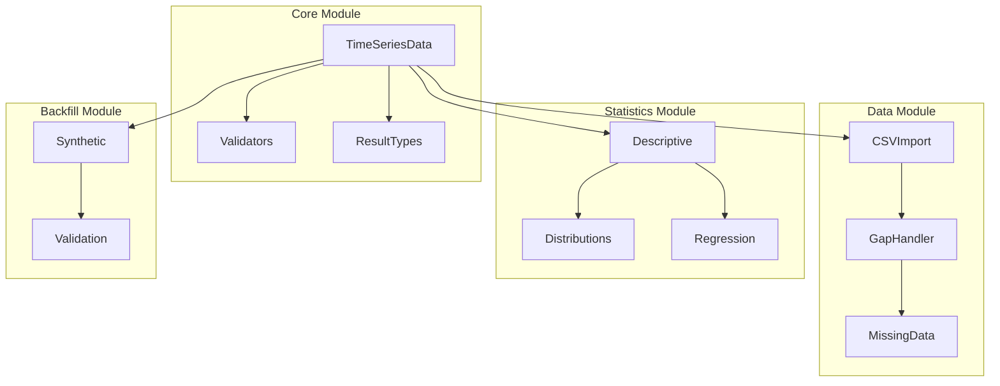

# Financial Time Series (FTS) Library - Specification & Architecture V2.0
Version: 2.0
Last Updated: 2024-11-14
Previous Version: 1.0

## Version Change Log
```
Added:
- Data import and validation module
- Gap handling functionality
- Missing data processing
- Backfill functionality for shorter series
- Status tracking for features
- Version history section

Modified:
- Removed portfolio optimization module
- Removed copula estimation module
- Removed interest rate functions
- Removed DCF functions
- Updated module dependencies
- Restructured core data flow

Deprecated:
- Portfolio optimization (moved to separate package)
- Copula estimation (moved to separate package)
- Interest rate functions (moved to separate package)
- DCF functions (moved to separate package)
```

## Table of Contents
1. [Introduction](#1-introduction)
2. [System Overview](#2-system-overview)
3. [Technical Specifications](#3-technical-specifications)
4. [Architecture](#4-architecture)
5. [Functional Specifications](#5-functional-specifications)
6. [Data Flow Specifications](#6-data-flow-specifications)
7. [Module Integration and Data Flow](#7-module-integration-and-data-flow)
8. [Interface Specifications](#8-interface-specifications)
9. [Implementation Planning Reference](#9-implementation-planning-reference)
10. [Conclusion](#10-conclusion)
11. [Appendix](#11-appendix)

## 1. Introduction

This document details the Specification and Architecture for Version 2.0 of the Financial Time Series (FTS) Library, reflecting significant changes in scope and functionality from Version 1.0.

### 1.1 Key Changes from Version 1.0

1. **Scope Reduction:**
   - Removed portfolio optimization (separate package)
   - Removed copula estimation (separate package)
   - Removed interest rate functions (separate package)
   - Removed DCF functions (separate package)

2. **New Features:**
   - CSV data import functionality
   - Gap handling for non-trading days
   - Missing data integration
   - Backfill functionality for shorter series

3. **Enhanced Core Features:**
   - Improved data validation
   - Extended statistical analysis
   - Robust error handling
   - Comprehensive data quality checks

### 1.2 Core Capabilities

| Capability | Description | Status | Version Added | Version Deprecated |
|------------|-------------|---------|---------------|-------------------|
| Price/Return Series | Handle both price and return data series | ACTIVE | 1.0 | - |
| Return Calculations | Support multiple return calculation methods | ACTIVE | 1.0 | - |
| Statistical Analysis | Comprehensive statistical metrics | ACTIVE | 1.0 | - |
| Time Frequency Support | Handle different time frequencies | ACTIVE | 1.0 | - |
| Data Import | Load and parse data from CSV files | NEW | 2.0 | - |
| Gap Handling | Process non-trading days | NEW | 2.0 | - |
| Backfill Shorter Series | Synthetic backfill functionality | NEW | 2.0 | - |
| Distribution Fitting | Fit and test distributions | ACTIVE | 1.0 | - |

## 2. System Overview

The FTS Library v2.0 focuses on core time series analysis capabilities while delegating specialized functions to separate packages. The system is designed to handle:

- Large datasets (5000+ securities)
- Multiple data frequencies
- Missing data and gaps
- Data quality validation
- Statistical analysis
- Time series transformations

## 3. Technical Specifications

Note: Detailed implementation specifications, including exact types, memory layouts,
and optimization strategies are provided in Implementation Plan sections 1.1 and 3.1.
Implementation follows the coding standards and requirements specified in the user
requirements document.

### 3.1 Type Definitions and Enums

```python
from enum import Enum, auto
from typing import NewType, Dict, List, Optional, Union, Tuple

# Core Types
TimeSeriesID = NewType('TimeSeriesID', str)
Timestamp = NewType('Timestamp', pd.Timestamp)
Value = NewType('Value', float)

# Enums
class SeriesType(Enum):
    PRICE = auto()
    RETURN = auto()
    FACTOR = auto()
    BENCHMARK = auto()
    SYNTHETIC = auto()
    ALPHA = auto()
    IDIOSYNCRATIC = auto()

class FrequencyType(Enum):
    DAILY = 'D'
    WEEKLY = 'W'
    MONTHLY = 'M'
    QUARTERLY = 'Q'
    ANNUAL = 'A'

class ValidationLevel(Enum):
    STRICT = auto()
    NORMAL = auto()
    RELAXED = auto()
```

#### 3.1.1 Technical Dependencies
| Package | Version | Usage |
|---------|---------|--------|
| numpy | >=1.21.0 | Core computations |
| pandas | >=1.3.0 | Time series handling |
| scipy | >=1.7.0 | Statistical functions |
| statsmodels | >=0.13.0 | GARCH/regression |
| fastdtw | >=0.3.0 | DTW implementation |

### 3.2 Data Quality Standards

#### 3.2.1 Missing Data Thresholds
| Metric | Threshold | Action |
|--------|-----------|--------|
| Missing Data % | < 5% | Warning |
| Missing Data % | 5-20% | Warning + Imputation Required |
| Missing Data % | > 20% | Error |

#### 3.2.2 Statistical Validity Thresholds
| Metric | Minimum Sample Size | Output |
|--------|-------------------|---------|
| Mean | None | Value + confidence level |
| Volatility | None | Value + confidence level |
| Higher Moments | 500 | Required for full moment adjustments |
| Correlation | None | Value + confidence level |

#### 3.2.3 Input Data Requirements
- Prices must be adjusted close prices
- Adjustments for dividends and corporate actions must be pre-applied
- Zero or negative prices will trigger validation errors
- Missing data points are allowed for non-trading periods
- Calculations use all available actual data points
- No automatic forward/backward filling of missing data

#### 3.2.4 Backfill Requirements
- Minimum 30 periods overlap required
- Additional 10 periods per explanatory variable
- Single method implementation as detailed in "Backfilling Shorter Time-Series Data"
- Regression diagnostics must meet minimum R² threshold of 0.3
- T-statistics must be significant at 95% confidence level

#### 3.2.5 Analysis Conventions
| Type | Convention | Notes |
|------|------------|-------|
| Volatility | Annualized | All volatilities must be annualized |
| Sharpe Ratios | Annualized | All performance metrics annualized |
| Returns | Logarithmic | Default return type, with full moment adjustments for conversions |
| Frequency | Daily | Default frequency |
| Distribution Fitting | Parameter estimation only | Simulation handled by separate package |
| Series Statistics | Full available data | Calculate using all available data points |
| Correlation Analysis | Overlapping periods only | Exclude dates where any asset has null value |
| Frequency Conversion | Last-day-of-period | Standard method for all conversions |

#### 3.2.6 Minimum Sample Requirements
| Analysis Type | Minimum Observations | Notes |
|--------------|---------------------|--------|
| Basic Statistics | 20 | For mean, volatility calculations |
| Return Conversions | 500 | For higher moment adjustments |
| Correlation Analysis | 30 | For pairwise correlations |
| Simple Regression | 30 | Single independent variable |
| Multiple Regression | 30 + 10 × (n_variables) | For n independent variables |
| PCA Analysis | 50 | For factor decomposition |
| Volatility Forecasting | 60 | For GARCH/HAR models |

#### 3.2.7 Missing Data Treatment
| Level | Treatment | Threshold |
|-------|-----------|-----------|
| Time Series Alignment | Include all dates with any observation | Primary |
| Return Calculations | Use available points only | No interpolation |
| Correlation Analysis | Pairwise complete observations | Required |
| PCA/Regression | Complete cases only | Required |

#### 3.2.8 Warning Thresholds
| Condition | Threshold | Action |
|-----------|-----------|--------|
| Data Gaps | > 5 consecutive days | Warning |
| Missing Pattern | > 5% missing | Analysis required |
| Series Length Discrepancy | > 20% difference | Warning |
| Return Size | > |20%| | Conversion warning |

### 3.3 Performance Standards

#### 3.3.1 Processing Time Limits
| Operation | Data Size | Max Time |
|-----------|-----------|----------|
| CSV Import | 1GB | 30s |
| Statistical Analysis | 1M rows | 60s |
| Backfill Generation | 10 years daily | 120s |

#### 3.3.2 Memory Usage Limits
| Operation | Max Memory |
|-----------|------------|
| Base Usage | System Memory Dependent |
| Peak Usage | Up to 75% of System Memory |
| Large Dataset | Up to 90% of System Memory |
| Note: Default memory limits are configurable based on system capabilities |

#### 3.3.3 Computation Optimization
| Method | Usage |
|--------|--------|
| Vectorization | Primary optimization method |
| Numba | For computation-heavy functions |
| GPU Acceleration | If available, for large matrix operations |

Priority order for optimization:
1. Vectorized operations using numpy/pandas
2. Numba-accelerated functions for heavy computations
3. GPU acceleration for large matrix operations where available

### 3.4 Logging Configuration

```python
LOGGING_CONFIG = {
    'version': 1,
    'disable_existing_loggers': False,
    'formatters': {
        'standard': {
            'format': '%(asctime)s [%(levelname)s] %(name)s: %(message)s'
        },
    },
    'handlers': {
        'default': {
            'level': 'INFO',
            'formatter': 'standard',
            'class': 'logging.StreamHandler',
        },
        'file': {
            'level': 'DEBUG',
            'formatter': 'standard',
            'class': 'logging.handlers.RotatingFileHandler',
            'filename': 'fts.log',
            'maxBytes': 10485760,  # 10MB
            'backupCount': 5,
        },
    },
    'loggers': {
        '': {  # root logger
            'handlers': ['default', 'file'],
            'level': 'INFO',
            'propagate': True
        },
        'fts': {
            'handlers': ['default', 'file'],
            'level': 'DEBUG',
            'propagate': False
        },
    }
}
```

### 3.5 Error Handling Specifications

#### 3.5.1 Error Hierarchy
```python
class FTSError(Exception):
    """Base exception for all FTS errors."""
    pass

class ValidationError(FTSError):
    """Data validation errors."""
    pass

class ProcessingError(FTSError):
    """Data processing errors."""
    pass

class ConfigurationError(FTSError):
    """Configuration related errors."""
    pass
```

#### 3.5.2 Error Recovery Procedures
| Error Type | Recovery Action | User Notification |
|------------|----------------|-------------------|
| ValidationError | Retry with relaxed validation | Warning message |
| ProcessingError | Retry with smaller chunk size | Error message + log |
| ConfigurationError | Load defaults | Warning + log |

#### 3.5.3 Error Handling Strategy
- Fail-fast approach for all validation errors
- No automatic recovery attempts
- Clear error messages detailing:
  * Exact nature of the error
  * Required conditions
  * Actual values that caused the error
- Logging of all errors with full context

### 3.6 Testing Requirements

#### 3.6.1 Coverage Requirements
| Component | Min Coverage |
|-----------|-------------|
| Core | 95% |
| Statistics | 90% |
| Data Import | 85% |
| Utils | 80% |

#### 3.6.2 Performance Test Scenarios
| Scenario | Description | Success Criteria |
|----------|-------------|-----------------|
| Large Import | Import 5000 series, 10 years daily | < 5 minutes |
| Bulk Analysis | Analyze 1000 series statistics | < 2 minutes |
| Memory Test | Process 1GB dataset | < 4GB peak memory |

### 3.7 Configuration Management

```python
@dataclass(frozen=True)
class FTSConfig:
    """Global configuration settings."""
    validation_level: ValidationLevel = ValidationLevel.NORMAL
    max_memory_gb: int = 4
    chunk_size: int = 100000
    cache_size: int = 1000
    log_level: str = "INFO"
    # DTW Configuration
    dtw_window_sizes: Dict[str, int] = field(default_factory=lambda: {
        'daily': 20,
        'weekly': 8,
        'monthly': 3
    })

    # Volatility Forecasting
    har_lags: Dict[str, int] = field(default_factory=lambda: {
        'daily': 1,
        'weekly': 5,
        'monthly': 22
    })
    garch_params: Dict[str, int] = field(default_factory=lambda: {
        'p': 1,
        'q': 1
    })

    # Covariance Shrinkage
    shrinkage_target: str = 'constant_correlation'
    condition_number_threshold: float = 1e6

    @classmethod
    def from_file(cls, path: str) -> 'FTSConfig':
        """Load configuration from file."""
        with open(path) as f:
            config_dict = yaml.safe_load(f)
        return cls(**config_dict)

    def validate(self) -> None:
        """Validate configuration values."""
        if self.max_memory_gb < 1:
            raise ConfigurationError("max_memory_gb must be >= 1")
        if self.chunk_size < 1000:
            raise ConfigurationError("chunk_size must be >= 1000")
```

### 3.8 Statistical Calculation Standards

Note: Detailed mathematical formulas and implementation details for all statistical
calculations are provided in Implementation Plan sections 1.2 and Appendix A.
Implementation follows methodologies detailed in the background notes.

#### 3.8.1 Return and Volatility Calculations
| Calculation | Method | Error Conditions |
|-------------|---------|-----------------|
| Returns | Close-to-close | Zero or negative prices |
| Volatility | Close-to-close standard deviation | Insufficient data points |
| Correlation | Pearson (default) | Insufficient overlapping points |
| Rank Correlation | Spearman (default), Kendall (optional) | Insufficient overlapping points |

#### 3.8.2 Data Point Requirements
| Calculation | Minimum Points | Notes |
|-------------|----------------|-------|
| Basic Returns | 2 consecutive points | Error if missing |
| Volatility | 60 points | As per section 3.2.2 |
| Correlation | 252 points | As per section 3.2.2 |
| Regression | 30 + 10 × (n_variables) | For backfill operations |

#### 3.8.3 Correlation and Covariance Calculations
| Method | Description | Configuration |
|--------|-------------|---------------|
| Pearson | Standard correlation | Default |
| DTW | Dynamic Time Warping correlation | window_size: {'daily': 20, 'weekly': 8, 'monthly': 3}<br>standardization: required<br>negative_correlation: handled via inverse similarity |
| Ledoit-Wolf | Shrinkage estimation | shrinkage_target: {'constant_correlation', 'identity', 'custom'}<br>condition_number_threshold: 1e6<br>min_observations: 252 |

#### 3.8.4 Volatility Forecasting

##### Forecast Window Management
| Window Type | Structure | Requirements |
|------------|-----------|--------------|
| Input RV | Rolling window | Previous 20 days |
| Forecast | Non-overlapping | Complete future window |
| Business Days | Skip non-trading | Date alignment required |

##### Model Selection Criteria
| Model | Use Case | Validation |
|-------|----------|------------|
| GARCH | High-frequency data | MLE convergence check |
| HAR | Daily/weekly forecasts | R² threshold check |
| Combined | Long-horizon forecasts | Model comparison required |

#### 3.8.5 PCA Analysis
| Component | Description | Parameters |
|-----------|-------------|------------|
| Variance Explained | Cumulative explained variance | Reported for all factors |
| Factor Selection | User-defined threshold | Typical values: 0.80, 0.90, 0.95 |
| Residual Analysis | Idiosyncratic returns | Calculated per asset |

#### 3.8.6 Advanced Statistical Methods
| Method | Description | Requirements |
|--------|-------------|--------------|
| DTW Correlation | Time-warped similarity | - Standardized returns<br>- Minimum 252 observations<br>- Memory: O(n²) per pair |
| Volatility Forecast | GARCH/HAR predictions | - Clean price history<br>- No missing values in forecast window<br>- Proper date alignment |
| Covariance Shrinkage | Ledoit-Wolf estimation | - Positive definite target<br>- Sufficient observations<br>- Matrix conditioning checks |

#### 3.8.7 Return Conversions and Adjustments

##### Return Conversion Formulas
| Type | Formula | Description |
|------|---------|-------------|
| Arithmetic to Geometric | Rg = Ra - σ²/2 - (γ₁σ³)/6 - (γ₂σ⁴)/24 | Full moment adjustment |
| Simple Conversion | Rg = Ra - σ²/2 | Variance drag only |
| Higher Moment | Rg = Ra - σ²/2 - γ₁σ³/6 | Up to third moment |

where:
- Rg = geometric return
- Ra = arithmetic return
- σ = volatility
- γ₁ = skewness
- γ₂ = excess kurtosis

For detailed implementation, see docs/internal_references/methodologies/Arithmetic_to_Geometric_returns.md

##### Sharpe Ratio Adjustments
| Type | Formula | Application |
|------|---------|------------|
| Standard | Ra/σ | Basic comparison |
| Geometric | (Rg)/σ | Multi-period analysis |
| Adjusted | (Rg - γ₁σ³/6 - γ₂σ⁴/24)/σ | Heavy-tailed distributions |

##### Higher Moment Adjustments
| Moment | Impact | Implementation |
|--------|--------|----------------|
| Variance (2nd) | Primary drag (σ²/2) | Required for all conversions |
| Skewness (3rd) | Asymmetry (γ₁σ³/6) | Optional, improves accuracy |
| Kurtosis (4th) | Tail risk (γ₂σ⁴/24) | Optional, heavy-tail cases |

#### 3.8.8 Sharpe Ratio Calculations
| Type | Description | Formula |
|------|-------------|---------|
| Standard | Arithmetic return based | Ra/σ |
| Geometric | Geometric return based | Rg/σ |
| Adjusted | Geometric return with higher moment adjustments | (Rg - kurtosis_drag - skew_drag)/σ_adjusted |

#### 3.8.9 Risk-Free Rate Specifications
| Requirement | Specification | Notes |
|------------|---------------|-------|
| Format | Annualized decimal | e.g., 0.05 for 5% |
| Input Options | Series or constant | Must align with return dates |
| Default Value | 0 if not provided | Warning issued |
| Required For | Sharpe ratio, excess returns | Validation check |

### 3.9 Usage Patterns and Workflows

#### 3.9.1 Time Series Analysis Workflow
| Step | Input | Output |
|------|-------|--------|
| Load Data | CSV files | TimeSeriesData |
| Convert Returns | Price series | Return series |
| Calculate Statistics | Return series | StatisticalResults |
| Generate Outputs | Results | Standardized format |

#### 3.9.2 Synthetic Historical Series Generation
| Step | Input | Output |
|------|-------|--------|
| Load Series | Target + Reference | Aligned TimeSeriesData |
| Analyze Relationships | Overlapping period | RegressionResults |
| Generate History | Regression + Parameters | Synthetic series |
| Validate | Generated series | ValidationResults |

#### 3.9.3 Multi-Asset Analysis Workflow
| Step | Requirements | Output |
|------|--------------|--------|
| Individual Statistics | Full available data per series | Per-series statistics with dates |
| Frequency Harmonization | Convert to lowest common frequency | Aligned series |
| Correlation Analysis | Minimum observations based on matrix size | Correlation matrix with metadata |
| Multiple Frequency Analysis | Generate statistics at all frequencies | Multi-frequency results |

##### Frequency Conversion Rules
| From | To | Method | Validation |
|------|-----|--------|------------|
| Daily | Weekly | Last day of period | Require minimum 2 daily points per period |
| Weekly | Monthly | Last week of period | Require 4 weekly points |
| Daily | Monthly | Last day of period | Require 20 daily points |

#### 3.9.4 Distribution Analysis Workflow
| Analysis Level | Requirements | Output |
|----------------|--------------|---------|
| Original Frequency | Full series | Distribution parameters |
| Lower Frequencies | Converted series | Parameters per frequency |
| Comparative Analysis | Matching frequencies | Distribution similarity tests |

##### Distribution Analysis Requirements
| Component | Threshold | Validation |
|-----------|-----------|------------|
| Sample Size | 500 minimum | Error if insufficient |
| Frequency Match | Same frequency for comparison | Warning if mismatched |
| Parameter Stability | Rolling window tests | Warning if unstable |

#### 3.9.5 Multi-Asset Statistical Integration
| Integration Point | Requirement | Validation |
|------------------|-------------|------------|
| Cross-Asset Analysis | Minimum 30 overlapping points | Error if insufficient |
| Mixed Frequencies | Convert to common frequency | Validate conversion |
| Length Discrepancies | Use maximum available data | Document coverage |

#### Integration Requirements
| Analysis Type | Data Requirements | Output Format |
|--------------|-------------------|---------------|
| Correlation Matrix | Aligned observation dates | Matrix with coverage metadata |
| PCA Decomposition | Complete cases only | Factors with explained variance |
| Risk Metrics | Matching frequency data | Comparable risk measures |

## 4. Architecture

### 4.1 High-Level Architecture



### 4.2 Module Structure

```
project_root/
├── src/
│   └── fts/                    # Main package
│       ├── __init__.py
│       ├── core/              # Core functionality
│       │   ├── __init__.py
│       │   ├── data.py       # Base data structures
│       │   ├── result_types.py # Result containers
│       │   └── validators.py  # Validation framework
│       ├── data/             # Data handling
│       │   ├── __init__.py
│       │   ├── import_csv.py # CSV import
│       │   ├── gap_handler.py # Gap handling
│       │   └── missing_data.py # Missing data
│       ├── statistics/       # Statistical analysis
│       │   ├── __init__.py
│       │   ├── descriptive.py # Basic statistics
│       │   ├── distributions.py # Distribution analysis
│       │   └── regression.py # Regression analysis
│       ├── dtw/             # Dynamic Time Warping
│       │   ├── __init__.py
│       │   ├── correlation.py # DTW correlation
│       │   ├── distance.py   # DTW distance calculations
│       │   └── optimization.py # DTW optimizations
│       ├── volatility/      # Volatility modeling
│       │   ├── __init__.py
│       │   ├── garch.py     # GARCH models
│       │   ├── har.py       # HAR-RV models
│       │   └── forecasting.py # Volatility forecasting
│       ├── backfill/        # Backfill functionality
│       │   ├── __init__.py
│       │   ├── synthetic.py # Synthetic data generation
│       │   └── validation.py # Backfill validation
│       └── utils/           # Utilities
│           ├── __init__.py
│           ├── optimization.py # Performance optimization
│           └── memory.py    # Memory management
```

### 4.3 Module Descriptions

#### 4.3.1 Core Module
| Component | Purpose | Key Responsibilities |
|-----------|---------|---------------------|
| data.py | Base data structures | - Time series containers<br>- Data validation<br>- Basic transformations |
| result_types.py | Result containers | - Statistical results<br>- Analysis outputs<br>- Validation results |
| validators.py | Validation framework | - Data quality checks<br>- Format validation<br>- Constraint checking |

#### 4.3.2 Data Module
| Component | Purpose | Key Responsibilities |
|-----------|---------|---------------------|
| import_csv.py | CSV data import | - File parsing<br>- Data validation<br>- Format handling |
| gap_handler.py | Gap processing | - Gap detection<br>- Trading day handling<br>- Gap filling |
| missing_data.py | Missing data handling | - Detection<br>- Imputation<br>- Quality reporting |

#### 4.3.3 Statistics Module
| Component | Purpose | Key Responsibilities |
|-----------|---------|---------------------|
| descriptive.py | Basic statistics | - Moments calculation<br>- Risk metrics<br>- Time series stats |
| distributions.py | Distribution analysis | - Distribution fitting<br>- Parameter estimation<br>- Testing |
| regression.py | Regression analysis | - Model fitting<br>- Parameter estimation<br>- Diagnostics |

#### 4.3.4 Backfill Module
| Component | Purpose | Key Responsibilities |
|-----------|---------|---------------------|
| synthetic.py | Synthetic data generation | - History generation<br>- Statistical matching<br>- Series extension |
| validation.py | Backfill validation | - Quality checks<br>- Statistical validation<br>- Consistency tests |

#### 4.3.5 Utils Module
| Component | Purpose | Key Responsibilities |
|-----------|---------|---------------------|
| optimization.py | Performance optimization | - Computation optimization<br>- Memory efficiency<br>- Parallelization |
| memory.py | Memory management | - Resource monitoring<br>- Cache management<br>- Memory limits |

#### 4.3.6 DTW Module
| Component | Purpose | Key Responsibilities |
|-----------|---------|---------------------|
| correlation.py | DTW correlation | - DTW correlation calculation<br>- Negative correlation handling<br>- Matrix building |
| distance.py | Distance calculations | - Core DTW algorithm<br>- Window size management<br>- Distance metrics |
| optimization.py | Performance optimization | - Fast DTW implementation<br>- Memory optimization<br>- Parallel processing |

#### 4.3.7 Volatility Module
| Component | Purpose | Key Responsibilities |
|-----------|---------|---------------------|
| garch.py | GARCH modeling | - GARCH(p,q) implementation<br>- Parameter estimation<br>- Model diagnostics |
| har.py | HAR-RV modeling | - HAR component calculation<br>- Model estimation<br>- Residual analysis |
| forecasting.py | Volatility forecasting | - Forecast generation<br>- Model selection<br>- Forecast evaluation |

### 4.4 Data Structures

#### 4.4.1 Core Data Classes

```python
@dataclass(frozen=True)
class TimeSeriesData:
    """Primary container for time series data."""
    data: pd.DataFrame
    series_type: SeriesType
    frequency: str
    metadata: Dict[str, Any] = field(default_factory=dict)

@dataclass(frozen=True)
class ValidationResult:
    """Validation results container."""
    is_valid: bool
    errors: List[str]
    warnings: List[str]
    metadata: Dict[str, Any] = field(default_factory=dict)

@dataclass(frozen=True)
class StatisticalResults:
    """Statistical analysis results."""
    mean: float
    volatility: float
    skewness: float
    kurtosis: float
    sample_size: int
    period: Tuple[datetime, datetime]
    metadata: Dict[str, Any] = field(default_factory=dict)
```

#### 4.4.2 Data Import and Processing Classes

```python
@dataclass(frozen=True)
class ImportConfig:
    """Configuration for data import."""
    date_column: str
    value_columns: List[str]
    frequency: str
    date_format: str
    metadata: Dict[str, Any] = field(default_factory=dict)

@dataclass(frozen=True)
class GapAnalysis:
    """Gap analysis results."""
    gaps_detected: List[Tuple[datetime, datetime]]
    gap_statistics: Dict[str, float]
    treatment_applied: str
    metadata: Dict[str, Any] = field(default_factory=dict)

@dataclass(frozen=True)
class MissingDataReport:
    """Missing data analysis results."""
    missing_percentage: float
    missing_patterns: Dict[str, int]
    imputation_method: str
    metadata: Dict[str, Any] = field(default_factory=dict)
```

#### 4.4.3 Statistical Analysis Classes

```python
@dataclass(frozen=True)
class DistributionFit:
    """Distribution fitting results."""
    distribution_type: str
    parameters: Dict[str, float]
    goodness_of_fit: Dict[str, float]
    test_statistics: Dict[str, float]
    metadata: Dict[str, Any] = field(default_factory=dict)

@dataclass(frozen=True)
class RegressionResults:
    """Regression analysis results."""
    coefficients: pd.Series
    std_errors: pd.Series
    t_stats: pd.Series
    p_values: pd.Series
    r_squared: float
    adjusted_r_squared: float
    residuals: pd.Series
    metadata: Dict[str, Any] = field(default_factory=dict)

@dataclass(frozen=True)
class RiskMetrics:
    """Risk analysis results."""
    volatility: float
    annualized_volatility: float
    skewness: float
    kurtosis: float
    var_95: float
    cvar_95: float
    max_drawdown: float
    period: Tuple[datetime, datetime]
    metadata: Dict[str, Any] = field(default_factory=dict)

@dataclass(frozen=True)
class DTWCorrelationResults:
    """DTW correlation calculation results."""
    correlation_matrix: np.ndarray
    window_sizes: Dict[str, int]
    standardization_params: Dict[str, Any]
    computation_time: float
    metadata: Dict[str, Any] = field(default_factory=dict)

@dataclass(frozen=True)
class VolatilityForecastResults:
    """Volatility forecast results."""
    forecasts: pd.Series
    model_type: str  # 'GARCH' or 'HAR'
    model_params: Dict[str, Any]
    forecast_dates: pd.DatetimeIndex
    metadata: Dict[str, Any] = field(default_factory=dict)

@dataclass(frozen=True)
class CovarianceShrinkageResults:
    """Covariance shrinkage results."""
    shrunk_matrix: np.ndarray
    shrinkage_intensity: float
    target_used: str
    condition_number: float
    metadata: Dict[str, Any] = field(default_factory=dict)

@dataclass(frozen=True)
class PCAResults:
    """PCA analysis results."""
    eigenvalues: np.ndarray
    eigenvectors: np.ndarray
    explained_variance_ratio: np.ndarray
    n_components: int
    factor_loadings: pd.DataFrame
    factor_returns: pd.DataFrame
    residual_returns: pd.DataFrame
    metadata: Dict[str, Any] = field(default_factory=dict)
```

#### 4.4.4 Backfill Analysis Classes

```python
@dataclass(frozen=True)
class BackfillResults:
    """Synthetic backfill results."""
    synthetic_data: pd.DataFrame
    fit_statistics: Dict[str, float]
    validation_results: ValidationResult
    overlap_period: Tuple[datetime, datetime]
    metadata: Dict[str, Any] = field(default_factory=dict)

@dataclass(frozen=True)
class BackfillValidation:
    """Backfill validation results."""
    statistical_consistency: Dict[str, float]
    temporal_validity: Dict[str, bool]
    quality_metrics: Dict[str, float]
    overlap_analysis: Dict[str, float]
    metadata: Dict[str, Any] = field(default_factory=dict)
```

### 4.5 External Dependencies

#### 4.5.1 Core Dependencies

| Package | Version | Purpose |
|---------|---------|---------|
| pandas | >=1.5.0 | Data manipulation and analysis |
| numpy | >=1.21.0 | Numerical computations |
| scipy | >=1.7.0 | Statistical functions |
| statsmodels | >=0.13.0 | Statistical modeling |

#### 4.5.2 Optional Dependencies

| Package | Version | Purpose |
|---------|---------|---------|
| scikit-learn | >=1.0.0 | Machine learning utilities |
| numba | >=0.55.0 | Performance optimization |
| hypothesis | >=6.0.0 | Property-based testing |

## 5. Functional Specifications

### 5.1 Data Import and Validation

#### 5.1.1 CSV Import Functions

| Function | Purpose | Input | Output |
|----------|---------|-------|--------|
| load_csv_data | Load data from CSV file | file_path: str<br>config: ImportConfig | TimeSeriesData |
| validate_csv_format | Validate CSV structure | file_path: str<br>expected_format: Dict | ValidationResult |
| parse_csv_dates | Parse and validate dates | date_column: Series<br>date_format: str | Series[datetime] |

#### 5.1.2 Gap Handling Functions

| Function | Purpose | Input | Output |
|----------|---------|-------|--------|
| detect_gaps | Identify trading gaps | data: TimeSeriesData | GapAnalysis |
| fill_gaps | Apply gap filling method | data: TimeSeriesData<br>method: str | TimeSeriesData |
| validate_gap_treatment | Validate gap handling | original: TimeSeriesData<br>filled: TimeSeriesData | ValidationResult |

#### 5.1.3 Missing Data Functions

| Function | Purpose | Input | Output |
|----------|---------|-------|--------|
| analyze_missing_data | Analyze missing patterns | data: TimeSeriesData | MissingDataReport |
| impute_missing_values | Fill missing values | data: TimeSeriesData<br>method: str | TimeSeriesData |
| validate_imputation | Validate imputed values | original: TimeSeriesData<br>imputed: TimeSeriesData | ValidationResult |

### 5.2 Statistical Analysis

Note: Detailed algorithm implementations, including exact formulas, edge cases,
and numerical considerations are provided in Implementation Plan sections 1.2, 1.3,
and Appendix A. Implementations align with methodologies from background notes.

#### 5.2.1 Basic Statistics Functions

| Function | Purpose | Input | Output |
|----------|---------|-------|--------|
| compute_moments | Calculate statistical moments | data: TimeSeriesData | StatisticalResults |
| calculate_risk_metrics | Compute risk measures | data: TimeSeriesData | RiskMetrics |
| analyze_distributions | Analyze return distributions | data: TimeSeriesData | DistributionFit |

#### 5.2.2 Time Series Analysis Functions

| Function | Purpose | Input | Output |
|----------|---------|-------|--------|
| compute_rolling_stats | Calculate rolling statistics | data: TimeSeriesData<br>window: int | pd.DataFrame |
| analyze_autocorrelation | Compute autocorrelation | data: TimeSeriesData<br>lags: int | Dict[str, float] |
| detect_seasonality | Identify seasonal patterns | data: TimeSeriesData | Dict[str, Any] |
| calculate_drawdown | Compute drawdown metrics | data: TimeSeriesData | RiskMetrics |
| compute_volatility | Calculate volatility measures | data: TimeSeriesData<br>annualize: bool | RiskMetrics |

#### 5.2.3 Distribution Analysis Functions

| Function | Purpose | Input | Output |
|----------|---------|-------|--------|
| fit_distribution | Fit statistical distribution | data: TimeSeriesData<br>dist_type: str | DistributionFit |
| test_distribution_fit | Test goodness of fit | data: TimeSeriesData<br>dist_params: Dict | Dict[str, float] |
| compare_distributions | Compare multiple distributions | data: TimeSeriesData<br>dist_types: List[str] | List[DistributionFit] |

#### 5.2.4 Advanced Statistical Functions
| Function | Purpose | Input | Output |
|----------|---------|-------|--------|
| calculate_dtw_correlation | Calculate DTW correlation matrix | data: TimeSeriesData<br>window_size: Optional[Dict[str, int]] | DTWCorrelationResults |
| forecast_volatility | Generate volatility forecasts | data: TimeSeriesData<br>method: str<br>horizon: int | VolatilityForecastResults |
| shrink_covariance | Apply Ledoit-Wolf shrinkage | data: TimeSeriesData<br>target: str | CovarianceShrinkageResults |
| calculate_har_components | Calculate HAR components | realized_vol: pd.Series<br>frequency: str | Dict[str, pd.Series] |
| fit_garch_model | Fit GARCH(1,1) model | returns: pd.Series | Dict[str, Any] |

#### 5.2.5 PCA and Factor Analysis Functions
| Function | Purpose | Input | Output |
|----------|---------|-------|--------|
| perform_pca | Perform PCA decomposition | standardized_returns: pd.DataFrame<br>threshold: float | PCAResults |
| calculate_factor_loadings | Generate factor loadings | pca_results: PCAResults<br>returns: pd.DataFrame | pd.DataFrame |
| generate_factor_returns | Calculate factor returns | loadings: pd.DataFrame<br>returns: pd.DataFrame | pd.DataFrame |
| calculate_residual_returns | Compute residual returns | returns: pd.DataFrame<br>factor_returns: pd.DataFrame<br>loadings: pd.DataFrame | pd.DataFrame |
| validate_pca_results | Validate PCA outputs | pca_results: PCAResults<br>original_data: pd.DataFrame | ValidationResult |

#### 5.2.6 Volatility Forecasting Functions
| Function | Purpose | Input | Output |
|----------|---------|-------|--------|
| forecast_garch | GARCH(1,1) forecasts | returns: pd.Series<br>horizon: int | VolatilityForecastResults |
| forecast_har | HAR model forecasts | realized_vol: pd.Series<br>horizon: int | VolatilityForecastResults |
| calculate_realized_vol | Calculate realized volatility | returns: pd.Series<br>window: int | pd.Series |
| validate_forecast_dates | Validate forecast dates | forecast_dates: pd.DatetimeIndex<br>frequency: str | ValidationResult |
| align_forecast_windows | Align forecast windows | input_dates: pd.DatetimeIndex<br>horizon: int | pd.DatetimeIndex |

#### 5.2.7 Return Conversion Functions
| Function | Purpose | Input | Output |
|----------|---------|-------|--------|
| arithmetic_to_geometric | Convert arithmetic to geometric returns | arithmetic_return: float<br>volatility: float<br>skew: float<br>kurtosis: float | float |
| calculate_total_drag | Calculate total return drag | volatility: float<br>skew: float<br>kurtosis: float | Dict[str, float] |
| adjust_sharpe_ratio | Calculate adjusted Sharpe ratio | returns: pd.Series<br>risk_free_rate: float | float |
| calculate_adjusted_volatility | Calculate volatility with kurtosis adjustment | volatility: float<br>kurtosis: float | float |

### 5.3 Backfill Functionality

#### 5.3.1 Synthetic Data Generation Functions

| Function | Purpose | Input | Output |
|----------|---------|-------|--------|
| generate_synthetic_history | Create synthetic data | short_series: TimeSeriesData<br>reference_series: TimeSeriesData | BackfillResults |
| validate_synthetic_data | Validate synthetic data | synthetic: TimeSeriesData<br>reference: TimeSeriesData | BackfillValidation |
| analyze_synthetic_fit | Analyze synthetic data fit | synthetic: BackfillResults | Dict[str, float] |

#### 5.3.2 Backfill Validation Functions

| Function | Purpose | Input | Output |
|----------|---------|-------|--------|
| check_statistical_consistency | Verify statistical properties | synthetic: TimeSeriesData<br>reference: TimeSeriesData | Dict[str, float] |
| verify_temporal_properties | Check temporal characteristics | synthetic: TimeSeriesData | Dict[str, bool] |
| assess_overlap_quality | Analyze overlap period | synthetic: TimeSeriesData<br>reference: TimeSeriesData | Dict[str, float] |

## 6. Data Flow Specifications

Note: Detailed implementation of data flows, including chunking strategies and
memory management are covered in Implementation Plan sections 3.2 and 5.2.
Performance requirements align with user requirements specifications.

### 6.1 Core Data Flow



### 6.2 Data Validation Flow



### 6.3 Error Handling Strategy

#### 6.3.1 Validation Errors
| Error Type | Handling Strategy | User Feedback |
|------------|------------------|---------------|
| Missing Data | Threshold check, optional imputation | Warning if < 20%, Error if >= 20% |
| Invalid Types | Attempt conversion, fail if not possible | Error with specific type mismatch |
| Date Format | Attempt parsing with multiple formats | Error with expected format |
| Value Range | Flag outliers, validate ranges | Warning with outlier details |

#### 6.3.2 Processing Errors
| Error Type | Handling Strategy | User Feedback |
|------------|------------------|---------------|
| Calculation Errors | Fallback to alternative method | Warning with method change |
| Memory Issues | Chunk processing, cleanup | Warning with memory status |
| Performance Issues | Timeout handling, partial results | Warning with completion status |

### 6.4 Data Quality Checks

#### 6.4.1 Input Data Quality
| Check Type | Criteria | Action |
|------------|----------|--------|
| Completeness | < 5% missing per column | Warning |
| Frequency | Consistent time intervals | Error if irregular |
| Range | Within expected bounds | Flag outliers |
| Format | Standardized format | Convert or reject |

#### 6.4.2 Output Data Quality
| Check Type | Criteria | Action |
|------------|----------|--------|
| Statistical Validity | Within confidence intervals | Warning if outside |
| Consistency | Matches input properties | Error if mismatch |
| Completeness | All required fields present | Error if missing |

## 7. Module Integration and Data Flow

### 7.1 Core Module Integration

The core module orchestrates interactions between various functional modules, ensuring seamless data flow and process execution.



### 7.2 Data Processing Pipeline

Note: Complete pipeline implementations, including optimization strategies and
error handling are detailed in Implementation Plan sections 2 and 3.3.

#### 7.2.1 Import and Validation Pipeline
```python
class DataImportPipeline:
    """
    Coordinates data import and validation process.
    """
    def process_csv(self, file_path: str, config: ImportConfig) -> TimeSeriesData:
        # Load raw data
        raw_data = self.load_csv(file_path, config)

        # Validate structure
        self.validate_structure(raw_data)

        # Handle gaps and missing data
        clean_data = self.process_gaps_and_missing(raw_data)

        return TimeSeriesData(clean_data, config.series_type, config.frequency)
```

#### 7.2.2 Statistical Analysis Pipeline
```python
class StatisticalAnalysisPipeline:
    """
    Coordinates statistical analysis process.
    """
    def analyze_series(self, data: TimeSeriesData) -> StatisticalResults:
        # Compute basic statistics
        basic_stats = self.compute_basic_stats(data)

        # Fit distributions
        dist_fit = self.fit_distributions(data)

        # Compute risk metrics
        risk_metrics = self.compute_risk_metrics(data)

        return StatisticalResults(basic_stats, dist_fit, risk_metrics)
```

#### 7.2.3 Backfill Pipeline
```python
class BackfillPipeline:
    """
    Coordinates synthetic data generation process.
    """
    def generate_backfill(
        self,
        short_series: TimeSeriesData,
        reference_series: TimeSeriesData
    ) -> BackfillResults:
        # Generate synthetic data
        synthetic_data = self.create_synthetic_history(
            short_series,
            reference_series
        )

        # Validate synthetic data
        validation_results = self.validate_synthetic_data(
            synthetic_data,
            reference_series
        )

        return BackfillResults(synthetic_data, validation_results)
```

### 7.3 Integration Points

#### 7.3.1 Module Dependencies
| Module | Dependencies | Integration Points |
|--------|--------------|-------------------|
| Core | None | TimeSeriesData, ValidationResult |
| Data | Core | ImportConfig, GapAnalysis |
| Statistics | Core | StatisticalResults, DistributionFit |
| Backfill | Core, Statistics | BackfillResults, ValidationResult |

#### 7.3.2 Data Exchange Formats
| Exchange Point | Format | Validation |
|----------------|--------|------------|
| CSV Import | pd.DataFrame | Structure, types, ranges |
| Gap Analysis | GapAnalysis | Completeness, consistency |
| Statistical Results | StatisticalResults | Value ranges, completeness |
| Synthetic Data | BackfillResults | Statistical properties, temporal consistency |

### 7.4 Performance Considerations

#### 7.4.1 Memory Management
```python
class MemoryManager:
    """
    Manages memory usage during processing.
    """
    def process_large_dataset(self, data: pd.DataFrame, chunk_size: int):
        for chunk in self.get_chunks(data, chunk_size):
            # Process chunk
            processed_chunk = self.process_chunk(chunk)

            # Yield results
            yield processed_chunk

            # Clear chunk from memory
            del chunk
```

#### 7.4.2 Caching Strategy
```python
class ResultCache:
    """
    Manages computation result caching.
    """
    def __init__(self, max_size: int = 1000):
        self.cache = {}
        self.max_size = max_size

    def get_or_compute(self, key: str, computation: Callable) -> Any:
        if key in self.cache:
            return self.cache[key]

        result = computation()
        self.cache[key] = result

        if len(self.cache) > self.max_size:
            self._cleanup_cache()

        return result
```

## 8. Interface Specifications

Note: Detailed interface implementations, including exact types, validation rules,
and error handling are provided in Implementation Plan sections 1.1 and 2.1.

### 8.1 Core Class Interfaces

#### 8.1.1 TimeSeriesData Interface

```python
class TimeSeriesData:
    """
    Primary interface for financial time series data.
    All transformation methods return new instances to maintain immutability.
    """

    def __init__(self,
                 data: pd.DataFrame,
                 series_type: SeriesType,
                 frequency: str,
                 metadata: Optional[Dict[str, Any]] = None) -> None:
        """Initialize a new TimeSeriesData instance."""
        self._validate_inputs(data, series_type, frequency)
        self._data = data
        self._series_type = series_type
        self._frequency = frequency
        self._metadata = metadata or {}
        self._cache = {}

    @property
    def data(self) -> pd.DataFrame:
        """Access the underlying time series data."""
        return self._data.copy()

    def validate(self) -> ValidationResult:
        """Validate the time series data."""
        return self._validator.validate()

    def to_returns(self) -> 'TimeSeriesData':
        """Convert price series to returns."""
        if self._series_type != SeriesType.PRICE:
            raise ValueError("Can only convert price series to returns")
        return self._converter.to_returns()

    def handle_missing(self, method: str) -> 'TimeSeriesData':
        """Handle missing data using specified method."""
        return self._missing_handler.process(method)

    def analyze_statistics(self) -> StatisticalResults:
        """Compute statistical analysis."""
        return self._statistics.compute()
```

#### 8.1.2 Data Import Interface

```python
class DataImporter:
    """Interface for data import functionality."""

    def load_csv(self,
                 file_path: str,
                 config: ImportConfig) -> TimeSeriesData:
        """Load data from CSV file."""
        raise NotImplementedError

    def validate_format(self,
                       data: pd.DataFrame,
                       expected_format: Dict) -> ValidationResult:
        """Validate data format."""
        raise NotImplementedError

    def process_dates(self,
                     dates: pd.Series,
                     format_str: str) -> pd.Series:
        """Process date column."""
        raise NotImplementedError
```

#### 8.1.3 Statistical Analysis Interface

```python
class StatisticalAnalyzer:
    """Interface for statistical analysis."""

    def compute_statistics(self,
                          data: TimeSeriesData) -> StatisticalResults:
        """Compute comprehensive statistics."""
        raise NotImplementedError

    def fit_distribution(self,
                        data: TimeSeriesData,
                        dist_type: str) -> DistributionFit:
        """Fit statistical distribution."""
        raise NotImplementedError

    def analyze_risk(self,
                    data: TimeSeriesData) -> RiskMetrics:
        """Compute risk metrics."""
        raise NotImplementedError
```

### 8.2 Error Handling Interfaces

#### 8.2.1 Custom Exceptions

```python
class FTSError(Exception):
    """Base exception for FTS library."""
    pass

class ValidationError(FTSError):
    """Raised when data validation fails."""
    pass

class ProcessingError(FTSError):
    """Raised when data processing fails."""
    pass

class BackfillError(FTSError):
    """Raised when backfill operation fails."""
    pass
```

#### 8.2.2 Error Handler Interface

```python
class ErrorHandler:
    """Interface for error handling."""

    def handle_validation_error(self,
                              error: ValidationError) -> None:
        """Handle validation errors."""
        raise NotImplementedError

    def handle_processing_error(self,
                              error: ProcessingError) -> None:
        """Handle processing errors."""
        raise NotImplementedError

    def log_error(self,
                 error: FTSError,
                 context: Dict[str, Any]) -> None:
        """Log error with context."""
        raise NotImplementedError
```

### 8.3 Configuration Interface

#### 8.3.1 Library Configuration

```python
@dataclass(frozen=True)
class FTSConfig:
    """Global library configuration."""
    cache_size: int = 1000
    chunk_size: int = 10000
    max_memory_usage: int = 1024 * 1024 * 1024  # 1GB
    log_level: str = "INFO"
    validation_mode: str = "strict"
    performance_mode: str = "balanced"
```

#### 8.3.2 Module Configuration

```python
@dataclass(frozen=True)
class ModuleConfig:
    """Base configuration for modules."""
    enabled: bool = True
    cache_enabled: bool = True
    validation_level: str = "normal"
    performance_mode: str = "balanced"
    metadata: Dict[str, Any] = field(default_factory=dict)
```

### 8.4 Validation Interfaces

#### 8.4.1 Data Validator Interface

```python
class DataValidator:
    """Interface for data validation."""

    def validate_structure(self,
                          data: pd.DataFrame) -> ValidationResult:
        """Validate data structure."""
        raise NotImplementedError

    def validate_values(self,
                       data: pd.DataFrame) -> ValidationResult:
        """Validate data values."""
        raise NotImplementedError

    def validate_temporal(self,
                         data: pd.DataFrame) -> ValidationResult:
        """Validate temporal properties."""
        raise NotImplementedError
```

## 9. Implementation Planning Reference

### 9.1 Development Phases

#### 9.1.1 Phase 1: Core Infrastructure
| Component | Priority | Dependencies | Timeline |
|-----------|----------|--------------|----------|
| TimeSeriesData class | Critical | None | Week 1 |
| Data validation framework | Critical | TimeSeriesData | Week 1 |
| Basic error handling | Critical | None | Week 1 |
| CSV import functionality | Critical | TimeSeriesData | Week 2 |

#### 9.1.2 Phase 2: Data Processing
| Component | Priority | Dependencies | Timeline |
|-----------|----------|--------------|----------|
| Gap detection and handling | High | Core infrastructure | Week 2 |
| Missing data analysis | High | Core infrastructure | Week 2 |
| Data quality checks | High | Validation framework | Week 3 |

#### 9.1.3 Phase 3: Statistical Analysis
| Component | Priority | Dependencies | Timeline |
|-----------|----------|--------------|----------|
| Basic statistics | Critical | Core infrastructure | Week 3 |
| Distribution fitting | High | Basic statistics | Week 4 |
| Risk metrics | High | Basic statistics | Week 4 |

#### 9.1.4 Phase 4: Backfill Functionality
| Component | Priority | Dependencies | Timeline |
|-----------|----------|--------------|----------|
| Synthetic data generation | High | Statistical analysis | Week 5 |
| Backfill validation | High | Synthetic generation | Week 5 |
| Quality assessment | High | Backfill validation | Week 6 |

### 9.6 Implementation Plan Coverage

A separate detailed implementation plan document will cover:

#### 9.6.1 Technical Specifications
| Component | Coverage | Reference |
|-----------|----------|-----------|
| Statistical Formulas | Exact mathematical formulas | Background notes |
| Algorithm Parameters | Specific thresholds and configurations | Background notes |
| Data Types | Precise numeric type specifications | Implementation tests |
| Edge Cases | Handling of special conditions | User requirements |

#### 9.6.2 Implementation Details
| Area | Coverage | Source |
|------|----------|--------|
| Memory Management | Chunking strategies, optimization techniques | Performance requirements |
| Error Handling | Specific error messages, recovery procedures | User requirements |
| Validation Rules | Exact validation criteria, thresholds | Background notes |
| Test Cases | Unit tests, integration tests, edge cases | User requirements |

Note: Complete implementation details will be provided in the Implementation Plan,
with cross-references to background notes and user requirements throughout.

## 10. Conclusion

The Financial Time Series (FTS) Library v2.0 represents a focused and streamlined approach to time series analysis, with enhanced capabilities for data import, gap handling, and synthetic data generation. Key improvements include:

1. **Focused Scope:**
   - Removed portfolio optimization (separate package)
   - Removed copula estimation (separate package)
   - Removed interest rate and DCF functions (separate package)

2. **Enhanced Core Features:**
   - Robust data import functionality
   - Comprehensive gap handling
   - Advanced missing data processing
   - Sophisticated backfill capabilities

3. **Improved Architecture:**
   - Clear module separation
   - Standardized interfaces
   - Comprehensive error handling
   - Enhanced performance optimization

The design ensures maintainability, extensibility, and reliability while providing a solid foundation for future enhancements.

## 11. Appendix

### 11.1 Glossary

| Term | Definition |
|------|------------|
| FTS | Financial Time Series |
| CSV | Comma-Separated Values |
| DTW | Dynamic Time Warping |
| GAP | Non-trading period in time series |
| MDA | Missing Data Analysis |

### 11.2 References

1. Python Development Standards
   - [PEP 8 - Style Guide for Python Code](https://peps.python.org/pep-0008/)
   - [PEP 484 - Type Hints](https://peps.python.org/pep-0484/)

2. Statistical Methods
   - Jiang & Martin (2020): "Synthetic Time Series Generation" (docs/internal_references/academic_papers/JiangMartin2020.pdf)
   - Stambaugh (1997): "Analyzing Investments with Missing Data" (docs/internal_references/academic_papers/Stambaugh1997.pdf)

3. Internal Documentation
   - Backfilling Shorter Time-Series Data: A Practical Approach (docs/internal_references/implementations/Backfilling_Shorter_TimeSeries.md)
   - DTW to Correlation Matrix (docs/internal_references/methodologies/DTW_to_CorrelationMatrix.md)
   - Volatility Forecasting: GARCH and HAR Models (docs/internal_references/methodologies/VolatilityForecasting_HAR_GARCH.md)
   - Shrinking Covariance Matrix (docs/internal_references/implementations/Shrinking_Covariance_Matrix.md)
   - Arithmetic to Geometric Returns (docs/internal_references/methodologies/Arithmetic_to_Geometric_returns.md)
   - PCA Factor Loading Time Series (docs/internal_references/methodologies/PCA_FactorLoadingTimeSeries.md)

### 11.4 Next Steps

#### 11.4.1 Documentation Completion
- [x] Review and update all cross-references between documents
- [x] Ensure all background notes are properly referenced
- [x] Validate technical specifications against user requirements
- [x] Create traceability matrix for requirements
- [ ] Complete gap analysis from traceability matrix
- [ ] Address identified gaps in documentation

#### 11.4.2 Design Validation
- [ ] Conduct formal architecture review
- [ ] Validate against system constraints
- [ ] Review error handling completeness
- [ ] Verify all interfaces are fully specified
- [ ] Validate memory and performance specifications
- [ ] Review statistical implementation details
- [ ] Verify data flow and integration points

#### 11.4.3 Implementation Preparation
- [ ] Set up development environment standards
- [ ] Create code templates and examples
- [ ] Establish review process
- [ ] Define acceptance criteria
- [ ] Create detailed implementation schedule
- [ ] Set up development environment
- [ ] Establish CI/CD pipeline

#### 11.4.4 Documentation Updates
- [ ] Update system design based on gap analysis
- [ ] Refine implementation plan details
- [ ] Complete cross-reference documentation
- [ ] Create developer onboarding guide
