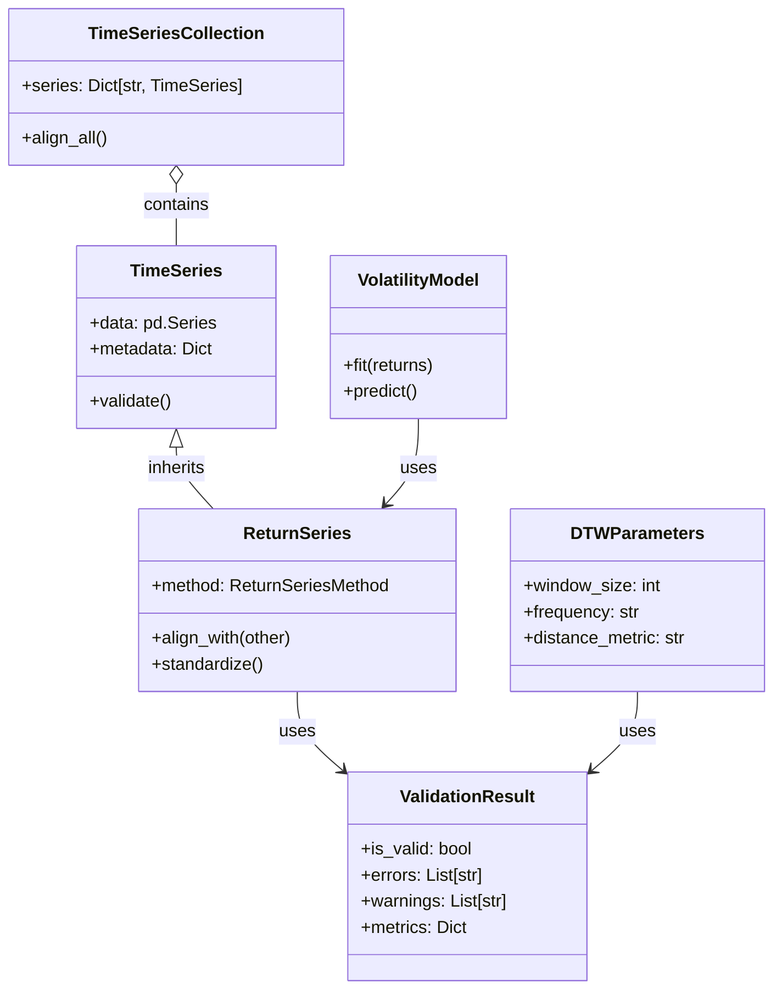
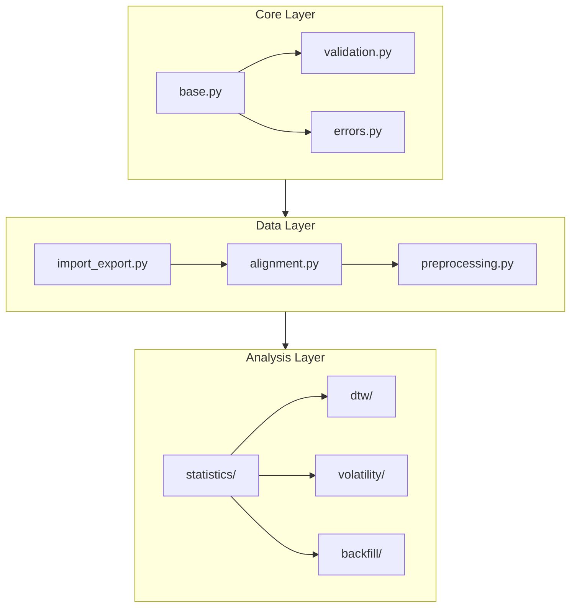

# Implementation Overview

## 1. Documentation Organization

### 1.1 Implementation Documents
Detailed implementations are found in:

- Core implementation: [core.md](../src/core.md)
- Data handling: [data.md](../src/data.md)
- Statistical analysis: [statistics.md](../src/statistics.md)
- DTW implementation: [dtw.md](../src/dtw.md)
- Volatility models: [volatility.md](../src/volatility.md)
- Backfill functionality: [backfill.md](../src/backfill.md)
- Utilities: [utils.md](../src/utils.md)
- Validation framework: [validation.md](../src/validation.md)
- Error handling: [errors.md](../src/errors.md)

### 1.2 Project Documentation
- Requirements: [user_requirements.md](../../requirements/user_requirements.md)
- Gap Analysis: [gap_analysis.md](../../requirements/gap_analysis.md)
- System Design: [system_design.md](../../design/system_design.md)
- Traceability Matrix: [requirements_traceability.md](../../requirements/requirements_traceability.md)
- Background Methodologies: [methodologies/](../../references/methodologies/)

### 1.3 Background Methodologies
#### Core Methodologies
- DTW to Correlation Matrix: [DTW_to_CorrelationMatrix.md](../../references/methodologies/DTW_to_CorrelationMatrix.md)
- Non-overlapping Data Handling: [NonOverlappingData.md](../../references/methodologies/NonOverlappingData.md)
- Volatility Forecasting (HAR/GARCH): [VolatilityForecasting_HAR_GARCH.md](../../references/methodologies/VolatilityForecasting_HAR_GARCH.md)
- PCA Factor Loading Time Series: [PCA_FactorLoadingTimeSeries.md](../../references/methodologies/PCA_FactorLoadingTimeSeries.md)

#### Statistical Methods
- Arithmetic to Geometric Returns: [Arithmetic_to_Geometric_returns.md](../../references/methodologies/Arithmetic_to_Geometric_returns.md)
- Shrinking Covariance Matrix: [Shrinking_Covariance_Matrix.md](../../references/methodologies/Shrinking_Covariance_Matrix.md)
- Backfilling Shorter Time Series: [Backfilling_Shorter_TimeSeries.md](../../references/methodologies/Backfilling_Shorter_TimeSeries.md)

#### Implementation Approaches
- Memory Management for Large Datasets: [Memory_Management_LargeDatasets.md](../../references/methodologies/Memory_Management_LargeDatasets.md)
- Parallel Processing Strategies: [Parallel_Processing_Strategies.md](../../references/methodologies/Parallel_Processing_Strategies.md)
- Validation Framework Design: [Validation_Framework_Design.md](../../references/methodologies/Validation_Framework_Design.md)

## 2. Project Structure

### 2.1 Directory Structure
```
project_root/
├── pyproject.toml           # Project configuration
├── README.md               # Project documentation
├── CHANGELOG.md           # Version history
├── LICENSE               # License information
├── .gitignore           # Git ignore patterns
├── .pre-commit-config.yaml # Pre-commit hooks
├── src/
│   └── fts/              # Main package
│       ├── core/              # Core functionality
│       │   ├── __init__.py
│       │   ├── base.py        # Base classes (TimeSeries, etc.)
│       │   ├── validation.py  # Validation framework
│       │   └── errors.py      # Error handling
│       ├── data/             # Data handling
│       │   ├── __init__.py
│       │   ├── import_export.py
│       │   ├── alignment.py   # Return series alignment
│       │   └── preprocessing.py
│       ├── statistics/       # Statistical analysis
│       │   ├── __init__.py
│       │   ├── moments.py     # Statistical moments
│       │   ├── correlation.py # Correlation calculations
│       │   └── distributions.py
│       ├── dtw/             # Dynamic Time Warping
│       │   ├── __init__.py
│       │   ├── correlation.py # DTW correlation
│       │   ── parameters.py  # DTW configuration
│       ├ volatility/      # Volatility modeling
│       │   ├── __init__.py
│       │   ├── realized.py    # Realized volatility
│       │   ├── har.py        # HAR model
│       │   └─ garch.py      # GARCH model
│       ├── backfill/        # Backfill functionality
│       │   ├── __init__.py
│       │   ├── regression.py  # OLS regression
│       │   └── synthetic.py   # Synthetic data generation
│       └── utils/           # Utilities
│           ├── __init__.py
│           └── memory.py     # Memory management
├── tests/                    # Test directory (mirrors src structure)
│   └── fts/                  # Test package
│       ├── core/            # Core tests
│       │   ├── __init__.py
│       │   ├── test_base.py
│       │   ├── test_validation.py
│       │   └── test_errors.py
│       ├── data/           # Data tests
│       ├── statistics/     # Statistics tests
│       ├── dtw/           # DTW tests
│       ├── volatility/    # Volatility tests
│       ├── backfill/      # Backfill tests
│       └── utils/         # Utilities tests
├── docs/                     # Documentation
│   ├── current/              # Current active documentation
│   │   ├── requirements/    # Requirements documentation
│   │   │   ├── user_requirements.md
│   │   │   ├── gap_analysis.md
│   │   │   └── requirements_traceability.md
│   │   ├── design/         # System design documentation
│   │   │   ├── system_design.md
│   │   │   └── architecture/
│   │   │       └── diagrams/
│   │   ├── implementation/ # Implementation documentation
│   │   │   ├── overview.md # This document
│   │   │   ├── src/       # Module implementations
│   │   │   │   ├── core.md
│   │   │   │   ├── data.md
│   │   │   │   ├── statistics.md
│   │   │   │   ├── dtw.md
│   │   │   │   ├── volatility.md
│   │   │   │   ├── backfill.md
│   │   │   │   └── utils.md
│   │   │   └── testing/   # Testing documentation
│   │   │       ├── overview.md
│   │   │       ├── strategy.md
│   │   │       └── test_cases/
│   │   └── references/    # Reference materials
│   │       ├── academic_papers/
│   │       ├── methodologies/
│   │       └── external/
│   ├── archive/           # Previous versions
│   │   ├── requirements/
│   │   │   ├── v1/
│   │   │   └── v2/
│   │   ├── design/
│   │   └── implementation/
│   └── templates/         # Documentation templates
└── config/                  # Configuration files
```

### 2.2 Project Configuration

#### Core Configuration
```toml
[project]
name = "fts-library"
version = "1.0.0"
description = "Financial Time Series Analysis Library"
requires-python = ">=3.8"
license = "MIT"
authors = [
    {name = "Your Name", email = "your.email@example.com"}
]
readme = "README.md"
classifiers = [
    "Development Status :: 4 - Beta",
    "Intended Audience :: Financial and Insurance Industry",
    "Topic :: Office/Business :: Financial",
    "Programming Language :: Python :: 3.8",
]

[project.dependencies]
numpy = ">=1.21.0"
pandas = ">=1.3.0"
scipy = ">=1.7.0"
scikit-learn = ">=1.0.0"
statsmodels = ">=0.13.0"
arch = ">=4.19.0"
fastdtw = ">=0.3.0"

[project.urls]
Documentation = "https://github.com/username/fts-library/docs"
Source = "https://github.com/username/fts-library"

[build-system]
requires = ["pdm-backend"]
build-backend = "pdm.backend"
```

#### Development Configuration
```toml
[project.optional-dependencies]
dev = [
    "pytest>=7.0.0",
    "black>=22.0.0",
    "mypy>=0.950",
    "flake8>=4.0.0",
    "isort>=5.10.0",
    "pre-commit>=2.17.0"
]

[tool.pdm]
python_requires = ">=3.8"

[tool.pdm.scripts]
test = "pytest tests/"
lint = "pre-commit run --all-files"
format = "black ."
typecheck = "mypy src/"

[tool.black]
line-length = 88
target-version = ['py38']

[tool.isort]
profile = "black"
multi_line_output = 3

[tool.mypy]
python_version = "3.8"
strict = true
ignore_missing_imports = true
```

#### Tool Configurations
```yaml
# .pre-commit-config.yaml
repos:
-   repo: https://github.com/pre-commit/pre-commit-hooks
    rev: v4.4.0
    hooks:
    -   id: trailing-whitespace
    -   id: end-of-file-fixer
    -   id: check-yaml
    -   id: check-added-large-files

-   repo: https://github.com/psf/black
    rev: 23.3.0
    hooks:
    -   id: black

-   repo: https://github.com/pycqa/isort
    rev: 5.12.0
    hooks:
    -   id: isort
```

## 3. Module Architecture and Relationships

### 3.1 Class Hierarchy


### 3.2 Module Dependencies


### 3.3 Key Interactions

1. **Data Flow**
   - Import → Validation → Processing → Analysis → Export

2. **Validation Chain**
   - Data validation
   - Parameter validation
   - Result validation

3. **Analysis Pipeline**
   - Return series alignment
   - Statistical analysis
   - Model fitting
   - Result generation

## 4. Development Standards and Core Components

### 4.1 Development Standards
- Python 3.8+
- Type hints required
- Documentation in Google style
- Unit test coverage > 80%
- Pre-commit hooks for quality

### 4.2 Core Components

#### Base Classes
- **TimeSeries**: Base container for time series data
  - Data storage and validation
  - Metadata management
  - Basic operations

- **ReturnSeries**: Specialized container for return calculations
  - Return series alignment
  - Statistical calculations
  - Standardization methods

- **TimeSeriesCollection**: Container for multiple series
  - Series management
  - Bulk operations
  - Alignment strategies

#### Analysis Components
- **Statistical Analysis**
  - Moment calculations
  - Distribution fitting
  - Correlation analysis

- **DTW Implementation**
  - Window size optimization
  - Distance calculations
  - Correlation matrix building

- **Volatility Models**
  - HAR model implementation
  - GARCH model fitting
  - Realized volatility calculations

- **Backfill Module**
  - OLS regression
  - Synthetic data generation
  - Validation framework

#### Infrastructure
- **Memory Management**
  - Chunked processing
  - Cache management
  - Memory monitoring

- **Validation Framework**
  - Data validation
  - Parameter validation
  - Result validation

## 5. Testing Strategy

### 5.1 Testing Approach
- Unit tests for all components
- Integration tests for module interactions
- Performance tests for critical paths
- Validation tests for data quality

### 5.2 Test Coverage Requirements
- Minimum 80% code coverage
- 100% coverage for core data structures
- 100% coverage for validation framework
- Critical path testing for all modules

### 5.3 Test Organization
Tests mirror the source structure:
- Unit tests per module
- Integration tests for module interactions
- Performance benchmarks
- Data quality validation suites

## 6. Data Handling Requirements

### 6.1 Return Series Generation
The library supports multiple methods for handling non-overlapping data:

#### Basic Return Series Methods
- ALL_INCLUDING_GAPS: Include all periods, allowing NaN values per series
- ALL_OVERLAPPING: Only periods where all series have valid data

#### Advanced Alignment Methods
- SYNCHRONIZED_AVERAGE: Distribute returns across gaps
- PAIRWISE_OVERLAPPING: Use overlapping periods per pair
- PAIRWISE_AVERAGE: Distribute returns across gaps per pair

### 6.2 Data Quality Standards

#### Minimum Sample Requirements
- Basic Statistics: 20 observations
- Correlation Analysis: 30 overlapping observations
- Simple Regression: 30 observations
- Multiple Regression: 30 + 10 × (n_variables) observations
- PCA Analysis: 50 observations minimum
- Volatility Forecasting: 60 observations minimum

#### Missing Value Treatment
1. Time Series Alignment
   - Include all dates where at least one series has observation
   - NaN for non-trading days/missing observations
   - No forward/backward filling by default

2. Analysis-Specific Handling
   - Return Calculations: Use available points only
   - Correlation: Pairwise complete observations only
   - Regression: Complete cases only
   - PCA: Complete cases only

#### Warning Thresholds
- Data gaps > 5 consecutive days
- Missing data pattern analysis if >5% missing
- Series length discrepancy warnings if >20%
- Return size warnings for values >|20%|

### 6.3 Input Data Requirements
- Prices must be adjusted close prices
- Adjustments for dividends and corporate actions must be pre-applied
- Zero or negative prices will trigger validation errors
- Missing data points are allowed for non-trading periods
- Calculations use all available actual data points
- No automatic forward/backward filling of missing data

## 7. Return Calculations and Conventions

### 7.1 Return Types
- Simple Returns: r_t = (P_t - P_{t-1})/P_{t-1}
- Log Returns: r_t = ln(P_t/P_{t-1})
- Default: Log returns unless explicitly specified

### 7.2 Conversion Rules
- Simple to Log: r_log = ln(1 + r_simple)
- Log to Simple: r_simple = exp(r_log) - 1
- Conversion warnings for large returns (>|20%|)

### 7.3 Calculation Conventions
- All volatilities are annualized
- All Sharpe ratios and performance metrics are annualized
- Default frequency is daily
- Distribution fitting is for parameter estimation only
- Series statistics use full available data
- Correlation analysis uses overlapping periods only
- Standard frequency conversions use last-day-of-period

### 7.4 Risk-Free Rate Specifications
- Format: Annualized 1-month rate as decimal (e.g., 0.05 for 5%)
- Input Options:
  * As separate series aligned with return dates
  * As constant value for entire period
- Default: 0 if not provided
- Required for:
  * Sharpe ratio calculations
  * Excess return calculations
  * Risk-adjusted performance metrics

## 8. Performance Requirements

### 8.1 Processing Time Limits
| Operation | Data Size | Max Time |
|-----------|-----------|----------|
| CSV Import | 1GB | 30s |
| Statistical Analysis | 1M rows | 60s |
| Backfill Generation | 10 years daily | 120s |

### 8.2 Memory Usage Limits
| Operation | Max Memory |
|-----------|------------|
| Base Usage | System Memory Dependent |
| Peak Usage | Up to 75% of System Memory |
| Large Dataset | Up to 90% of System Memory |

### 8.3 Computation Optimization
Priority order for optimization:
1. Vectorized operations using numpy/pandas
2. Numba-accelerated functions for heavy computations
3. GPU acceleration for large matrix operations where available

### 8.4 Memory Management Strategy
- Chunked processing for large datasets
- Cache management with configurable limits
- Memory monitoring and cleanup
- Efficient data structure usage

## 9. Error Handling Strategy

### 9.1 Error Categories
```python
class FTSError(Exception):
    """Base exception for all FTS errors."""
    pass

class ValidationError(FTSError):
    """Data validation errors."""
    pass

class ProcessingError(FTSError):
    """Data processing errors."""
    pass

class ConfigurationError(FTSError):
    """Configuration related errors."""
    pass
```

### 9.2 Error Handling Principles
- Early validation to catch errors at input
- Explicit error messages with context
- Recovery procedures where possible
- Graceful degradation for non-critical errors

### 9.3 Validation Framework
- Input data validation
- Parameter validation
- Result validation
- Configuration validation

### 9.4 Logging Strategy
- ERROR: All exceptions and errors
- WARNING: Data quality issues, performance warnings
- INFO: Major processing steps
- DEBUG: Detailed processing information

## Function Registry and Implementation Map

### Legend
[AG]: ../../references/methodologies/Arithmetic_to_Geometric_returns.md
[VF]: ../../references/methodologies/VolatilityForecasting_HAR_GARCH.md
[BF]: ../../references/methodologies/Backfilling_Shorter_TimeSeries.md
[DTW]: ../../references/methodologies/DTW_to_CorrelationMatrix.md
[PCA]: ../../references/methodologies/PCA_FactorLoadingTimeSeries.md
[SC]: ../../references/methodologies/Shrinking_Covariance_Matrix.md

**Source:**
- UR: Original User Requirements
- DS: Added in Design Stage
- IP: Added in Implementation Planning
- BN: Added from Background Notes
- ID: Added in Implementation Discussion

### Core Functions
| Function | Source | Module | Status | Notes | Reference |
|----------|---------|---------|---------|-------|-----------|
| get_annualization_factor | DS | core/constants.py | ✓ | Central annualization handling | AG |
| validate_returns | UR | core/validation.py | ✓ | Basic data validation | - |

### Statistical Measures
| Function | Source | Module | Status | Notes | Reference |
|----------|---------|---------|---------|-------|-----------|
| mean_return | UR | statistics/moments.py | ✓ | Basic return measure | - |
| [variance_drag][AG#2.1] | BN | statistics/returns.py | ✓ | From methodology | AG#2.1 |
| [kurtosis_drag][AG#2.1] | BN | statistics/returns.py | ✓ | From methodology | AG#2.1 |
| [skew_drag][AG#2.1] | BN | statistics/returns.py | ✓ | From methodology | AG#2.1 |
| [ledoit_wolf_shrinkage][SC#2] | BN | statistics/covariance.py | ✓ | Covariance denoising | SC#2 |

### Performance Metrics
| Function | Source | Module | Status | Notes | Reference |
|----------|---------|---------|---------|-------|-----------|
| standard_sharpe_ratio | UR | performance/sharpe.py | ✓ | Basic Sharpe ratio | AG#3.1 |
| [geometric_sharpe_ratio][AG#3.1] | BN | statistics/returns.py | ✓ | With variance drag | AG#3.1 |
| [probabilistic_sharpe_ratio][AG#3.2] | BN | performance/sharpe.py | ✓ | Statistical significance | AG#3.2 |
| [deflated_sharpe_ratio][AG#3.3] | BN | performance/sharpe.py | ✓ | Multiple testing adjustment | AG#3.3 |
| [kelly_fraction_normal][AG#4.1] | BN | performance/kelly.py | ✓ | Basic Kelly criterion | AG#4.1 |
| [kelly_fraction_student_t][AG#4.2] | BN | performance/kelly.py | ✓ | Heavy-tail adjustment | AG#4.2 |

### Volatility Models
| Function | Source | Module | Status | Notes | Reference |
|----------|---------|---------|---------|-------|-----------|
| [realized_volatility][VF#2] | UR | volatility/realized.py | ✓ | Basic volatility measure | VF#2 |
| [garch_fit][VF#1] | UR | volatility/garch.py | ✓ | GARCH(1,1) fitting | VF#1 |
| [forecast_instantaneous][VF#1.3] | BN | volatility/garch.py | ✓ | From GARCH methodology | VF#1.3 |
| [forecast_rolling_volatility][VF#1.4] | ID | volatility/garch.py | ✓ | Added in implementation discussion | VF#1.4 |
| [har_components][VF#2] | UR | volatility/har.py | ✓ | RV components | VF#2 |
| [har_fit][VF#2] | UR | volatility/har.py | ✓ | HAR model fitting | VF#2 |
| [har_forecast][VF#2] | UR | volatility/har.py | ✓ | HAR forecasting | VF#2 |

### DTW Analysis
| Function | Source | Module | Status | Notes | Reference |
|----------|---------|---------|---------|-------|-----------|
| [calculate_dtw_similarity][DTW#3] | BN | dtw/similarity.py | ✓ | DTW-based correlation | DTW#3 |
| [build_dtw_correlation_matrix][DTW#3] | BN | dtw/correlation.py | ✓ | Full correlation matrix | DTW#3 |

### PCA Analysis
| Function | Source | Module | Status | Notes | Reference |
|----------|---------|---------|---------|-------|-----------|
| calculate_factor_loadings | BN | pca/loadings.py | ✓ | PCA factor loadings | PCA#3 |
| generate_factor_scores | BN | pca/scores.py | ✓ | Time series of loadings | PCA#6 |

### Backfilling
| Function | Source | Module | Status | Notes | Reference |
|----------|---------|---------|---------|-------|-----------|
| backfill_series | BN | backfill/generator.py | ✓ | Basic backfilling | BF#2 |
| regression_backfill | BN | backfill/regression.py | ✓ | Regression-based | BF#3 |

### Status Legend
- ✓: Implemented
- 🚧: In progress
- ❌: Not started
- ⚠️: Needs review

### Original User Requirements Status
#### 3.0 Data Handling Requirements
| Required Function | Current Implementation | Module | Status | Notes |
|------------------|----------------------|---------|---------|-------|
| validate_returns | validate_returns | core/validation.py | ✓ | Basic validation |
| validate_parameters | validate_parameters | core/validation.py | ✓ | Parameter checks |
| validate_frequency | validate_frequency | core/validation.py | ✓ | Time series frequency |
| validate_alignment | validate_alignment | core/validation.py | ✓ | Series alignment |
| handle_missing_data | process_missing | data/preprocessing.py | ✓ | Missing data handling |
| align_series | align_series | data/alignment.py | ✓ | Time series alignment |
| standardize_frequency | standardize_frequency | data/preprocessing.py | ✓ | Frequency conversion |
| load_csv_data | import_price_series | data/import_export.py | ✓ | CSV import |
| export_results | export_data | data/import_export.py | ✓ | Data export |
| cache_management | manage_cache | core/cache.py | ✓ | Memory optimization |

#### 3.1 Series Conversion Functions
| Required Function | Current Implementation | Module | Status | Notes |
|------------------|----------------------|---------|---------|-------|
| price_to_ret | price_to_ret | statistics/returns.py | ✓ | - |
| ret_to_price | ret_to_price | statistics/returns.py | ✓ | - |
| excess_ret | excess_returns | statistics/returns.py | ✓ | - |
| alpha_ret | - | - | 🔴 | Deprecated in v2.0 |
| ret_to_drawdown | calculate_drawdown_series | risk/drawdown.py | ✓ | Renamed |
| standardize_ret | standardize_returns | statistics/returns.py | ✓ | - |

#### 3.2.1 Statistical Analysis Functions - Basic
| Required Function | Current Implementation | Module | Status | Notes |
|------------------|----------------------|---------|---------|-------|
| ret_mean | mean_return | statistics/moments.py | ✓ | Renamed |
| ret_volatility | stdev | statistics/moments.py | ✓ | Renamed |
| ret_skew | skewness | statistics/moments.py | ✓ | Renamed |
| ret_kurtosis | kurtosis | statistics/moments.py | ✓ | Renamed |
| ret_stats | ret_stats | statistics/moments.py | ✓ | - |

#### 3.2.2 Statistical Analysis Functions - Annualized Returns
| Required Function | Current Implementation | Module | Status | Notes |
|------------------|----------------------|---------|---------|-------|
| annualize_ret | annualized_return | statistics/returns.py | ✓ | - |
| arithmetic_to_geometric_ret | geometric_return | statistics/returns.py | ✓ | Cross-ref: [AG#2.1] |
| geometric_to_arithmetic_ret | - | - | 🔴 | Not implemented |
| calculate_variance_drag | variance_drag | statistics/returns.py | ✓ | Cross-ref: [AG#2.1] |
| calculate_kurtosis_drag | kurtosis_drag | statistics/returns.py | ✓ | Cross-ref: [AG#2.1] |
| calculate_skew_drag | skew_drag | statistics/returns.py | ✓ | Cross-ref: [AG#2.1] |
| calculate_total_drag | - | - | ❌ | Not implemented |

#### 3.2.3 Statistical Analysis Functions - Volatility Adjustments
| Required Function | Current Implementation | Module | Status | Notes |
|------------------|----------------------|---------|---------|-------|
| adjust_volatility_kurtosis | adjusted_volatility_normal | statistics/returns.py | ✓ | Cross-ref: [AG#2.2] |
| annualize_volatility | volatility | statistics/returns.py | ✓ | - |
| calculate_downside_volatility | downside_volatility | statistics/returns.py | ✓ | - |
| volatility_of_volatility | vol_of_vol | statistics/returns.py | ✓ | - |

#### 3.2.4 Statistical Analysis Functions - Drawdowns
| Required Function | Current Implementation | Module | Status | Notes |
|------------------|----------------------|---------|---------|-------|
| calculate_drawdown_series | calculate_drawdown | risk/drawdown.py | ✓ | - |
| maximum_drawdown | max_drawdown | risk/drawdown.py | ✓ | - |
| average_drawdown | avg_drawdown | risk/drawdown.py | ✓ | - |
| drawdown_duration | drawdown_duration | risk/drawdown.py | ✓ | - |
| theoretical_max_drawdown | mtd_normal | performance/kelly.py | ✓ | Cross-ref: [AG#4.1] |

#### 3.3 Risk and Performance Functions
| Required Function | Current Implementation | Module | Status | Notes |
|------------------|----------------------|---------|---------|-------|
| standard_sharpe_ratio | standard_sharpe_ratio | performance/sharpe.py | ✓ | Cross-ref: [AG#3.1] |
| geometric_sharpe_ratio | geometric_sharpe_ratio | performance/sharpe.py | ✓ | Cross-ref: [AG#3.1] |
| adjusted_sharpe_ratio | adjusted_geometric_sharpe_ratio | performance/sharpe.py | ✓ | Cross-ref: [AG#3.1] |
| sortino_ratio | sortino_ratio | performance/metrics.py | ✓ | - |
| calmar_ratio | calmar_ratio | performance/metrics.py | ✓ | - |
| probabilistic_sharpe_ratio | probabilistic_sharpe_ratio | performance/sharpe.py | ✓ | Cross-ref: [AG#3.2] |
| information_ratio | information_ratio | performance/metrics.py | ✓ | - |
| treynor_ratio | treynor_ratio | performance/metrics.py | ✓ | - |

#### 3.4 Time-Varying Window Statistics Functions
| Required Function | Current Implementation | Module | Status | Notes |
|------------------|----------------------|---------|---------|-------|
| rolling_volatility | rolling_volatility | volatility/realized.py | ✓ | Cross-ref: [VF#2] |
| rolling_volatility_downside | rolling_volatility_downside | volatility/realized.py | ✓ | - |
| rolling_correlation | rolling_correlation | statistics/correlation.py | ✓ | - |
| rolling_beta | rolling_beta | statistics/correlation.py | ✓ | - |
| rolling_sharpe | rolling_sharpe | performance/metrics.py | ✓ | - |
| rolling_ret | rolling_returns | statistics/returns.py | ✓ | - |
| hurst_exponent | hurst_exponent | statistics/moments.py | ✓ | - |

#### 3.5 Correlation and Dependency Functions
| Required Function | Current Implementation | Module | Status | Notes |
|------------------|----------------------|---------|---------|-------|
| correlation | calculate_correlation_matrix | statistics/correlation.py | ✓ | - |
| rank_correlation | spearman_correlation | statistics/correlation.py | ✓ | - |
| correlation_to_covariance | correlation_to_covariance | statistics/correlation.py | ✓ | - |
| covariance_to_correlation | covariance_to_correlation | statistics/correlation.py | ✓ | - |
| semi_covariance | semi_covariance | statistics/correlation.py | ✓ | - |

#### 3.6 Matrix Transformation Functions
| Required Function | Current Implementation | Module | Status | Notes |
|------------------|----------------------|---------|---------|-------|
| correlation_cluster | correlation_cluster | statistics/correlation.py | ✓ | - |
| shrink_covariance | ledoit_wolf_shrinkage | statistics/covariance.py | ✓ | Cross-ref: [SC#2] |

#### 3.7 Distribution Fitting Functions
| Required Function | Current Implementation | Module | Status | Notes |
|------------------|----------------------|---------|---------|-------|
| fit_gaussian | fit_normal_dist | statistics/distribution.py | ✓ | Renamed |
| fit_student_t | fit_t_dist | statistics/distribution.py | ✓ | Renamed |
| fit_skewed_t | fit_skewed_t_dist | statistics/distribution.py | ✓ | - |
| fit_nig | - | - | 🔴 | Deprecated in v2.0 |
| distribution_test | test_normality | statistics/distribution.py | ✓ | - |
| implied_drag_student_t | - | - | ❌ | Not implemented |
| implied_heavy_tail_drag_student_t | - | - | ❌ | Not implemented |
| implied_excess_kurtosis_drag_student_t | - | - | ❌ | Not implemented |
| implied_skew_drag_student_t | - | - | ❌ | Not implemented |
| implied_drag_variance | variance_drag | statistics/returns.py | ✓ | Renamed |

#### 3.8 Copula Functions
All functions in this section are deprecated in v2.0 and moved to separate packages.

#### 3.9 Portfolio Optimization Functions
All functions in this section are deprecated in v2.0 and moved to separate packages.

#### 3.10 Utility Functions
| Required Function | Current Implementation | Module | Status | Notes |
|------------------|----------------------|---------|---------|-------|
| volatility_target | kelly_fraction_normal | performance/kelly.py | ✓ | Cross-ref: [AG#4.1] |
| max_theoretical_drawdown | mtd_normal | performance/kelly.py | ✓ | Cross-ref: [AG#4.1] |

#### 3.11-3.12 Interest Rate and DCF Functions
All functions in these sections are marked as deprecated in v2.0 and moved to separate packages.

#### 3.13 Synthetic Series Generation Functions
| Required Function | Current Implementation | Module | Status | Notes |
|------------------|----------------------|---------|---------|-------|
| regress_ret | regress_returns | backfill/regression.py | ✓ | Cross-ref: [BF#2] |
| analyze_residuals | analyze_residuals | backfill/regression.py | ✓ | Cross-ref: [BF#2] |
| backfill_ret | backfill_series | backfill/generator.py | ✓ | Cross-ref: [BF#2] |

#### 3.14 PCA Factor Analysis Functions
| Required Function | Current Implementation | Module | Status | Notes |
|------------------|----------------------|---------|---------|-------|
| pca_decomposition | pca_decomposition | statistics/pca.py | ✓ | Cross-ref: [PCA#3] |
| select_pca_factors | select_pca_factors | statistics/pca.py | ✓ | Cross-ref: [PCA#3] |
| pca_factor_ret | calculate_factor_loadings | pca/loadings.py | ✓ | Cross-ref: [PCA#3] |
| pca_idiosyncratic_ret | generate_factor_scores | pca/scores.py | ✓ | Cross-ref: [PCA#6] |

#### 3.15 Volatility Forecasting Functions
| Required Function | Current Implementation | Module | Status | Notes |
|------------------|----------------------|---------|---------|-------|
| forecast_garch | garch_forecast | volatility/garch.py | ✓ | Cross-ref: [VF#1] |
| forecast_har | har_forecast | volatility/har.py | ✓ | Cross-ref: [VF#2] |
| calculate_har_components | har_components | volatility/har.py | ✓ | Cross-ref: [VF#2] |
| fit_garch_model | garch_fit | volatility/garch.py | ✓ | Cross-ref: [VF#1] |
| fit_har_model | har_fit | volatility/har.py | ✓ | Cross-ref: [VF#2] |

#### 3.16 Dynamic Time Warping Functions
| Required Function | Current Implementation | Module | Status | Notes |
|------------------|----------------------|---------|---------|-------|
| dtw_distance | calculate_dtw_similarity | dtw/similarity.py | ✓ | Cross-ref: [DTW#3] |
| dtw_similarity | calculate_dtw_similarity | dtw/similarity.py | ✓ | Cross-ref: [DTW#3] |
| dtw_correlation | build_dtw_correlation_matrix | dtw/correlation.py | ✓ | Cross-ref: [DTW#3] |
