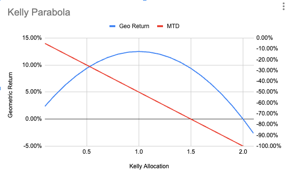

# Portfolio Construction with Higher Moments

## 1. Introduction

Traditional portfolio construction often overlooks the impact of skewness and kurtosis, leading to an incomplete picture of risk and return. This note provides a practical framework for incorporating these higher moments into the portfolio construction process.  We will focus on standardizing assets to allow fair comparison, allocating risk budgets appropriately, and constructing portfolio weights that reflect the impact of these higher moments. This allows for a more robust and nuanced assessment of risk and return,  moving beyond traditional methods that rely solely on mean and variance.  Critically, the framework utilizes *arithmetic* returns and related metrics for asset comparison and portfolio construction, as these are appropriate for analyzing the relative merits of individual assets or sub-portfolios within a risk budgeting context. *Geometric* returns and associated metrics are reserved for evaluating the performance of the total portfolio, as they reflect the compounded growth of the overall investment strategy.

For a detailed explanation of the calculations and implications of arithmetic and geometric returns under non-normal distributions, please refer to the accompanying note, 'Arithmetic and Geometric Returns Under Non-Normal Distributions'.

## 2. Data Requirements and Preprocessing

* For each asset, the following data is required:
    * Arithmetic returns ($R_i$)
    * Volatility ($\sigma_i$)
    * Skewness ($\gamma_{3,i}$)
    * Kurtosis ($\gamma_{4,i}$)
* Ensure data is appropriately preprocessed (e.g., handling missing values, outliers).

## 3. Standardizing Assets for Fair Comparison

### 3.1 The Role of Arithmetic Returns in Portfolio Construction

To compare assets with varying risk profiles on a level playing field, we must standardize them. While geometric returns better represent long-term wealth evolution, arithmetic returns play a crucial role in portfolio construction and asset comparison. Consider an asset with returns of -50% and +100% over two periods. The arithmetic average of 25% poorly represents the true wealth evolution (geometric return of 0%). However, arithmetic returns remain essential in portfolio construction for several reasons:

1. Single-Period Analysis: Portfolio optimization methods like Mean-Variance Optimization (MVO) and Risk Parity focus on single-period return characteristics, where arithmetic returns are the appropriate measure of expected return.

2. Scaling Properties: Modern Portfolio Theory assumes we can leverage or de-leverage positions to achieve desired risk levels. This scaling property is more naturally expressed using arithmetic returns.

3. Statistical Properties: Arithmetic returns preserve the mathematical properties needed for optimization, such as linearity of expectations and the ability to decompose portfolio risk.

### 3.2 Standardization by Adjusted Volatility


For each asset *i*, standardize excess returns by the *adjusted* volatility:

1. **Calculate Adjusted Volatility:**
   $$ \sigma_{adj,i} = \sigma_i \sqrt{1 + \frac{(\gamma_{4,i} - 3)\sigma_i^2}{4} + \frac{\gamma_{3,i}^2 \sigma_i^2}{6}} $$
    Where:
        - $\sigma_i$ is the raw volatility of asset  *i*.
        - $\gamma_{3,i}$ is the skewness of asset  *i*.
        - $\gamma_{4,i}$ is the kurtosis of asset *i*.
        
   This formula adjusts raw volatility to account for the impact of skewness ($\gamma_{3,i}$) and kurtosis ($\gamma_{4,i}$) on the dispersion of returns. It is based on a Taylor approximation of the variance of a non-normal distribution.      

2. **Standardize Returns:**
   $$X_{adj,i} = \frac{R_i - R_f}{\sigma_{adj,i}}$$
   Where:
      - $R_i$ is the raw arithmetic return of asset *i*.
      - $R_f$ is the risk-free rate.

  The resulting $X_{adj,i}$ represents the risk-adjusted return of asset *i* assuming unit adjusted volatility. This is useful for comparison of assets with varying volatilities.

This standardization process accounts for the impact of higher moments on volatility, creating a level playing field for asset comparison. The resulting standardized returns ($X_{adj,i}$) represent the risk-adjusted performance of each asset, assuming a volatility adjusted for higher moments. Note that this step standardizes and risk adjusts arithmetic excess returns to unit volatility. These are suitable for relative asset comparison purposes.


### 3.3 Risk Budget Allocation

Use the standardized, adjusted returns ($X_{adj,i}$) as inputs to a portfolio optimization framework (e.g., MVO, HERC) with the constraint that portfolio weights sum up to one. The output of the optimisation are risk budgets, $w_{risk,i}$, representing the allocation of risk to each asset, under the assumption of unit volatility for all assets. The framework considers both the adjusted returns and the standardized risk, providing a robust foundation for the optimization process.

## 4. Constructing Portfolio Weights

### 4.1 Upscaling Risk Budgets to Actual Portfolio Weight

To obtain actual portfolio weights, upscale the risk budget allocations by the *adjusted* volatilities:

$$w_i = w_{risk,i} \times \sigma_{adj,i}$$

Where:

*  `w_i` is the actual portfolio weight for asset *i*.
*  `w_{risk,i}` is the risk budget allocation for asset *i* (determined in 11.2.2).
*  `σ_adj,i` is the *adjusted* volatility for asset *i* calculated in 11.2.1, Step 1.


**Rationale:**

By upscaling by the *adjusted* volatility, we ensure that the portfolio weights reflect the impact of higher moments on the dispersion of returns.  We standardize by the adjusted volatility to enable fair comparison assuming a unit volatility target; however, when it comes to final portfolio construction, we should reflect each asset's *actual* volatility (adjusted for higher moments), in its contribution to the total portfolio weight. This leads to a more accurate representation of the portfolio's true risk profile.  If we were to upscale by the raw volatility, we would underestimate the portfolio's risk, particularly when assets have significant skewness or kurtosis.  We standardized by the adjusted volatility for asset comparison purposes under the assumption of unit volatility.  However, we are not constrained by this after portfolio construction. In order to derive portfolio weights, we must consider that assets have differing volatilities that have been adjusted for higher moments.

**In summary:**  Standardizing by adjusted volatility allows for a clean comparison of assets during risk budgeting. Upscaling by the *same* adjusted volatilities ensures that the final portfolio weights accurately reflect the risk contributions of each asset, accounting for the impact of higher moments. This two-step approach provides both a simplified framework for asset comparison and a robust method for constructing a portfolio with the desired risk characteristics.

## 5. Portfolio Evaluation

### 5.1 Portfolio Return and Volatility Calculation

Calculate the portfolio's adjusted geometric return ($R_{g,adj}$) and adjusted geometric Sharpe ratio using the portfolio's overall characteristics, including its higher moments.  These geometric metrics are appropriate for evaluating the long-run performance of the *total portfolio* only, reflecting the compounded returns. These should *not* be used for individual asset comparisons during the portfolio construction phase where arithmetic returns are appropriate.

### 5.2 Portfolio-Level Geometric Return and Sharpe Ratio Adjustments

The portfolio's adjusted geometric return ($R_{g,adj}$) is calculated using the portfolio's aggregated characteristics (return, volatility, skewness, and kurtosis).  The detailed formulas and Python implementation for these calculations can be found in the accompanying note, "Arithmetic and Geometric Returns Under Non-Normal Distributions."  Here, we focus on applying these calculations at the portfolio level.


**Explanation and Rationale:**

This process allows us to use the simplified, unit-volatility framework for portfolio optimization while still accounting for the actual risk profiles of the assets.  The rescaling and upscaling steps ensure that the final portfolio weights reflect both the desired risk budget allocations and the adjusted volatilities.  This provides a practical and intuitive way to incorporate higher moments into the portfolio construction process. This methodology combines the benefits of simplified asset comparison with accurate portfolio risk and return estimation.  

### 5.3 Portfolio-Level Adjusted Sharpe Ratios

* **Arithmetic Adjusted Sharpe Ratio:** Calculate the portfolio's arithmetic Sharpe ratio using the *portfolio's* adjusted volatility:
  $$SR_{adj, arithmetic} = \frac{R_p - R_f}{\sigma_{p, adj}}$$
  Where $\sigma_{p, adj}$ is the portfolio’s volatility adjusted for its higher moments.

* **Geometric Adjusted Sharpe Ratio:** Calculate the portfolio's geometric Sharpe ratio using the portfolio's adjusted geometric return ($R_{g,adj}$) and adjusted volatility:
  $$SR_{adj, geometric} = \frac{R_{g, adj} - R_f}{\sigma_{p, adj}}$$

The geometric adjusted Sharpe ratio uses the portfolio's adjusted geometric return and adjusted volatility.  For the detailed calculation of the adjusted geometric return, refer to the accompanying note, "Arithmetic and Geometric Returns Under Non-Normal Distributions"

## 6. Reconciling Asset-Level and Portfolio-Level Metrics

This section clarifies the distinct roles of arithmetic and geometric returns, along with their associated metrics, in portfolio construction and evaluation.  Understanding these distinctions is crucial for making sound investment decisions.

### 6.1 Arithmetic Returns for Asset Comparison and Portfolio Construction

Arithmetic returns, standardized by adjusted volatility as described in Section 3, are the appropriate metric for comparing individual assets and constructing portfolios. This is because:

1. **Portfolio Optimization Focus:** Portfolio optimization techniques, such as Mean-Variance Optimization (MVO) and Risk Parity, operate on arithmetic returns and covariances.  These methods aim to maximize expected return for a given level of risk or allocate risk efficiently across assets.

2. **Scaling Properties:**  A core assumption of Modern Portfolio Theory is the ability to leverage or deleverage positions. This scaling property is more naturally expressed and manipulated using arithmetic returns.  Standardizing by adjusted volatility allows us to compare the risk-adjusted *potential* of different assets assuming we can adjust their leverage.

3. **Focus on Relative Merits:**  During portfolio construction, the primary goal is to determine the *relative* attractiveness of different assets based on their expected returns, adjusted volatilities (which are standardized to 1), and higher moment characteristics.  For this purpose, arithmetic returns, standardized for risk and adjusted for higher moments, provide a consistent and appropriate comparison metric.


### 6.2 Geometric Returns for Portfolio Evaluation

Geometric returns, along with their associated metrics like the adjusted geometric Sharpe ratio, are essential for evaluating the *overall performance* of a portfolio.  This is because:

1. **Compounding Effects:** Geometric returns accurately reflect the cumulative growth of an investment over time, capturing the impact of compounding.

2. **Wealth Evolution:** For measuring long-term wealth creation, geometric returns are the relevant metric.

3. **Connecting Arithmetic and Geometric Views:** While geometric returns provide the most accurate measure of long-term portfolio growth, the adjusted arithmetic Sharpe ratio, calculated using the portfolio's adjusted volatility, plays a critical role in portfolio optimization and risk management during the construction phase. This is because the Kelly Criterion, often used for volatility targeting, can be expressed in terms of the arithmetic Sharpe ratio. This connection between arithmetic and geometric perspectives allows for a practical approach to portfolio construction while keeping in mind the long-term growth objective. See "Arithmetic and Geometric Returns Under Non-Normal Distributions" for a discussion of how the Kelly Criterion, often used for volatility targeting, connects these two perspectives.

### 6.3 Illustrative Example:

Consider two assets with identical arithmetic Sharpe ratios of 1.0:

* **Asset A:**
    * Arithmetic Return: 10%
    * Volatility: 10%

* **Asset B:**
    * Arithmetic Return: 80%
    * Volatility: 80%

A naive comparison based on geometric returns would heavily penalize Asset B due to its higher volatility, which would be incorrect in a portfolio context. *This illustrates why standardized arithmetic returns are crucial during asset comparison.* If we deleverage Asset B to 10% volatility, its arithmetic return also becomes 10%, equivalent to Asset A.  This highlights why standardization by volatility and the use of arithmetic returns are crucial for asset *comparison* and portfolio construction. *After* portfolio construction, we evaluate the performance of the *portfolio* using geometric returns and related metrics, as these reflect the actual compounded growth of the overall investment strategy.

This example demonstrates that while raw volatility differences are neutralized during asset comparison, they remain crucial for determining the appropriate leverage or deleveraging required to achieve a target portfolio volatility *after* the assets have been selected. Therefore, both arithmetic and geometric returns, and their adjusted metrics, serve distinct but essential purposes in the portfolio management process.


## 7. Maximum Theoretical Drawdown (MTD) Adjustments

### MTD Under Normal Distribution (Base Case)
For a log-normal world (no skew, no excess kurtosis) and full Kelly leverage:
- Full Kelly volatility target = Sharpe ratio (SR)
- Maximum Theoretical Drawdown (MTD) = 50%

Mathematically:
$$ MTD_{\text{normal}} = \frac{\sigma}{2 \times SR} = 50\% \text{ when } \sigma = SR. $$

### MTD Under Normal Distribution With Skew and Kurtosis
When we incorporate skewness ($\gamma_3$) and excess kurtosis ($\gamma_4 - 3$), the geometric return, volatility, and Sharpe ratio are adjusted. The adjusted geometric Sharpe ratio under normal assumptions with higher moments is:
$$ SR_{g,adj} = \frac{R_{g,adj} - R_f}{\sigma_{adj}}. $$

If we scale volatility to the adjusted full Kelly allocation, the theoretical MTD formula remains structurally the same but uses the adjusted parameters:
$$ MTD_{\text{normal,adj}} = \frac{\sigma_{adj}}{2 \times SR_{g,adj}}. $$

Where:

   - $v$ is the degrees of freedom parameter of the skewed Student-t distribution.
   - $\gamma_3$ is the skewness of the distribution.
   - $\lambda$ is a scaling parameter of the skewed Student-t distribution that adjusts for skew.

Thus, instead of simply 50%, the MTD can now differ depending on how these higher moments reduce $SR_{g,adj}$ and affect $\sigma_{adj}$.

### Skewed Student-t Distribution

Full Kelly under skewed Student-t is lower than SR. Using optimal volatility target and distributions:

$$
   MTD_{skewed-t} = 0.5 \times \sqrt{\frac{v}{v-2}} \times (1 - \gamma_3 \lambda).
   $$

As $\gamma_3$ < 0 typically, MTD often increases due to tail and skew effects.


## 8. Kelly Criterion and Volatility Targeting for Maximum Long-Term Growth
### 8.1 Kelly Criterion: From Discrete to Continuous Time

#### 8.1.1 The Original Kelly Framework: Discrete Betting
Consider a simple scenario where you have a series of independent bets. Each bet has two possible outcomes: a win with probability p and a loss with probability q = 1 - p. If you win, you get a return of b, and if you lose, you lose your entire bet. The goal is to determine the optimal fraction of your capital to bet on each opportunity.

#### 8.1.2 Mathematical Derivation of Discrete Kelly
Let f be the fraction of your capital that you bet on each opportunity.
- If you win, your wealth is scaled by 1 + bf
- If you lose, your wealth is scaled by 1-f

The geometric growth is calculated using:

$$ G = p * \log(1 + bf) + q * \log(1 -f) $$

where:
- G represents the long-run geometric growth rate of your capital
- p is the probability of winning
- q is the probability of losing (1 - p)
- b is the payout of the winning bet
- f is the fraction of your wealth you choose to bet

To maximize this long-run geometric growth, we take the derivative and set it equal to zero:

$$ \frac{dG}{df} = \frac{p * b}{1+bf} - \frac{q}{1-f} = 0 $$

Solving for f gives:

$$ f* = \frac{pb-q}{pb+qb} $$

#### 8.1.3 Edge and Probability: A Practical Example
For symmetrical payouts (b = 1), the formula simplifies to:

$$ f* = (2p - 1) $$

This shows that the optimal bet size is directly proportional to your edge. For example:
- If p = 0.5 (fair coin), f* = 0 (don't bet)
- If p = 0.6 (60% win rate), f* = 0.2 (bet 20% of capital)


#### 8.1.4 Kelly with Asymmetrical Outcomes
The Kelly criterion naturally accounts for situations where the payout is not symmetrical. Consider an example where:
- b = 2 (a win doubles your bet)
- p = 0.4 (40% chance of winning)
- q = 0.6 (60% chance of losing)

Applying the Kelly formula:

$$ f* = \frac{pb-q}{pb+qb} = \frac{0.4(2)-0.6}{0.4(2)+0.6} = \frac{0.8-0.6}{0.8+0.6} = \frac{0.2}{1.4} \approx 0.14 $$

This shows that despite having a positive expected value (EV = p×b - q = 0.2), the optimal bet size is only 14% of capital. This reduction in optimal bet size primarily reflects the increased dispersion of outcomes when payoffs are asymmetric. The larger spread between potential outcomes (winning 2x versus losing 1x) increases the effective volatility of the betting strategy, leading to a more conservative optimal position size.

This principle carries forward to continuous distributions: increased dispersion of outcomes (whether from fat tails or extreme asymmetry) generally reduces the optimal Kelly fraction. However, in a continuous setting, the impact of skewness itself is different - positive skewness (tendency for positive outliers) can actually increase the optimal position size, while negative skewness (tendency for negative outliers) reduces it, all else being equal. We'll explore these effects in detail when we discuss Kelly adjustments for higher moments in continuous distributions.


### 8.2 Kelly Criterion Under Log-Normal Assumptions (Base Case)

#### 8.2.1 From Discrete to Continuous Returns
The discrete betting framework provides valuable intuition, but financial markets present a more complex challenge. Instead of binary outcomes, we face continuous distributions of returns. Instead of isolated bets, we manage portfolios of multiple assets that can be dynamically adjusted. In this continuous setting, we begin with the simplest case: log-normally distributed returns.

#### 8.2.2 Kelly as a Wealth Multiplier (`f*_wealth`): Mathematical Derivation

The Kelly criterion in a continuous setting seeks to maximize the long-run geometric growth rate (G) of capital. Let's say a fraction of your portfolio is allocated to an asset (f), then the long-run growth can be written as:

$$ G = E[\log(1 + f * (R_a - R_f) - f*R_f)] $$

where:
- E[ ] denotes the expectation operator
- R_a is the arithmetic return
- R_f is the risk-free rate

Using a Taylor expansion to approximate the log term:

$$ \log(1 + f*(R_a-R_f) - f*R_f) \approx f*(R_a - R_f) - \frac{1}{2} * f^2 * \sigma^2 $$

The approximation of geometric growth (G) becomes:

$$ G \approx f*(R_a - R_f) - \frac{1}{2} * f^2 * \sigma^2 $$

Taking the derivative with respect to f and setting it to zero:

$$ \frac{dG}{df} \approx (R_a - R_f) - f * \sigma^2 = 0 $$

This gives us the fixed-position Kelly formula:

$$ f*_{wealth} = \frac{R_a - R_f}{\sigma^2} $$

#### 8.2.3 Kelly as a Volatility Target (`f*_volatility`)
In practice, particularly when managing portfolios that can be frequently rebalanced, it's often more useful to think of Kelly in terms of volatility targeting. Under log-normal assumptions and continuous rebalancing, the optimal volatility target is simply the arithmetic Sharpe ratio:

$$ f*_{volatility} = SR = \frac{R_a - R_f}{\sigma} $$

#### 8.2.4 Interpreting the Two Kelly Formulations
Both formulations of Kelly appear frequently in literature, sometimes causing confusion. Let's clarify their relationship:

**Fixed Position Kelly (`f*_wealth`):**
$$ f*_{wealth} = \frac{R_a - R_f}{\sigma^2} = \frac{SR}{\sigma} $$

**Volatility Target Kelly (`f*_volatility`):**
$$ f*_{volatility} = \frac{R_a - R_f}{\sigma} = SR $$

The relationship between these formulations becomes clear when we consider:
$$ f*_{wealth} * \sigma = \frac{SR}{\sigma} * \sigma = SR = f*_{volatility} $$

This equality reveals why we see both formulations in literature:
- `f*_wealth` represents a multiplier on wealth (how much to leverage)
- `f*_volatility` represents the resulting volatility target
- Multiplying `f*_wealth` by volatility converts the wealth multiplier into the implied volatility target

**Practical Applications:**
- Fixed Position Kelly (`f*_wealth`):
  * Appropriate for single, isolated positions
  * Best for illiquid assets or positions that cannot be frequently adjusted
  * Natural for discrete betting scenarios

- Volatility Target Kelly (`f*_volatility`):
  * Appropriate for actively managed portfolios
  * More practical for modern portfolio management
  * Natural for continuous rebalancing scenarios

Understanding this relationship helps reconcile different presentations of the Kelly criterion in financial literature and guides the choice of which formulation to use in different contexts.


### 8.3 Adjustments for Skewness and Kurtosis

#### 8.3.1 Beyond Log-Normal: The Impact of Higher Moments
The basic Kelly formulations assume log-normally distributed returns. However, financial returns often exhibit:
- Fat tails (excess kurtosis)
- Asymmetry (skewness)
- More extreme drawdowns than predicted by normal distributions

These deviations from normality require adjustments to the optimal Kelly fraction.

#### 8.3.2 Three Approaches to Higher Moment Adjustments

##### 8.3.2.1 Exact Numerical Solution Under Normal Distribution
The most precise approach under normal distribution assumptions is to directly maximize the expected geometric growth rate numerically. The geometric growth rate with higher moments is:

$$ G(f) = E[\log(1 + f(R_a - R_f))] $$

Where the expectation incorporates the full distribution including skewness and kurtosis. This can be solved using numerical optimization:

1. Define a function that calculates geometric growth given f
2. Use numerical methods (e.g., scipy.optimize.minimize_scalar) to find the f that maximizes G(f)
3. Consider the full distribution of returns including higher moments

This method:
- Provides the most accurate solution under normal distribution assumptions
- Doesn't rely on approximations
- Can handle arbitrary levels of skewness and kurtosis
- Serves as a benchmark for evaluating simpler approaches

##### 8.3.2.2 Taylor Series Approximation
A simpler but approximate solution uses a second-order Taylor expansion:

$$ f \approx SR_{adj} * (1 - \frac{\gamma_3 * \sigma_{adj}}{6} - \frac{(\gamma_4 - 3) * \sigma_{adj}^2}{24}) $$

Where:
- `SR_adj` is the arithmetic Sharpe ratio using adjusted volatility
- `σ_adj` is the volatility adjusted for higher moments
- `γ₃` is the skewness parameter
- `γ₄` is the kurtosis parameter

This approximation:
- Provides a closed-form solution
- Is computationally efficient
- May become less accurate for extreme values of skewness or kurtosis

##### 8.3.2.3 Skewed Student-t Distribution Approach
When returns are better modeled by a skewed Student-t distribution:

$$ \sigma_{target} = SR_{adj} * \frac{(ν - 2)}{(ν + 1)} * (1 + \gamma_3λ) $$

This approach:
- Provides a more precise solution than Taylor expansion
- Better captures fat tail behavior through the degrees of freedom parameter
- More accurately models extreme events
- Is particularly useful when returns exhibit significant departures from normality

#### 8.3.3 Comparison of Methods
- The numerical solution provides the benchmark for accuracy but requires computational resources
- The Taylor approximation offers a quick estimate but may break down for extreme parameters
- The skewed Student-t approach offers a good balance of accuracy and tractability, particularly for fat-tailed distributions

In practice:
- Use numerical solution when accuracy is crucial and computational cost is acceptable
- Use Taylor approximation for quick estimates or when parameters are moderate
- Use skewed Student-t when fat tails are a significant concern

All three methods typically suggest lower optimal volatility targets than the basic log-normal Kelly formula, reflecting the additional risks from higher moments.


### 8.4 Portfolio-Level Kelly Applications

#### 8.4.1 The Problem with Individual Asset Kelly
Applying Kelly separately to individual assets in a portfolio is suboptimal for several reasons:
- Ignores correlations between assets
- Fails to capture portfolio-level risk characteristics
- May lead to excessive overall leverage
- Doesn't account for the interaction of multiple independent risks

Even with independent assets, applying Kelly individually is problematic because:
1. The optimal volatility target depends on the characteristics of the entire portfolio
2. Individual asset volatilities contribute to overall portfolio risk in complex ways
3. The impact of higher moments at the portfolio level differs from individual asset effects

#### 8.4.2 Portfolio-Level Implementation
The correct approach involves three steps:

1. **Standardization and Risk Budgeting:**
   - Standardize assets using adjusted volatility: $X_{adj,i} = (R_i - R_f) / \sigma_{adj,i}$
   - Use risk budgeting techniques (MVO, Risk Parity, etc.) to establish relative allocations
   - These risk budgets represent the relative potential of each asset assuming unit volatility

2. **Portfolio Construction:**
   - Upscale risk budgets by adjusted volatilities to get actual portfolio weights
   - This reflects each asset's true risk contribution while maintaining relative allocations

3. **Kelly Scaling at Portfolio Level:**
   - Calculate portfolio-level characteristics (return, volatility, higher moments)
   - Apply Kelly criterion to the entire portfolio as a single entity
   - Use the most appropriate method (numerical, Taylor approximation, or skewed Student-t) based on portfolio characteristics

#### 8.4.3 Advantages of Portfolio-Level Kelly
This approach:
- Properly accounts for correlations and portfolio-level risk
- Maintains desired risk budgeting relationships
- Provides more stable position sizing
- Better reflects the true maximum geometric growth objective

#### 8.4.4 Implementation Example
Consider a portfolio with two assets:
- First standardize returns and determine risk budgets (e.g., 60%/40%)
- Upscale by individual asset adjusted volatilities
- Apply portfolio-level Kelly criterion to determine final scaling

This ensures both optimal relative sizing (through risk budgeting) and appropriate overall risk levels (through portfolio-level Kelly).

### 8.5 The Kelly Parabola and Practical Considerations

#### 8.5.1 Understanding the Kelly Parabola
The Kelly Parabola illustrates the relationship between geometric growth rate and the fraction of Kelly betting employed:



Key features of the graph:
- Left Y-axis: Geometric return (blue line)
- Right Y-axis: Maximum Theoretical Drawdown (MTD) in percent (red line)
- X-axis: Kelly fraction (0 to 2, where 1 represents full Kelly)
- Maximum geometric growth occurs at full Kelly (1.0)
- MTD increases linearly with Kelly fraction

#### 8.5.2 Maximum Theoretical Drawdown (MTD)

##### Under Normal Distribution (Base Case)
For a log-normal world (no skew, no excess kurtosis) and full Kelly leverage:
- Full Kelly volatility target = Sharpe ratio (SR)
- Maximum Theoretical Drawdown (MTD) = 50%

Mathematically:
$$ MTD_{normal} = \frac{\sigma}{2 \times SR} = 50\% \text{ when } \sigma = SR $$

##### MTD Under Non-Normal Distributions
When returns deviate from log-normality due to skewness and kurtosis:
- MTD calculations become more complex
- The simple 50% rule no longer holds
- Generally, fat tails and negative skewness increase potential drawdowns
- Exact MTD formulation requires careful consideration of the specific distribution

Note: The precise formulation of MTD under higher moments and skewed Student-t distributions requires further research and verification. The key insight is that non-normal distributions typically lead to larger potential drawdowns than predicted by the basic log-normal case, providing additional motivation for using fractional Kelly strategies.

#### 8.5.3 Practical Implications and Recommendations

##### The Case for Fractional Kelly
1. **Parameter Uncertainty:**
   - Return and risk estimates are imperfect
   - Market conditions change over time
   - Higher moments are difficult to estimate precisely

2. **Risk-Return Tradeoff:**
   - Half-Kelly (0.5) reduces MTD by 50%
   - Only modest reduction in long-term growth rate
   - More stable equity curve
   - Better Sharpe ratio of geometric returns

3. **Common Fractional Kelly Approaches:**
   - Half Kelly (0.5x) is widely used
   - Quarter Kelly (0.25x) for more conservative strategies
   - Generally avoid leverage above full Kelly

##### Implementation Guidelines
1. **Conservative Estimation:**
   - Use longer estimation windows for stability
   - Consider regime changes in parameter estimates
   - Account for estimation error in parameters

2. **Dynamic Adjustment:**
   - Regularly update parameter estimates
   - Adjust fraction based on market conditions
   - Consider reducing fraction in high volatility periods

3. **Risk Management:**
   - Monitor realized drawdowns against theoretical limits
   - Implement additional safety margins in volatile markets
   - Consider correlation breakdown in stress scenarios

#### 8.5.4 Synthesis with Portfolio Construction
The Kelly framework should be integrated with the broader portfolio construction process:
1. Use standardized returns for asset comparison
2. Apply risk budgeting for relative sizing
3. Calculate portfolio-level characteristics
4. Apply fractional Kelly at the portfolio level
5. Monitor and adjust based on realized performance

This comprehensive approach combines the theoretical optimality of Kelly with practical risk management considerations, leading to more robust portfolio management outcomes.

## 9. Conclusion

This note has presented a comprehensive framework for incorporating higher moments into portfolio construction and risk management, emphasizing the crucial distinction between standardization for comparison and actual portfolio implementation. The key contributions include:

### 9.1 Theoretical Framework
- A rigorous approach to standardizing assets using adjusted volatility that accounts for skewness and kurtosis
- Clear distinction between arithmetic returns (for asset comparison) and geometric returns (for portfolio evaluation)
- Comprehensive treatment of the Kelly criterion from discrete to continuous time, including adjustments for higher moments

### 9.2 Practical Implementation
- Three-step portfolio construction process:
  1. Standardization and risk budgeting using adjusted volatility
  2. Upscaling to actual portfolio weights
  3. Portfolio-level Kelly scaling and risk management
- Multiple methods for Kelly criterion implementation:
  1. Exact numerical solution for optimal growth
  2. Taylor series approximation for computational efficiency
  3. Skewed Student-t approach for fat-tailed distributions

### 9.3 Risk Management Integration
- Framework for Maximum Theoretical Drawdown under different distributional assumptions
- Practical considerations for fractional Kelly implementation
- Integration of higher moment adjustments with traditional portfolio optimization techniques

### 9.4 Key Insights
1. **Standardization vs Implementation:** The importance of distinguishing between standardized returns for comparison and actual portfolio weights for implementation
2. **Portfolio-Level Approach:** The superiority of applying Kelly criterion at the portfolio level rather than to individual assets
3. **Conservative Implementation:** The practical advantages of fractional Kelly strategies given parameter uncertainty and non-stationary market conditions

This framework provides practitioners with both theoretical rigor and practical tools for portfolio construction in markets characterized by non-normal returns. By carefully considering higher moments throughout the investment process, from asset comparison through portfolio construction to risk management, investors can build more robust portfolios better aligned with their long-term investment objectives.

## 10. References

Harvey, Campbell R., Liechty, John C., Liechty, Merrill W., & Müller, Philip (2010). Portfolio selection with higher moments. Quantitative Finance.

Kelly, J. L. (1956). A new interpretation of information rate. Bell System Technical Journal, 35(4), 917-926.

Thorp, E. O. (1969). Optimal gambling systems for favorable games. Review of the International Statistical Institute, 37(3), 273-294.

MacLean, L. C., Thorp, E. O., & Ziemba, W. T. (2011). The Kelly Capital Growth Investment Criterion: Theory and Practice. World Scientific.

General Kelly Criterion:

Kelly, J. L. (1956). A new interpretation of information rate. Bell System Technical Journal, 35(4), 917-926. - Original Kelly paper, but it does not involve higher moments.

Thorp, E. O. (1969). Optimal gambling systems for favorable games. Review of the International Statistical Institute, 37(3), 273-294. - Original work on Kelly with binary outcomes.

Kelly with Non-Normal Distributions:

MacLean, L. C., Thorp, E. O., & Ziemba, W. T. (2011). The Kelly Capital Growth Investment Criterion: Theory and Practice. World Scientific. - A comprehensive work that addresses various extensions to the Kelly criterion, however, is not specific about skewed student-t.

Geometric Growth Rates

Hakansson, N. H. (1971). Capital growth and the mean-variance approach. Financial Analysts Journal, 27(1), 57-69. - A good article that links geometric growth to the concept of Kelly.

Approximations of Kelly under Higher Moments:

Hsu, J. C., & Ziemba, W. T. (2007). The effects of skewness and kurtosis on the optimal investment policy for the power utility. Quantitative Finance, 7(3), 231-242. This paper explores approximations of Kelly, and some of the results in the paper may be useful in our context, and was referenced previously in our discussion of Taylor approximations.

Student-t Distribution in Finance:

Many academic papers use the Student-t distribution (including the skewed-t) for financial time series analysis due to its ability to capture fat tails. Unfortunately, these papers do not explicitly focus on volatility targeting or Kelly, but on modeling of returns, VaR etc.

## Appendix I: Python Code Example: 
```python
import numpy as np
# from your_other_note import adjusted_volatility, arithmetic_return, sharpe_ratio_arithmetic_adjusted # Import from other note/module
# import optimization library here

# see Gemini 2.0 chat for Kelly portfolio weights, 3 first functions below

#-------------Kelly adjustments for Higher Moments - Optimal Portfolio Volatility Target

def taylor_approx_vol_target(arithmetic_return, volatility, excess_kurtosis, skewness, risk_free_rate=0):
  """Calculates optimal volatility target using Taylor series approximation."""
  adj_sharpe = adjusted_sharpe_ratio_normal(arithmetic_return, volatility, excess_kurtosis, skewness, risk_free_rate)
  adj_vol = adjusted_volatility_normal(volatility, excess_kurtosis, skewness)
  return adj_sharpe * (1 - (skewness * adj_vol / 6) - ((excess_kurtosis) * adj_vol ** 2) / 24)

def skew_student_t_vol_target(arithmetic_return, volatility, df, skewness, market_impact, risk_free_rate=0):
    """Calculates optimal volatility target using skewed Student-t formula."""
    adj_sharpe = adjusted_sharpe_ratio_student_t(arithmetic_return, volatility, 0, skewness, df, market_impact, risk_free_rate)
    return adj_sharpe * (df - 2) / (df + 1) * (1 - skewness * market_impact)

def find_optimal_vol_target(arithmetic_return, volatility, excess_kurtosis, skewness, df=None, market_impact=None, risk_free_rate=0, method = "taylor"):
  """Finds the optimal volatility target using a precise search method. If df is not None, it will use skew student-t, if df is none it will use taylor expansion, if method = "search", then it will use a simulation approach"""

  if method == "search":
       # Use scipy optimization with the geometric_return as the function being maximized

          def neg_geometric_return_with_kelly_multiplier(kelly_multiplier):
                """Helper function to find min for optimization (scipy minimizes)"""
                if df is not None and market_impact is not None:
                    geo_return = adjusted_geometric_return_student_t(arithmetic_return, volatility * kelly_multiplier, df, skewness)
                else:
                    geo_return = geometric_return(arithmetic_return, volatility * kelly_multiplier)
                return -geo_return

          result = minimize_scalar(neg_geometric_return_with_kelly_multiplier, bounds=(0.01, 5), method='bounded')
          optimal_vol_target =  result.x
          return optimal_vol_target
  elif df is not None and market_impact is not None:
      return skew_student_t_vol_target(arithmetic_return, volatility, df, skewness, market_impact, risk_free_rate)
  else:
       return taylor_approx_vol_target(arithmetic_return, volatility, excess_kurtosis, skewness, risk_free_rate)


# Example Usage:
arithmetic_return = 0.10
volatility = 0.20
excess_kurtosis = 1.5
skewness = -0.5
df = 9
market_impact = 0.3
risk_free_rate = 0.02

vol_target_taylor = find_optimal_vol_target(arithmetic_return, volatility, excess_kurtosis, skewness, risk_free_rate = risk_free_rate)
vol_target_skew_t = find_optimal_vol_target(arithmetic_return, volatility, excess_kurtosis, skewness, df, market_impact, risk_free_rate = risk_free_rate)
vol_target_search_taylor = find_optimal_vol_target(arithmetic_return, volatility, excess_kurtosis, skewness, risk_free_rate = risk_free_rate, method = "search")
vol_target_search_skew_t = find_optimal_vol_target(arithmetic_return, volatility, excess_kurtosis, skewness, df, market_impact, risk_free_rate = risk_free_rate, method = "search")


print("Taylor Approx Volatility Target:", vol_target_taylor)
print("Skew Student-t Volatility Target:", vol_target_skew_t)
print("Search method (Taylor)", vol_target_search_taylor)
print("Search method (Skew-t)", vol_target_search_skew_t)

def standardize_returns(returns, volatilities, skewness, kurtosis, risk_free_rate=0.0):
    """Standardizes excess returns by adjusted volatility."""
    adj_volatilities = adjusted_volatility(volatilities, skewness, kurtosis)  # Call function from other note
    excess_returns = returns - risk_free_rate
    standardized_returns = excess_returns / adj_volatilities
    return standardized_returns, adj_volatilities


def risk_budget_allocation(standardized_returns, covariance_matrix):
    """Illustrative risk budgeting using Mean-Variance Optimization (MVO).  Replace with your preferred method."""

    # Define optimization objective (e.g. minimise variance with some target return)

    # Constraints: weights sum to 1
    constraints = ({'type': 'eq', 'fun': lambda w: np.sum(w) - 1})

    # Optimization bounds (e.g. long only, example below)
    bounds = [(0, 1) for _ in range(len(standardized_returns))]

    # Initial weights
    initial_weights = np.array([1/len(standardized_returns)] * len(standardized_returns))


    # Optimization (replace with your preferred method/library)
    result = # Your optimization call using standardized_returns, covariance_matrix, constraints, and bounds

    risk_budgets = result.x  # Extract optimized weights (risk budgets)
    return risk_budgets

def upscale_weights(risk_budgets, adj_volatilities):
    """Upscales risk budgets to actual portfolio weights using adjusted volatilities."""
    portfolio_weights = risk_budgets * adj_volatilities
    return portfolio_weights

def portfolio_metrics(portfolio_weights, returns, volatilities, skewness, kurtosis, risk_free_rate=0.0):
  """Calculates portfolio return, volatility, and adjusted Sharpe ratios."""

  portfolio_return = arithmetic_return(portfolio_weights, returns) # assuming you have a weighted sum function called aritmetic return
  portfolio_volatility = # Portfolio vol calculation function using portfolio_weights and a covariance matrix derived from volatilities
  portfolio_adj_volatility = adjusted_volatility(portfolio_volatility, #portfolio skewness calculation, #portfolio kurtosis)
  portfolio_adj_arithmetic_sharpe = sharpe_ratio_arithmetic_adjusted(portfolio_return, portfolio_adj_volatility, risk_free_rate)

  portfolio_adj_geometric_return = # Your adjusted geometric return calculation (using a function from your other note)
  portfolio_adj_geometric_sharpe = (portfolio_adj_geometric_return - risk_free_rate) / portfolio_adj_volatility # Calculate adjusted geometric Sharpe here

  return portfolio_return, portfolio_volatility, portfolio_adj_volatility, portfolio_adj_arithmetic_sharpe, portfolio_adj_geometric_return, portfolio_adj_geometric_sharpe


# Example Usage (Illustrative - replace with your actual data and preferred optimization method)

# Sample Data (replace with your actual data)
returns = np.array([0.10, 0.15, 0.05])
volatilities = np.array([0.15, 0.20, 0.10])
skewness = np.array([-0.5, 0.2, -0.8])
kurtosis = np.array([1.0, 0.5, 1.2])  # Excess kurtosis
risk_free_rate = 0.02

covariance_matrix = # calculate or import

# 1. Standardize returns
standardized_returns, adj_volatilities = standardize_returns(returns, volatilities, skewness, kurtosis, risk_free_rate)

# 2. Risk Budget Allocation
risk_budgets = risk_budget_allocation(standardized_returns, covariance_matrix)

# 3. Upscale to Portfolio Weights
portfolio_weights = upscale_weights(risk_budgets, adj_volatilities)


# 4. Portfolio Evaluation
portfolio_return, portfolio_volatility, portfolio_adj_volatility, portfolio_adj_arithmetic_sharpe, portfolio_adj_geometric_return, portfolio_adj_geometric_sharpe = portfolio_metrics(portfolio_weights, returns, volatilities, skewness, kurtosis, risk_free_rate)


print("Portfolio Weights:", portfolio_weights)
print("Portfolio Return:", portfolio_return)
print("Portfolio Volatility:", portfolio_volatility)
print("Portfolio Adjusted Volatility:", portfolio_adj_volatility)
print("Portfolio Adjusted Arithmetic Sharpe Ratio:", portfolio_adj_arithmetic_sharpe)
print("Portfolio Adjusted Geometric Return:", portfolio_adj_geometric_return)
print("Portfolio Adjusted Geometric Sharpe Ratio:", portfolio_adj_geometric_sharpe)


```

Okay, that's a very sensible approach. You're choosing to keep the main body of the note focused on a practical and reasonably good approximation while also acknowledging its limitations, and you're wisely adding an appendix to outline the more complex, but more accurate, theoretical approach. This allows your document to be both accessible to a wide audience and also rigorous for those who want to dive deeper.

Let's structure this appendix following our discussion, focusing on clear language and highlighting the path forward:

## Appendix II: Limitations and Future Directions for Portfolio Construction

### A.1 The Challenge of Non-Linearity: Why Simple Scaling Isn't Enough

Our portfolio construction approach (as detailed in the main body of this note) relies on a simplifying assumption: that once we have found the appropriate weights for our assets (using standardized returns and unit volatility), we can simply scale the entire portfolio's volatility to achieve an optimal level, without changing the *relative* contributions of each asset. This involves finding a level of volatility that gives us the best trade-off between long-run geometric growth and maximum theoretical drawdown (MTD), and then scaling all of our assets proportionately, by multiplying our risk budgets by the adjusted volatility of each asset.

However, this approach is not perfect, because assets do not behave in this linear manner, and we might be leaving performance "on the table." The problem lies in the fact that individual assets in our portfolio don't respond to these changes in overall portfolio volatility in a linear fashion (that is, a 2x increase in overall volatility does not result in a 2x increase in the risk of individual assets).

This is because assets are not simply defined by their volatility. They also possess unique characteristics in terms of skewness and kurtosis (which is to say, the degree of asymmetry of their return distribution, and the thickness of their tails). These higher moments of the return distribution, along with the volatility, all contribute to how an asset will perform at various levels of portfolio risk, and with a varying target volatility level.

When we have assets with higher skew or kurtosis values, then their performance might increase (or decrease) at a greater rate than when volatility is scaled linearly, as these assets respond in different ways. For example: an asset that has positive skewness might benefit from an overall higher volatility, because its distribution implies higher positive returns (and will likely be under-represented in a portfolio that assumes a proportional scaling). Similarly, options might become more attractive when there is higher volatility as they are often used as a way to benefit from the effect of fat tails and crashes. In contrast, an asset with fat tails, may become *less* attractive with a higher volatility target, because they are more exposed to large drawdowns.

These non-linearities mean that our current approach of simply scaling the entire portfolio to a higher level of volatility is not optimal.

### A.2 Approaches to Addressing Non-Linearities (and Their Limitations)

Here are some approaches for addressing the non-linearities and the related shortcomings, and why they might not work as well as we might like.

1.  **Iterative Optimization Across Different Volatility Targets:**
    *   **Concept:** We could run the asset selection (risk budgeting) process multiple times, for different portfolio volatility targets. For instance, you could generate risk budgets for when the target is 10%, and then again when it is 20%, and again at 30%, and so on.
    *   **Why It Fails:** The problem with this approach is that it is iterative and circular. The relative weighting of assets influences the portfolio's overall return, volatility, skew, and kurtosis and these risk budgets influence the portfolio Sharpe (which, in turn, affects the optimal volatility target). By re-calculating weights separately for each volatility level, we create a circular dependency (where parameters depend on other parameters) that does not converge to a unique solution. For each target portfolio volatility level, we would need to calculate new weights, a process that does not have a stable optimal value.

2.  **Dynamic Allocation Based on Expected Geometric Returns:**
    *  **Concept:** For each asset, we could try to estimate the *expected geometric return*, for various levels of portfolio volatility, and use that to re-weight our assets based on this changing geometric return.
    *   **Why It Fails:** This approach also has similar issues. The geometric return of each individual asset is dependent on the *entire* portfolio's performance (and in particular, the weighting of all other assets), and not just on its specific parameters. Thus, to accurately estimate the geometric return (and rank them based on their desirability) we must have the final portfolio weights (which, is the value we are trying to derive).

### A.3 The Path Forward: Multi-Dimensional Optimization

The issues outlined above show that we must use a different approach, where we jointly optimize *all* aspects of a portfolio, together: the asset weights, the total portfolio volatility and our strategy for tail-hedging.

1. **Joint Optimization:**
    *  The most theoretically sound approach involves a *joint* optimization of the portfolio. This means finding the asset weights, the target portfolio volatility, *and* the best tail-hedging strategy (for instance with put options) at the same time.
    * This also implies that the parameters that are used to set the portfolio volatility, must also be evaluated in a joint optimization scheme.
2. **Simulation for Realistic Representation**
    *   As we have seen previously, it is necessary to use numerical methods such as simulations, as they are able to capture non-linearities without resorting to specific approximations.
3. **Implementation**
   *   This involves a multi-dimensional search (through weights, volatilities and hedging parameters) to find the set of parameters that maximizes the long-run geometric return of the portfolio.
    *   **Brute Force**: The most direct (although computationally expensive) approach, involves evaluating a large number of parameter combinations (different portfolio weights, volatility targets, and option parameters). You would then have to select the set of parameters that yields the highest geometric return.
     *   **Advanced Search:** You might also consider using various other optimisation methods to help find the most optimal set of parameters.
      * **Hierarchical Structure**: If you have many assets, then you could consider methods such as HERC where you can combine smaller assets into clusters, and treat these clusters as one single asset, for computational efficiency.
    *   **Practical Considerations:** A simulation would also need to account for transaction costs, borrowing costs, slippage, and any other real-world constraints which will all have an impact on the final performance.
4. **Tail Hedging**
   * You will also need to incorporate the cost of the options, and their potential upside and downside scenarios, by accounting for both the probability and the magnitude of those potential outcomes. This will be most relevant for portfolios that target high levels of volatility and are therefore more exposed to large drawdowns.

**Limitations**

* **Computational Cost:** These types of solutions have a much higher computational cost compared to our simplified methods, but that can be overcome with time, and powerful computers.

* **Local Maxima**: You will still be presented with a "local optima" problem where your solutions might be very close to the best, but not necessarily the *global* optimal.

*  **Overfitting:** These more complex models have more parameters, which means they are more exposed to overfitting and parameter uncertainty, making them potentially unstable if those parameters cannot be reliably estimated.

**Conclusion**

The multi-dimensional optimization approach represents the most theoretically sound method for handling non-linearities and maximizing the geometric growth of a portfolio, while also considering tail hedging strategies. It will also show us how far from optimal our simplified approach actually is. This approach will need to be further tested with real world data to see if the trade off between additional complexity is actually worth the additional computational cost.

This appendix should provide a clear outline of the problem of non-linearity, what causes it and what the possible solutions are. It also outlines the challenges of using these more complex methods. It highlights the limitations of the current approach, and sets a path for future research, while also providing practical context that can be implemented with current computational resources.


## Appendix III: Typical Higher Moments in Select Asset Classes

**Data Sources and Considerations**

*   **Historical Data:** These values are based on historical returns data for major asset classes.
*   **Time Period:** The specific period used to calculate these values can affect the results. Here, I'll aim for representative long-term averages.
*   **Frequency:** Daily or monthly data may give different skew and kurtosis estimates. Here, I will assume monthly data is being used.
*   **Skew Student-t Fit:** For the skewed Student-t parameters, I'll rely on a combination of common ranges observed in the literature and some empirically derived estimates. Estimating the degrees of freedom `v`, is often subjective, and it is more accurately determined by evaluating how well your data is captured by the tails of the distribution.
*   **S&P 500 Options:** Data on options skew and kurtosis is typically derived from implied volatilities rather than realized returns, reflecting market expectations. ATM options (at-the-money) are often more volatile than OTM options (out of the money).

**Typical Higher Moment Values for Major Asset Classes and S&P 500 Options**

| Asset Class                    | Typical Excess Kurtosis (γ₄ - 3) | Typical Skewness (γ₃) | Degrees of Freedom (v) (Skewed Student-t) | Notes                                                                                                                                                                                                      |
| :----------------------------- | :------------------------------: | :------------------: | :--------------------------------------: | :------------------------------------------------------------------------------------------------------------------------------------------------------------------------------------------------------------- |
| **Equities**                   |                                  |                      |                                         |                                                                                                                                                                                                             |
| US Large-Cap (S&P 500)           |               1 to 3          |    -0.5 to -0.7          |                 5 to 10                  | Negative skew is characteristic, and kurtosis is significant.                                                                                                                                                    |
| Developed Markets (Ex-US)      |               0.5 to 2            |   -0.3 to -0.6         |                  6 to 12                  | Similar to the S&P 500, but often less pronounced, and dependent on regional market conditions.                                                                                                                                     |
| Emerging Markets               |               2 to 5           |    -0.6 to -1.0       |                   4 to 9                | Higher kurtosis and more negative skew is common. There may be a higher estimation error due to limited historical data for many emerging markets.                                                              |
| **Fixed Income**              |                                  |                      |                                         |                                                                                                                                                                                                              |
| US Treasuries (Long-Term)    |                0 to 1            |    0 to -0.3        |                  8 to 15                  | Typically less kurtosis than equities, but may exhibit small levels of negative skew. Higher degrees of freedom are common, implying less heavy tails.                                                                         |
| Corporate Bonds (IG)            |               1 to 2            |   -0.2 to -0.4           |                  7 to 14                  | Similar to treasuries, but slightly more pronounced heavy tails and negative skew. Also dependent on credit ratings.                                                                                                           |
| **Commodities**                 |                                  |                      |                                         |                                                                                                                                                                                                             |
| Broad Commodity Index          |              3 to 6             |   -0.3 to -0.7          |                    4 to 8                  | High excess kurtosis and negative skew. These are not necessarily representative of all commodities, but rather of an average (as different commodities may have different underlying properties).                   |
| Energy (Crude Oil)            |           4 to 8             |   -0.4 to -0.8          |                    4 to 7                   | Can exhibit very fat tails and significant negative skew.                                                                                                                                                              |
| Precious Metals (Gold)             |               1 to 3           |   -0.1 to 0.2         |                   7 to 13                   | Moderate kurtosis, but can have slightly positive or negative skew, depending on the market regime. Gold can act as a safe-haven.                                                                                      |
| **Currencies**                |                                  |                      |                                         |                                                                                                                                                                                                              |
| Major Currency Pairs (EUR/USD) |             0 to 1           |   0 to -0.1         |                  10 to 20                 | Relatively low kurtosis, small amounts of negative skew is not uncommon. These have fairly narrow tails.                                                                                                                      |
| **S&P 500 Options (Implied)**       |                                  |                      |                                         |                                                                                                                                                                                                             |
| S&P 500 ATM Calls                |               0.5 to 2               |   -0.2 to -0.4         |                  5 to 10                  | Implied skew can be more pronounced on puts. Implied kurtosis is lower than realized.                                                                                                                               |
| S&P 500 ATM Puts                |              1 to 3               |   -0.5 to -0.8         |                  5 to 10                 | Implied skew is often more pronounced, negative skew is common. Implied kurtosis is also dependent on the specific strike price and date of expiry.                                                                                  |

**Important Caveats:**

*   **Time-Varying Parameters:** These values are *not* static and can change significantly over time. You should constantly re-evaluate your estimates of higher moments.
*   **Regime Dependence:** Skewness and kurtosis are often regime-dependent, meaning they vary based on market conditions (e.g., normal, crisis, recovery). You should consider the market regime when you are making these estimates.
*   **Data Frequency:** Estimates are highly dependent on the data frequency (daily, weekly, monthly, etc). Using data at different frequencies can often result in different estimates.
*   **Approximations:** These are all approximations based on typical values seen in the market. The true parameters can vary wildly, due to the chaotic nature of markets, estimation errors and other factors.

**Key Takeaways:**

*   **Negative Skew:** Negative skew is common in many asset classes (especially equities, energy and options), reflecting the fact that large crashes tend to occur more quickly than large rises.
*  **Fat Tails:** Higher kurtosis (fat tails) is also common in many of these asset classes. This reflects the fact that the probability of extreme events is higher than what is predicted by a log-normal distribution.
* **Options:** Implied skews are often greater in puts than in calls, reflecting the demand for downside protection, and that puts often command a greater premium, and can be valuable for tail-hedging strategies.

This table provides a practical starting point for understanding the typical behavior of these higher moments. Remember that these values are approximations, and you should always estimate these parameters from the data itself, and understand how these estimates are used in your models. These rough estimates may be used as a check, if your estimated values are wildly outside the typical range seen here.


## Appendix III - A potentially more efficient approach

Below is a refined methodology that balances the desire for computational efficiency and acknowledges the complexity of higher moments and distribution fitting. This approach combines a two-phase process: first, find a baseline Kelly-optimal portfolio under simplifying assumptions; then iteratively incorporate higher moments, distribution fitting, fractional scaling, and re-optimization to converge to a stable solution.

---

### Refined Methodology

**Conceptual Goal:**  
1. Start with a relatively simpler model or baseline assumptions to quickly identify a candidate Kelly-optimal portfolio.
2. Fit the distribution of that candidate portfolio’s returns to capture the higher moments accurately.
3. Use the fitted distribution to implement fractional Kelly (reduced risk) targets and re-iterate until stable, adjusting asset weights via log-growth optimization under the new constraints and updated distribution parameters.

This two-phase approach avoids brute-forcing an enormous search space of candidate portfolios. Instead, it leverages a well-informed starting point and iterates with increasing realism and complexity.

---

### Detailed Steps

#### Phase 1: Identify the Initial Full-Kelly Portfolio Under Baseline Assumptions

1. **Estimate Basic Inputs:**  
   From your universe of assets, estimate:
   - Expected returns (if you have forward-looking views, use them here).
   - Covariances or correlations.
   
   At this stage, you may:
   - Assume normality or use a simpler approximation.
   - Ignore skew/kurtosis for the initial guess.

2. **Initial Kelly Optimization (Baseline):**  
   Solve the Kelly optimization problem:
   \[
   \max_{w} \mathbb{E}[\log(1 + w^T R_{\text{approx}})]
   \]
   under the simplifying assumption of normal or standard approximations. This might be done using closed-form approximations (e.g., for log-growth under normality) or a basic numerical solver.

   The outcome is \( w_{\text{initial}} \), a portfolio weight vector that should maximize growth under the baseline assumptions.

3. **Check Constraints and Feasibility:**  
   Ensure that \( w_{\text{initial}} \) is reasonable (e.g., no excessively large leverage unless intended).

*Result:* A baseline full-Kelly portfolio that is quick to obtain and serves as a starting point.

---

#### Phase 2: Incorporate Higher Moments, Fractional Kelly Targets, and Iteration

1. **Construct Historical Returns of the Baseline Portfolio:**  
   Using the historical data of the individual assets and the weights \( w_{\text{initial}} \), compute the portfolio’s historical return series. This step captures:
   - Actual historical co-movements,
   - Regime shifts,
   - Correlation changes over time,
   - Non-linearities that the baseline approximation missed.

2. **Fit a Realistic Distribution to the Portfolio Returns:**
   Fit a skewed Student-t distribution (or other higher-moment model) to the historical portfolio returns. Now you have parameters (location, scale, degrees of freedom, skewness) that characterize the actual shape and tails of the portfolio’s return distribution as historically observed.

3. **Zero-Mean Adjustment and Forward-Looking Shift:**
   - Generate zero-mean simulations from the fitted distribution to preserve the historical shape of returns.
   - Add your forward-looking expected return to these simulations, aligning the shape from history with your best guess of future drift.

4. **Evaluate Full-Kelly Portfolio Under the Realistic Distribution:**
   With the now realistic distribution (including skewness and kurtosis), re-calculate the expected log growth for the portfolio \( w_{\text{initial}} \). Confirm if it is still close to Kelly-optimal under the new assumptions. It may or may not be.

   If needed, re-optimize \( w \) using the realistic distribution-based simulations to truly find the *distribution-aware* Kelly portfolio:
   \[
   \max_{w} \mathbb{E}_{\text{skewed-t}}[\log(1 + w^T R)]
   \]
   This step adjusts the initial weights to reflect the actual (non-normal) risk-return profile. Call the solution \( w_{\text{Kelly, realistic}} \).

5. **Set a Fractional Kelly Target:**
   Decide on a fraction \( f \) (e.g. 0.5 for half-Kelly). The naïve approach would be to scale \( w_{\text{Kelly, realistic}} \) linearly by \( f \), but as discussed, this may not yield the desired risk profile due to non-linearities.

6. **Re-Optimize at the Fractional Risk/Volatility Level:**
   Instead of linear scaling, impose a constraint that effectively targets the fractional risk level. For instance:
   - Impose a target portfolio volatility or a leverage constraint corresponding to the fractional Kelly fraction.
   - Re-optimize under the full distribution simulation:
     \[
     \max_{w} \mathbb{E}_{\text{skewed-t}}[\log(1 + w^T R)] \quad \text{subject to } w^{T}\Sigma w \leq (\text{scaled target})^2.
     \]

   This produces a new portfolio \( w_{\text{fracKelly}} \) that should yield the fractional Kelly risk exposure you desire.

7. **Iterate Until Stable:**
   - After finding \( w_{\text{fracKelly}} \), re-compute the portfolio’s historical returns (adjusted by these new weights), re-fit the skewed-t distribution (if the change in weights is significant enough to alter the return distribution profile).
   - Re-run the optimization at the fractional risk level with the updated distribution.
   
   Repeat this process:
   - If changes in weights or performance metrics (expected log growth, drawdowns, Sharpe ratio) across iterations are small, convergence is achieved.
   - If large changes occur, continue iterating. Adjust fraction \( f \) or risk constraints if needed.

**Convergence Criteria:**
- The portfolio weights and key metrics stabilize between successive iterations.
- The distribution parameters (skew, kurtosis) are not changing drastically after re-fitting.
- The expected log growth under the constraints and fractional Kelly fraction remains stable.

---

### Implementation Notes

- **Efficiency Gains:**
  By starting with \( w_{\text{initial}} \) from a simpler model, you avoid brute-forcing a massive space of candidate portfolios. You only apply the intensive distribution fitting and simulation steps to a small number of promising portfolio configurations found during the iterative refinement.

- **Distribution Fitting Frequency:**
  You don’t need to re-fit the distribution at every minor iteration if changes in weights are small. Consider a threshold: re-fit only if portfolio composition changes by more than a certain amount, or at predefined iteration steps.

- **Parallel and Incremental Computation:**
  Simulations can be parallelized. Keep cached results of scenario outcomes if the distribution or time series doesn’t change dramatically to reduce re-computation.

- **Robustness Checks:**
  Conduct out-of-sample tests or scenario analysis after final convergence to ensure that the chosen portfolio performs reasonably under varied market conditions.

---

### Advantages of this Method

- **Reduced Search Space:**
  Starting with a baseline normal-based or simplified Kelly solution cuts down the initial complexity.

- **Realistic Adjustments:**
  Iteratively introducing and re-optimizing with higher moments ensures that final allocations are not only theoretically optimal but also practically robust given the true return distribution characteristics.

- **Gradual Refinement:**
  Iterations allow for controlled adjustments and immediate feedback if the portfolio strays too far from the desired risk profile.

---

**In Summary:**

1. **Find an initial Kelly portfolio using simpler, approximate methods (normal assumptions).**
2. **Fit the actual complex distribution (skewed Student-t) to this initial portfolio’s historical returns.**
3. **Re-implement the Kelly optimization under the realistic distribution to get a fully distribution-aware Kelly portfolio.**
4. **Set a fractional Kelly risk target and re-optimize under these constraints, using the realistic distribution.**
5. **Iterate steps 2-4 until stable and converged.**

This methodology balances efficiency with realism, avoiding brute-force over the entire asset space while still benefiting from the nuanced insights of a fully fitted skewed Student-t distribution and iterative fractional Kelly refinement.