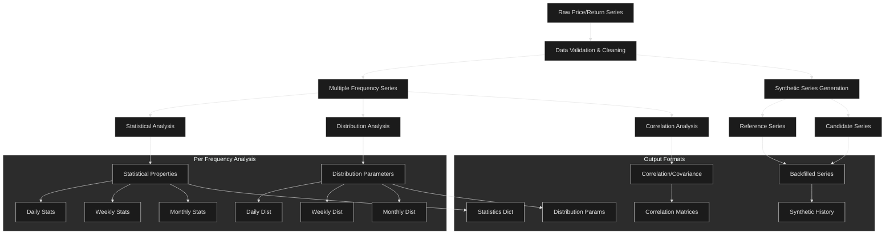

# Financial Time Series (FTS) Library - User Requirements
Version: 2.0
Last Updated: 2024-11-14
Previous Version: 1.0

## Version Change Log
```
Added:
- Status tracking for all features
- Version history section
- Change tracking section
- Data import from CSV files
- Gap handling for non-trading days
- Missing data integration

Modified:
- Document structure to support feature status
- Table formats to include status column

Deprecated:
- Return series simulation integration (moved to separate package)
- Portfolio optimization (moved to separate package)
- Copula estimation (moved to separate package)
- intrest rate and discounted cash flow functions (moved to separate package)

```

## Status Definitions
| Status | Description |
|--------|-------------|
| ACTIVE | Currently implemented and supported feature |
| NEW | Planned feature for this version |
| DEPRECATED | Feature to be removed/replaced |
| MODIFIED | Existing feature with significant changes |


## 1. Overview & Objectives

### 1.1 Library Purpose
A Python library for financial time series analysis focusing on:
- Data loading and preparation for analysis
- Statistical analysis of return series
- Risk and performance metrics
- Multi-asset correlation/covaraiance analysis


### 1.2 Core Capabilities
| Capability | Description | Status | Version Added | Version Deprecated |
|------------|-------------|---------|---------------|-------------------|
| Price/Return Series | Handle both price and return data series | ACTIVE | 1.0 | - |
| Return Calculations | Support multiple return calculation methods (log, simple) | ACTIVE | 1.0 | - |
| Statistical Analysis | Comprehensive statistical metrics and analysis tools | ACTIVE | 1.0 | - |
| Portfolio Optimization | Various closed form optimization approaches | DEPRECIATED | 1.0 | 2.0 |
| Time Frequency Support | Handle different time frequencies (daily, weekly, monthly) | ACTIVE | 1.0 | - |
| Simulation Integration | Generate inputs for external simulation packages | DEPRECIATED | 1.0 | 2.0 |
| Backfill Shorter time-series | Implement synthetic backfill data functionality | NEW | 2.0 | - |
| Data Import | Load and parse data from CSV files | NEW | 2.0 | - |
| Gap Handling | Process non-overlapping periods and non-trading days | NEW | 2.0 | - |
| Distribution Fitting | Fit and test various statistical distributions (Gaussian, Student-t, etc.) | ACTIVE | 1.0 | - |


### 1.3 Scope

Out of scope (handled by separate packages):

- Database integration (BigQuery, SQL)
- Return series simulation (separate simulation package)
- Advanced visualization
- Portfolio optimization  (depreciated)
- Copula estimtion (depreciated)
- Interest rate and discounted cash flow functions (depreciated)


### 1.4 Conventions
- All volatilities are annualized
- All Sharpe ratios and performance metrics are annualized
- Default return type is logarithmic
- Default frequency is daily
- Distribution fitting is for parameter estimation only (simulation handled by separate package)
- All individual sereis statistics are calculated using full available data for each series
- Correlation analysis is performed on overlapping periods only (e.g if one asset is closed for trading and has a null value, exclude that date)
- Standard frequency conversions: daily→weekly→monthly
- Method for frequency conversion:last-day-of-period

#### 1.4.1 Data Quality Standards

##### Minimum Sample Requirements
- Basic Statistics: 20 observations
- Correlation Analysis: 30 overlapping observations
- Simple Regression: 30 observations per variable
- Multiple Regression: 30 + 10 × (n_independent_variables) observations
- PCA Analysis: 50 observations minimum
- Volatility Forecasting: 60 observations minimum

##### Missing Value Treatment
1. Time Series Alignment
   - Include all dates where at least one series has observation
   - NaN for non-trading days/missing observations
   - No forward/backward filling by default

2. Analysis-Specific Handling
   - Return Calculations: Use available points only
   - Correlation: Pairwise complete observations only
   - Regression: Complete cases only
   - PCA: Complete cases only
   - Warning if missing data exceeds 10% of series length

3. Warning Thresholds
   - Data gaps > 5 consecutive days
   - Missing data pattern analysis if >5% missing
   - Series length discrepancy warnings if >20%

4. Error Conditions
   - Insufficient observations for chosen analysis
   - Missing data in critical periods
   - Non-overlapping series for correlation/regression

#### 1.4.2 Return Calculations and Conversions

##### Return Types
- Simple Returns: r_t = (P_t - P_{t-1})/P_{t-1}
- Log Returns: r_t = ln(P_t/P_{t-1})
- Default: Log returns unless explicitly specified

##### Conversion Rules
- Simple to Log: r_log = ln(1 + r_simple)
- Log to Simple: r_simple = exp(r_log) - 1
- Conversion warnings for large returns (>|20%|)

##### Price Inputs
- Required Format: Adjusted close prices
- Responsibility: User must provide prices adjusted for:
  * Dividends
  * Stock splits
  * Rights issues
  * Other corporate actions
- Warning: Functions will not validate if prices are properly adjusted

#### 1.4.3 Risk-Free Rate Specifications

- Format: Annualized 1-month rate as decimal (e.g., 0.05 for 5%)
- Input Options:
  1. As separate series aligned with return dates
  2. As constant value for entire period
- Default: 0 if not provided
- Required for:
  * Sharpe ratio calculations
  * Excess return calculations
  * Risk-adjusted performance metrics
- Warning if risk-free rate not provided for relevant calculations

### 1.5 Expected Usage Patterns

#### 1. Time Series Analysis Workflow
   - Load multiple asset price/return series
   - Convert to consistent return basis (log/simple)
   - Calculate statistical properties and correlations
   - Generate standardized outputs for downstream analysis

    Required Inputs:
    - Price series (pd.DataFrame): Multiple asset adjusted closing prices
    - Frequency: Daily, weekly, or monthly
    - Return type: 'log' or 'simple' (default='log')

    Function Sequence:
    1. ```load_csv_data(file_path, date_column='Date', price_columns=[...])```
    2. ```validate_time_series(price_series)```
    3. ```price_to_ret(price_series, return_type='log')```
    4. ```ret_stats(return_series)```
      - Automatically calculates: mean, volatility, skew, kurtosis
      - Returns dictionary of statistics per series

    Output Format:
    - Statistical summary DataFrame with series as columns
    - Each statistic includes sample size and period coverage
    - Warning flags for data quality issues


#### 2. Synthetic Historical Series Generation
   - Load target series with limited history (e.g., EMG index from 2000)
   - Load reference series with full history (e.g., S&P500 from 1980)
   - Load candidate explanatory series (e.g., other EMG indices, commodities, currencies)
   - Analyze correlations and statistical relationships during overlapping period
   - Generate synthetic historical values for limited series
   - Validate synthetic series using statistical tests

   - Identify explanatory variables with longer histories based on correlation and relevance to the short series (e.g., using correlation or DTW correlation).
   - Use `regress_returns` with the short time series (`short_return_series`) and the selected explanatory variables (`long_explanatory_series`) as input to obtain `regression_coefficients` and `residuals`.
   - Use `analyze_residuals` with the `residuals` from the previous step to fit a skewed Student's t-distribution (or an alternative distribution if specified) and get `distribution_parameters`.
   - Use `backfill_returns` with `short_return_series`, `long_explanatory_series`, `regression_coefficients`, `distribution_parameters`, and `n_simulations=1` to generate a single combined backfilled sample (`backfilled_series`).
   - Use the `backfilled_series` to extend the short time series and combine it with the longer time series for covariance matrix calculation or any other analysis that requires equal-length time series.

    Required Inputs:
    - Target series (short history)
    - Reference series (full history)
    - Optional explanatory series
    - Minimum 30 observations overlap period

    Function Sequence:
    1. Load and validate data:
      ```python
      target_ret = price_to_ret(target_prices)
      reference_ret = price_to_ret(reference_prices)
      ```
    2. Regression analysis:
      ```python
      reg_results = regress_ret(target_ret, reference_ret,
                              min_overlap=30)
      ```
    3. Analyze residuals:
      ```python
      residual_stats = analyze_residuals(reg_results.residuals)
      ```
    4. Generate synthetic history:
      ```python
      synthetic_ret = backfill_ret(target_ret, reference_ret,
                                  reg_results.coefficients,
                                  residual_stats)
      ```

    Parameter Settings:
    - min_overlap: 30 observations (default)
    - regression_method: 'OLS' (default)
    - residual_distribution: 'skewed-t' (default)


#### 3. Multi-Asset Statistical Analysis with Mixed Frequencies/Lengths
   - Load series with different frequencies and lengths
   - Calculate individual series statistics using full available data
     * Include first/last observation dates in statistical output
     * Generate full-length statistical properties for each series
   - For correlation analysis:
     * Automatically harmonize frequencies to lowest common frequency
     * Identify overlapping time period between series
     * Compute correlations using overlapping period only
     * Include metadata about:
       - Time period used for correlation calculation
       - Original frequencies and lengths of each series
       - Frequency conversion method applied
   - For each series, generate statistical properties at multiple frequencies:
     * Original frequency
     * All lower frequencies present in other series
     * Include sample size for each frequency

    Required Inputs:
    - Multiple return series (different frequencies allowed)
    - Frequency conversion method
    - Minimum observations per series: 30

    Function Sequence:
    1. Standardize frequencies:
      ```python
      aligned_ret = standardize_frequency(ret_series,
                                        target_freq='monthly')
      ```
    2. Individual statistics:
      ```python
      stats_dict = {
          series: ret_stats(aligned_ret[series])
          for series in aligned_ret.columns
      }
      ```
    3. Correlation analysis:
      ```python
      corr_matrix = correlation(aligned_ret,
                              min_overlap=30,
                              method='pearson')
      ```

    Output Requirements:
    - Statistics at original and standardized frequencies
    - Correlation matrix with overlap periods
    - Data coverage metrics


#### 4. Distribution Analysis Workflow
   - Analyze return series properties at multiple frequencies:
     * Original frequency of each series
     * All relevant comparison frequencies
     * e.g., For daily series: daily, weekly, monthly distributions
     * e.g., For monthly series: monthly distribution
   - Fit distributions for each frequency level:
     * Return parameters for each frequency
     * Generate goodness-of-fit metrics for each frequency
     * Include sample size and period coverage for each frequency
   - Enable direct distribution comparison across series:
     * Match frequencies for valid comparison
     * Flag cases where sample sizes significantly differ
     * Provide statistical tests for distribution similarity
   - Output comprehensive distribution report:
     * Parameters at all analyzed frequencies
     * Comparative analysis for overlapping frequencies
     * Metadata about conversion methods and sample sizes

    Required Inputs:
    - Return series at original frequency
    - Target frequencies for comparison
    - Minimum 50 observations per frequency

    Function Sequence:
    1. Generate multi-frequency returns:
       ```python
       freq_returns = {
           'daily': ret_series,
           'weekly': standardize_frequency(ret_series, 'W'),
           'monthly': standardize_frequency(ret_series, 'M')
       }
       ```
    2. Fit distributions:
       ```python
       for freq, returns in freq_returns.items():
           dist_params = fit_skewed_t(returns)
           goodness_fit = distribution_test(returns, dist_params)
       ```

    Parameter Settings:
    - test_threshold: 0.05 (default)
    - distribution_type: 'skewed-t' (default)
    - min_observations: 50 per frequency

#### 5. Data Import and Gap Handling
   - Load data from CSV files with multiple series
   - Handle missing data and non-trading days
   - Implement gap handling for non-trading days
   - Provide detailed report on gap handling

    Required Inputs:
    - Standardized return series
    - Variance explained threshold (e.g., 0.90)
    - Minimum 50 observations

    Function Sequence:
    1. ```standardize_ret(ret_series)```
    2. ```pca_decomposition(standardized_returns)```
    3. ```select_pca_factors(eigenvalues, threshold=0.90)```
    4. ```pca_factor_ret(standardized_returns, n_factors)```
    5. ```pca_idiosyncratic_ret(standardized_returns, factor_returns)```

    Parameter Settings:
    - variance_threshold: 0.90 (default)
    - min_observations: 50
    - standardization_method: 'zscore' (default)

#### 6. Cross-sectional Data Analysis
    - Load multiple asset price/return series
    - Calculate statistical properties of all series
    - Generate standardized cross-sectional outputs for downstream analysis
    - Provide detailed report on cross-sectional analysis results
    - e.g. analyst want to do comparison plots (downstream) the returns, volatilities, drawdown,
      distribution moment and other statistics of all the assets in the universe

    Required Inputs:
    - Return series (minimum 60 observations)
    - Forecast horizon
    - Model type ('GARCH' or 'HAR')

    Function Sequence:
    For GARCH:
    1. ```fit_garch_model(ret_series, p=1, q=1)```
    2. ```forecast_garch(model, horizon=20)```

    For HAR:
    1. ```calculate_har_components(realized_vol, frequency='D')```
    2. ```fit_har_model(realized_vol, components)```
    3. ```forecast_har(model, horizon=20)```

    Parameter Settings:
    - garch_p: 1 (default)
    - garch_q: 1 (default)
    - har_lags: {'daily': 1, 'weekly': 5, 'monthly': 22} (default)
    - forecast_horizon: 20 days (default)

#### 7. Single Asset Data Analysis (an example tear sheet to be provided in the documentation)
    - Load single asset price/return series
    - Calculate statistical properties of the series
    - Generate standardized outputs for downstream analysis
    - Provide detailed report on single asset analysis results
    - e.g. analyst want to do detailed plots or a tear sheet of (downstream)
      the price, returns, volatilities, drawdown series, distribution moment
      and other statistics of a single asset over various time-frames

    Required Inputs:
    - Multiple asset return series (pd.DataFrame)
    - Minimum 30 observations per series
    - Common frequency (or frequency conversion method)

    Function Sequence:
    1. Compute individual statistics:
       ```python
       ret_stats = {
           'returns': ret_mean(ret_series),
           'volatility': ret_volatility(ret_series),
           'drawdown': maximum_drawdown(ret_series),
           'skew': ret_skew(ret_series),
           'kurtosis': ret_kurtosis(ret_series)
       }
       ```
    2. Generate distribution metrics:
       ```python
       dist_params = fit_skewed_t(ret_series)
       ```
    3. Calculate risk metrics:
       ```python
       risk_metrics = {
           'sharpe': standard_sharpe_ratio(ret_series, rf_rate),
           'sortino': sortino_ratio(ret_series),
           'calmar': calmar_ratio(ret_series)
       }
       ```

    Output Format:
    - Cross-sectional summary statistics DataFrame
    - Distribution parameters per asset
    - Risk metrics comparison
    - Data quality indicators per series


#### 8. PCA Factor Analysis and Risk Decomposition Calculate standardized returns.
    - Compute the covariance matrix.
    - Use `pca_decomposition` to obtain principal components and explained variance.
    - Analyze explained variance ratios with `explained_variance_ratio` to determine significant factors.
    - Project the returns onto the principal components using `factor_loadings` to create factor loadings.
    - Calculate `residual_returns` for idiosyncratic risk analysis.
    - Use factor loadings for risk attribution and portfolio construction.

    Required Inputs:
    - Single asset return series
    - Risk-free rate (if required)
    - Minimum 60 observations for full analysis

    Function Sequence:
    1. Basic Statistics:
       ```python
       basic_stats = ret_stats(ret_series)
       ```
    2. Rolling Analysis:
       ```python
       rolling_metrics = {
           'volatility': rolling_volatility(ret_series, window=20),
           'sharpe': rolling_sharpe(ret_series, rf_rate, window=60),
           'drawdown': calculate_drawdown_series(ret_series)
       }
       ```
    3. Distribution Analysis:
       ```python
       dist_analysis = {
           'params': fit_skewed_t(ret_series),
           'test_results': distribution_test(ret_series, 'skewed-t')
       }
       ```

    Parameter Settings:
    - rolling_window: 20 days (default)
    - risk_metrics_window: 60 days (default)
    - distribution_type: 'skewed-t' (default)


#### 9. Dynamic Time Warping for Correlation of Non-Linear Assets
   - Calculate the DTW distance matrix using `dtw_distance`  between asset return series.
   - Convert DTW distances to correlation using `dtw_correlation`
   - Use the DTW correlation matrix in portfolio optimization (e.g., HRP, HERC) or other analyses.

   Required Inputs:
   - Multiple return series
   - Frequency specification
   - Minimum 30 observations per series

   Function Sequence:
   1. Prepare data:
      ```python
      standardized_ret = standardize_ret(ret_series)
      ```
   2. Calculate DTW correlations:
      ```python
      dtw_matrix = build_dtw_correlation_matrix(
          standardized_ret,
          frequency='daily',
          window_size=20
      )
      ```
   3. Compare with standard correlation:
      ```python
      standard_corr = correlation(standardized_ret)
      correlation_diff = dtw_matrix - standard_corr
      ```

   Parameter Settings:
   - window_size: Based on frequency
     * daily: 20
     * weekly: 8
     * monthly: 3
   - min_overlap: 30 observations
   - standardization: True (required)


#### 10. Backfilling a Short Time Series using Yang & Martin Method
    - Identify explanatory variables with longer histories based on correlation and relevance to the short series (e.g., using correlation or DTW correlation).
    - Use `regress_returns` with the short time series (`short_return_series`) and the selected explanatory variables (`long_explanatory_series`) as input to obtain `regression_coefficients` and `residuals`.
    - Use `analyze_residuals` with the `residuals` from the previous step to fit a skewed Student's t-distribution (or an alternative distribution if specified) and get `distribution_parameters`.
    - Use `backfill_returns` with `short_return_series`, `long_explanatory_series`, `regression_coefficients`, `distribution_parameters`, and `n_simulations=1` to generate a single combined backfilled sample (`backfilled_series`).
    - Use the `backfilled_series` to extend the short time series and combine it with the longer time series for covariance matrix calculation or any other analysis that requires equal-length time series.

    Required Inputs:
    - Short series (target)
    - Long series (explanatory variables)
    - Minimum 30 periods overlap
    - Frequency specification

    Function Sequence:
    1. Validate data overlap:
       ```python
       validate_time_series([short_ret, *long_ret_list])
       ```
    2. Perform regression:
       ```python
       reg_results = regress_ret(
           short_ret,
           long_ret_list,
           min_overlap=30
       )
       ```
    3. Analyze and fit residuals:
       ```python
       residual_stats = analyze_residuals(
           reg_results.residuals,
           distribution='skewed-t'
       )
       ```
    4. Generate backfilled series:
       ```python
       backfilled_ret = backfill_ret(
           short_ret,
           long_ret_list,
           reg_results.coefficients,
           residual_stats
       )
       ```

    Parameter Settings:
    - min_overlap: 30 observations
    - regression_method: 'OLS'
    - residual_distribution: 'skewed-t'
    - confidence_level: 0.95

    Validation Checks:
    - R-squared threshold: 0.3
    - Significant t-statistics
    - Residual normality tests
    - Economic reasonableness of coefficients
    ```


### 1.6 Data Volume Expectations
- Asset universe: Up to 5000+ securities
- History length: Up to 30 years monthly data, 10yrs for daily data
- Update frequency: Daily updates
- Concurrent calculations: Multiple portfolios/analyses simultaneously
- Memory constraints: Should handle typical workstation resources (32GB)

### 1.7 Technical Dependencies

#### Core Requirements
- Python Version: 3.12 or higher
- NumPy: Latest stable version
- Pandas: Latest stable version

#### External Libraries
1. Statistical Analysis
   - scipy: Statistical functions, distribution fitting
   - statsmodels: Regression, time series analysis

2. Machine Learning
   - scikit-learn: PCA, standardization, cross-validation

3. Financial Analysis
   - arch: GARCH models
   - fastdtw: DTW calculations

4. Optional Dependencies
   - matplotlib: Plotting (if visualization added later)
   - numba: Performance optimization

#### Function-Specific Dependencies
Core statistical functions (3.2.1-3.2.4): numpy, scipy
Correlation functions (3.5): numpy, scipy
PCA functions (3.14): scikit-learn
Volatility forecasting (3.15): arch, statsmodels
DTW functions (3.16): fastdtw


## 2. Core Data Flow


## 3. Function Groups

Also: add a new section that detail all proprietary (non standard definitions) functions, e.g geo_sharpe_ratio_adj, drag calculations etc.

### 3.0 Data Loading and Preparation Functions
| Function | Purpose | Input | Output | Priority | Status | Version Added | Version Deprecated |
|----------|---------|-------|---------|----------|---------|---------------|-------------------|
| load_csv_data | Load and validate time series data | file_path, data_format | price_series | Critical | NEW | 2.0 | - |
| load_multiple_csv | Load multiple CSV files with alignment | file_paths, data_format | price_series_dict | Critical | NEW | 2.0 | - |
| validate_time_series | Validate and clean time series data | price_series | validated_series | Critical | NEW | 2.0 | - |
| handle_missing_data | Process and fill missing data points | price_series, method | cleaned_series | High | NEW | 2.0 | - |
| align_multiple_series | Align multiple series to common dates | series_dict, method | aligned_series_dict | Critical | NEW | 2.0 | - |
| handle_trading_gaps | Process non-trading days and holidays | price_series, calendar | adjusted_series | High | NEW | 2.0 | - |
| standardize_frequency | Convert series to standard frequency | price_series, target_freq | standardized_series | Critical | NEW | 2.0 | - |
| detect_outliers | Identify and flag potential outliers | price_series, method | flagged_series | Medium | NEW | 2.0 | - |
| validate_data_quality | Check data quality metrics | price_series | quality_report | High | NEW | 2.0 | - |
| export_processed_data | Export processed data to CSV | price_series, file_path | success_flag | Medium | NEW | 2.0 | - |

### 3.1 Series Conversion Functions
| Function | Purpose | Input | Output | Priority | Status | Version Added | Version Deprecated |
|----------|---------|-------|---------|----------|---------|---------------|-------------------|
| price_to_ret | Convert price to returns | price_series, ret_type | ret | Critical | ACTIVE | 1.0 | - |
| ret_to_price | Convert returns to price | ret, initial_price | price_series | Critical | ACTIVE | 1.0 | - |
| excess_ret | Calculate excess returns | ret, risk_free_rate | excess_ret | Critical | ACTIVE | 1.0 | - |
| alpha_ret | Calculate relative returns | ret, benchmark_ret | alpha_ret | High | ACTIVE | 1.0 | 2.0 |
| ret_to_drawdown | Generate return drawdown series | ret, type | drawdown_series | High | NEW | 2.0 | - |
| standardize_ret | Standardize returns to mean 0, sd 1 | ret | standardized_ret | Critical | NEW | 2.0 | - |

classes: a fts object (financial time series) can be of form prices, returns, factor_series, benchmarks, synthetic series,alpha_series, idosyncratic_series etc.

### 3.2.1 Statistical Analysis Functions - Basic (per period)
| Function | Purpose | Input | Output | Priority | Status | Version Added | Version Deprecated |
|----------|---------|-------|---------|----------|---------|---------------|-------------------|
| ret_mean | Calculate mean return for period | ret | mean | Critical | ACTIVE | 1.0 | - |
| ret_volatility | Calculate period volatility | ret | volatility | Critical | ACTIVE | 1.0 | - |
| ret_skew | Calculate skewness for period | ret | skewness | Critical | ACTIVE | 1.0 | - |
| ret_kurtosis | Calculate excess kurtosis for period | ret | kurtosis | Critical | ACTIVE | 1.0 | - |
| ret_stats | Calculate all period statistics | ret | stats_dict | Critical | ACTIVE | 1.0 | - |

### 3.2.2 Statistical Analysis Functions - Annualized Returns
| Function | Purpose | Input | Output | Priority | Status | Version Added | Version Deprecated |
|----------|---------|-------|---------|----------|---------|---------------|-------------------|
| annualize_ret | Convert period returns to annual | ret, period_type | annualized_ret | Critical | NEW | 2.0 | - |
| arithmetic_to_geometric_ret | Convert arithmetic to geometric | arithmetic_ret, volatility, skew, kurtosis | geometric_ret | Critical | NEW | 2.0 | - |
| geometric_to_arithmetic_ret | Convert geometric to arithmetic | geometric_ret, volatility, skew, kurtosis | arithmetic_ret | Critical | NEW | 2.0 | - |
| calculate_variance_drag | Calculate variance drag component | volatility | variance_drag | Critical | NEW | 2.0 | - |
| calculate_kurtosis_drag | Calculate kurtosis drag component | kurtosis, volatility | kurtosis_drag | Critical | NEW | 2.0 | - |
| calculate_skew_drag | Calculate skew drag component | skew, volatility | skew_drag | Critical | NEW | 2.0 | - |
| calculate_total_drag | Calculate total return drag | volatility, skew, kurtosis | total_drag | Critical | NEW | 2.0 | - |

### 3.2.3 Statistical Analysis Functions - Volatility Adjustments
| Function | Purpose | Input | Output | Priority | Status | Version Added | Version Deprecated |
|----------|---------|-------|---------|----------|---------|---------------|-------------------|
| adjust_volatility_kurtosis | Adjust volatility for kurtosis | volatility, kurtosis | adjusted_volatility | Critical | NEW | 2.0 | - |
| annualize_volatility | Convert period volatility to annual | volatility, period_type | annualized_volatility | Critical | NEW | 2.0 | - |
| calculate_downside_volatility | Calculate downside volatility | ret | downside_vol | Critical | NEW | 2.0 | - |
| volatility_of_volatility | Calculate vol of vol | ret, window | vol_of_vol | High | ACTIVE | 1.0 | - |

### 3.2.4 Statistical Analysis Functions - Drawdowns
| Function | Purpose | Input | Output | Priority | Status | Version Added | Version Deprecated |
|----------|---------|-------|---------|----------|---------|---------------|-------------------|
| calculate_drawdown_series | Generate drawdown time series | ret | drawdown_series | Critical | NEW | 2.0 | - |
| maximum_drawdown | Calculate maximum drawdown | ret | max_drawdown | Critical | ACTIVE | 1.0 | - |
| average_drawdown | Calculate average drawdown | ret | avg_drawdown | High | NEW | 2.0 | - |
| drawdown_duration | Calculate drawdown duration stats | ret | duration_stats | High | ACTIVE | 1.0 | - |
| theoretical_max_drawdown | Calculate theoretical max drawdown | ret, distribution_params | theoretical_mdd | Medium | NEW | 2.0 | - |


### 3.3 Risk and Performance Functions
| Function | Purpose | Input | Output | Priority | Status | Version Added | Version Deprecated |
|----------|---------|-------|---------|----------|---------|---------------|-------------------|
| standard_sharpe_ratio | Calculate standard Sharpe ratio | arithmetic_ret, volatility | sharpe_ratio | Critical | ACTIVE | 1.0 | - |
| geometric_sharpe_ratio | Calculate geometric Sharpe ratio | geometric_ret, volatility | geo_sharpe | Critical | NEW | 2.0 | - |
| adjusted_sharpe_ratio | Calculate adjusted Sharpe ratio | geometric_ret, adjusted_volatility | adj_sharpe | Critical | NEW | 2.0 | - |
| sortino_ratio | Calculate Sortino ratio | ret, min_acceptable_ret | sortino | High | ACTIVE | 1.0 | - |
| calmar_ratio | Calculate Calmar ratio | ret | calmar | High | ACTIVE | 1.0 | - |
| probabilistic_sharpe_ratio | Calculate PSR | ret, benchmark_sharpe | prob_sharpe | Medium | ACTIVE | 1.0 | - |
| information_ratio | Calculate information ratio | ret, benchmark_ret | info_ratio | High | ACTIVE | 1.0 | - |
| treynor_ratio | Calculate Treynor ratio | ret, market_ret, rf_rate | treynor | Medium | NEW | 2.0 | - |

### 3.4 Time-Varying Window Statistics Functions
| Function | Purpose | Input | Output | Priority | Status | Version Added | Version Deprecated |
|----------|---------|-------|---------|----------|---------|---------------|-------------------|
| rolling_volatility | Calculate rolling volatility | ret, window | rolling_vol_series | Critical | ACTIVE | 1.0 | - |
| rolling_volatility_downside | Calculate rolling volatility downside | ret, window | rolling_vol_series | Critical | NEW | 2.0 | - |
| rolling_correlation | Calculate rolling correlation | ret1, ret2, window | rolling_corr_series | High | ACTIVE | 1.0 | - |
| rolling_beta | Calculate rolling beta | ret, market_ret, window | rolling_beta_series | High | ACTIVE | 1.0 | - |
| rolling_sharpe | Calculate rolling Sharpe ratio | ret, risk_free_rate, window | rolling_sharpe_series | Medium | ACTIVE | 1.0 | - |
| rolling_ret | Calculate rolling returns | ret, window, ret_type | rolling_ret_series | Critical | ACTIVE | 2.0 | - |
| hurst_exponent | Calculate hurst exponent | ret, window | hurst_exponent_series | Critical | ACTIVE | 2.0 | - |

### 3.5 Correlation and Dependency Functions
| Function | Purpose | Input | Output | Priority | Status | Version Added | Version Deprecated |
|----------|---------|-------|---------|----------|---------|---------------|-------------------|
| correlation | Calculate correlation matrix | ret | correlation_matrix | Critical | ACTIVE | 1.0 | - |
| rank_correlation | Calculate rank correlation | ret, method | rank_correlation_matrix | High | ACTIVE | 1.0 | - |
| correlation_to_covariance | Convert correlation to covariance | correlation_matrix, volatilities | covariance_matrix | Critical | ACTIVE | 1.0 | - |
| covariance_to_correlation | Convert covariance to correlation | covariance_matrix | correlation_matrix | Critical | ACTIVE | 1.0 | - |
| semi_covariance | Calculate semi-covariance matrix | ret, threshold | semi_covariance_matrix | Medium | ACTIVE | 1.0 | - |


#### 3.6 Matrix Transformation Functions
| Function | Purpose | Input | Output | Priority | Status | Version Added | Version Deprecated |
|----------|---------|-------|---------|----------|---------|---------------|-------------------|
| correlation_cluster | Identify correlation clusters | correlation_matrix, threshold | clusters | Medium | ACTIVE | 1.0 | - |
| shrink_covariance | Apply covariance shrinkage | covariance_matrix, shrinkage_target | shrunk_covariance_matrix | High | ACTIVE | 1.0 | - |


### 3.7 Distribution Fitting Functions
| Function | Purpose | Input | Output | Priority | Status | Version Added | Version Deprecated |
|----------|---------|-------|---------|----------|---------|---------------|-------------------|
| fit_gaussian | Fit Gaussian distribution | ret | parameters | Critical | ACTIVE | 1.0 | - |
| fit_student_t | Fit Student-t distribution | ret | parameters | High | DEPRECATED | 1.0 | 2.0 |
| fit_skewed_t | Fit skewed Student-t | ret | parameters | Critical | ACTIVE | 1.0 | - |
| fit_nig | Fit Normal Inverse Gaussian | ret | parameters | Low | DEPRECATED | 1.0 | 2.0 |
| distribution_test | Test distribution goodness of fit | ret, distribution_type | test_results | Critical | ACTIVE | 1.0 | - |
| implied_drag_student_t | Drag from variance, kurtosis, skew | student_t_params | total_drag | High | NEW | 2.0 | - |
| implied_heavy_tail_drag_student_t | Drag from heavy tails | student_t_params | heavy_tail_drag | High | NEW | 2.0 | - |
| implied_excess_kurtosis_drag_student_t | Drag from excess kurtosis | student_t_params | excess_kurtosis_drag | High | NEW | 2.0 | - |
| implied_skew_drag_student_t | Drag from skew | student_t_params | skew_drag | High | NEW | 2.0 | - |
| implied_drag_variance | Drag from variance from any distribution | volatility | variance_drag | High | NEW | 2.0 | - |

### 3.8 Copula Functions
| Function | Purpose | Input | Output | Priority | Status | Version Added | Version Deprecated |
|----------|---------|-------|---------|----------|---------|---------------|-------------------|
| fit_gaussian_copula | Fit Gaussian copula | ret | copula_params | High | DEPRECATED | 1.0 | 2.0 |
| fit_student_t_copula | Fit Student-t copula | ret | copula_params | High | DEPRECATED | 1.0 | 2.0 |
| fit_clayton_copula | Fit Clayton copula | ret | copula_params | Medium | DEPRECATED | 1.0 | 2.0 |
| copula_dependency | Calculate copula dependency measures | ret, copula_type | dependency_metrics | Medium | DEPRECATED | 1.0 | 2.0 |


### 3.9 Portfolio Optimization Functions
| Function | Purpose | Input | Output | Priority | Status | Version Added | Version Deprecated |
|----------|---------|-------|---------|----------|---------|---------------|-------------------|
| mean_variance_optimization | Calculate MVO weights | ret, constraints | optimal_weights | Critical | DEPRECATED | 1.0 | 2.0 |
| black_litterman | Black-Litterman optimization | ret, views, confidences | optimal_weights | High | DEPRECATED | 1.0 | 2.0 |
| risk_parity_optimization | Calculate risk parity weights | ret | weights | High | DEPRECATED | 1.0 | 2.0 |
| hierarchical_risk_parity | Calculate HRP weights | ret | weights | Medium | DEPRECATED | 1.0 | 2.0 |
| marginal_risk_contribution | Calculate marginal risk | weights, covariance_matrix | marginal_risks | High | DEPRECATED | 1.0 | 2.0 |
| component_risk_contribution | Calculate component risk | weights, covariance_matrix | component_risks | High | DEPRECATED | 1.0 | 2.0 |
| portfolio_volatility | Calculate portfolio volatility | weights, covariance_matrix | volatility | Critical | DEPRECATED | 1.0 | 2.0 |
| expected_portfolio_ret | Calculate expected return | weights, expected_ret | portfolio_ret | Critical | DEPRECATED | 1.0 | 2.0 |

### 3.10 Utility Functions
| Function | Purpose | Input | Output | Priority | Status | Version Added | Version Deprecated |
|----------|---------|-------|---------|----------|---------|---------------|-------------------|
| volatility_target | Calculate volatility target | sharpe_ratio | target_volatility | High | ACTIVE | 1.0 | - |
| max_theoretical_drawdown | Calculate theoretical max drawdown | sharpe_ratio, volatility | theoretical_drawdown | Medium | ACTIVE | 1.0 | - |

### 3.11 Interest Rate Utility Functions
| Function | Purpose | Input | Output | Priority | Status | Version Added | Version Deprecated |
|----------|---------|-------|---------|----------|---------|---------------|-------------------|
| compounding_conversion | Convert between compounding frequencies | rate, from_freq, to_freq | converted_rate | High | DEPRECATED | 1.0 | 2.0 |
| forward_rate | Calculate forward rate | spot_rates, periods | forward_rate | High | DEPRECATED | 1.0 | 2.0 |
| zero_coupon_rate | Convert BEY to zero coupon | bey_rate, period | zero_rate | High | DEPRECATED | 1.0 | 2.0 |
| bey_coupon_rate | Convert zero coupon to BEY | zero_rate, period | bey_rate | High | DEPRECATED | 1.0 | 2.0 |
| bond_price | Calculate bond price | cashflows, discount_rates | price | High | DEPRECATED | 1.0 | 2.0 |
| time_value_of_money | Calculate future value | principal, rate, time | future_value | Medium | DEPRECATED | 1.0 | 2.0 |
| discount_rate | Calculate discount rate | principal, future_value, time | rate | Medium | DEPRECATED | 1.0 | 2.0 |
| present_value | Calculate present value | future_value, rate, time | present_value | Medium | DEPRECATED | 1.0 | 2.0 |

### 3.12 Discounted Cash Flow Functions
| Function | Purpose | Input | Output | Priority | Status | Version Added | Version Deprecated |
|----------|---------|-------|---------|----------|---------|---------------|-------------------|
| npv | Calculate net present value | cash_flows, discount_rate, type | npv | High | DEPRECATED | 1.0 | 2.0 |
| wacc | Calculate WACC | equity, debt, equity_cost, debt_cost, tax_rate | wacc | High | DEPRECATED | 1.0 | 2.0 |
| xirr | Calculate irregular IRR | cash_flows, dates, guess | xirr | Medium | DEPRECATED | 1.0 | 2.0 |

### 3.13 Synthetic Series Generation Functions
| Function | Purpose | Input | Output | Priority | Status | Version Added | Version Deprecated |
|----------|---------|-------|---------|----------|---------|---------------|-------------------|
| regress_ret | Perform OLS regression on overlap period | target_ret, explanatory_ret, periodicity | regression_results | Critical | NEW | 2.0 | - |
| analyze_residuals | Analyze regression residuals | residuals | residual_stats | Critical | NEW | 2.0 | - |
| backfill_ret | Generate backfilled returns | short_ret, long_ret, coefficients, distribution_parameters, periodicity | backfilled_ret | Critical | NEW | 2.0 | - |

### 3.14 PCA Factor Analysis Functions
| Function | Purpose | Input | Output | Priority | Status | Version Added | Version Deprecated |
|----------|---------|-------|---------|----------|---------|---------------|-------------------|
| pca_decomposition | Perform PCA on correlation matrix | correlation_matrix | eigenvalues, eigenvectors | Critical | ACTIVE | 1.0 | - |
| select_pca_factors | Select factors based on variance threshold | eigenvalues, threshold | n_factors | Critical | NEW | 2.0 | - |
| pca_factor_ret | Generate factor returns from PCA | standardized_ret, n_factors | factor_ret | Critical | NEW | 2.0 | - |
| pca_idiosyncratic_ret | Calculate residual returns after PCA factors | standardized_ret, factor_ret | residual_ret | Critical | NEW | 2.0 | - |

### 3.15 Volatility Forecasting Functions
| Function | Purpose | Input | Output | Priority | Status | Version Added | Version Deprecated |
|----------|---------|-------|---------|----------|---------|---------------|-------------------|
| forecast_garch | Forecast volatility using GARCH | ret, horizon | volatility_forecast | Critical | NEW | 2.0 | - |
| forecast_har | Forecast volatility using HAR | ret, horizon, frequency | volatility_forecast | Critical | NEW | 2.0 | - |
| calculate_har_components | Calculate HAR components (daily, weekly, monthly) | ret, frequency | har_components | High | NEW | 2.0 | - |
| fit_garch_model | Fit GARCH model to returns | ret | model_parameters | High | NEW | 2.0 | - |
| fit_har_model | Fit HAR model to realized volatility | realized_vol, frequency | model_parameters | High | NEW | 2.0 | - |

### 3.16 Dynamic Time Warping Functions (DTW)
| Function | Purpose | Input | Output | Priority | Status | Version Added | Version Deprecated |
|----------|---------|-------|---------|----------|---------|---------------|-------------------|
| dtw_distance | Calculate DTW distance between series | ret1, ret2, window_size, frequency | dtw_distance | Critical | NEW | 2.0 | - |
| dtw_similarity | Calculate DTW similarity (0 to 1 scale) | ret1, ret2, window_size, frequency | similarity_original, similarity_inverse | Critical | NEW | 2.0 | - |
| dtw_correlation | Convert DTW similarity to correlation (-1 to 1) | similarity_original, similarity_inverse | correlation | Critical | NEW | 2.0 | - |
| build_dtw_correlation_matrix | Build full correlation matrix using DTW | ret_df, frequency | correlation_matrix | Critical | NEW | 2.0 | - |

## 4. Integration Points

### 4.1 Data Output Integration
The library provides standardized outputs for use by external packages:

| Output Type | Description | Source Functions |
|------------|-------------|------------------|
| Time Series | Sanitized and validated price/return series | Series Conversion Functions |
| Statistical Measures | Volatility, skewness, kurtosis, and other statistical metrics | Statistical Analysis Functions |
| Correlation Data | Correlation and covariance matrices | Correlation and Dependency Functions |
| Distribution Parameters | Fitted distribution parameters for return series | Distribution Fitting Functions |
| Time-Varying Metrics | Rolling statistics and dynamic measures | Time-Varying Statistics Functions |

### 4.2 Data Format Standards
- All time series outputs are pandas DataFrames with standardized datetime index
- All matrices are provided in numpy arrays or pandas DataFrames with consistent labeling
- Statistical metrics are returned in standardized dictionary format
- All outputs include metadata about calculation parameters used

### 4.3 Validation Guarantees
The library ensures:
- No missing values in output series
- Properly aligned timestamps across all series
- Consistent frequency of observations
- Statistical validity checks on all outputs
- Documentation of any data cleaning or adjustment procedures applied

### 4.4 Synthetic Returns Output Format
The library will output two CSV files:

1. Synthetic Returns CSV:
   - Date
   - Synthetic Return Value
   - Original Return Value (where available)
   - Return Periodicity (daily/weekly/monthly)

2. Model Information CSV:
   - Model timestamp
   - Return Periodicity
   - R-squared
   - Residual statistics (std, skew, kurtosis)
   - For each explanatory variable:
     * Variable name
     * Coefficient
     * T-statistic
     * P-value

## 5. Research References

### 5.1 Core Methodologies
- Jiang & Martin: Turning Long and Short Return Histories into Equal Histories: A Better Way to Backfill Returns
- Jorion: Bayes-Stein shrinkage estimation for returns and covariance
- Principal Component Regression (PCR) techniques
- Risk-adjusted performance metrics

#### 5.1.1 Internal references the core methodologies used in the library
- Synthetic Series Generation (add details on storing syntethic series) -  BackfillTimeSeriesWithSyntheticData.md
- DTW - DTW_to_CorrelationMatrix.md
- PCA - PCA_FactorLoadingsTimeSeries.md
- Volatility Forecasts - VolatilityForecasting_HAR_GARCH.md

- drag functions (volatility tax, kurtosis, skew)
- volatility and conversion between arithmetic and geometric returns
- Risk metrics adjusted for Distribution properties
  - Max Theoretical Drawdown
  - Volatility
  - Returns

- Hurst Exponent
- Kelly volatility targeting
- Sharpe ratio and its adjustments
- covariance shrinkage methods

### 5.2 Advanced Topics

- Higher moment adjustments for performance metrics

## 6. Implementation Considerations

### 6.1 Performance Requirements
- Efficient handling of large datasets (1000+ assets)
- Support for long historical series (20+ years daily data)
- Optimized matrix operations
- Caching of frequently accessed statistics

### 6.2 Numerical Considerations
- Numerical stability in optimization routines
- Precision in statistical calculations
- Handling of extreme values and outliers
- Robust correlation estimation

### 6.3 Integration Requirements
- Clean interfaces with simulation package
- Standardized data formats
- Efficient data transfer
- Consistent error handling

### 6.4 Validation Requirements
- Input data validation
- Statistical result validation
- Optimization constraint validation
- Integration point validation

### 8. Clarifications and Additional Requirements

### 8.1 Standardizing Returns for PCA
*   Standardizing returns (mean 0, standard deviation 1) is required *before* applying `pca_decomposition`. This ensures that PCA is not biased by the scale of the returns and improves comparability between assets or features.

### 8.2 Handling Negative Codependency with DTW
*   The `dtw_correlation` function should handle negative codependency between time series by correctly reflecting negative correlations, similar to traditional correlation measures (-1 to 1).

### 8.3 Backfill Distribution
* Specify that the default distribution for fitting residuals is the skewed Student's t-distribution. Allow users to specify alternative distributions if needed (e.g., normal, generalized hyperbolic).

### 8.4 Backfill Simulation
* Explain how to generate multiple backfilled samples using the `n_simulations` parameter in `backfill_returns`. Discuss the use cases for multiple samples (e.g., assessing uncertainty in estimates, performing simulations).

### 8.5 Hurst Exponent Window
* Clarify that the `hurst_exponent` function requires a `window` parameter to define the rolling window size for calculating the Hurst exponent. Explain that this parameter should be user-defined and guide users on choosing an appropriate window size based on the data frequency and their analysis goals.

### 8.6 Backfill Frequency
* `backfill_returns` should support daily, weekly, monthly, quarterly, and annual series.

## Implementation Notes

- Consider using established libraries like `statsmodels` for regression and `scipy.stats` for distribution fitting.
- Ensure that the backfill functions handle different data frequencies (monthly, quarterly, annual) correctly.
- Implement error handling and validation for inputs (e.g., checking for missing data, ensuring compatibility of time series).
- **Dependencies:**
     - `pandas` for data manipulation.
     - `numpy` for numerical computations.
     - `scipy` for statistical functions.
     - `statsmodels` for statistical modeling.
     - `sklearn` for machine learning and shrinkage estimators.
     -       for DTW
     - skew student t fitting

### Data Handling Requirements

+ #### Return Series Generation
+ The library must support multiple methods for handling non-overlapping data in return series:
+
+ 1. Basic Return Series
+    - ALL_INCLUDING_GAPS: Include all periods, allowing NaN values per series
+    - ALL_OVERLAPPING: Only periods where all series have valid data
+
+ 2. Advanced Return Series Alignment
+    - SYNCHRONIZED_AVERAGE: Distribute returns across gaps
+    - PAIRWISE_OVERLAPPING: Use overlapping periods per pair
+    - PAIRWISE_AVERAGE: Distribute returns across gaps per pair
+
+ 3. Method Selection Guidelines
+    - Frequency-based defaults (daily vs weekly vs monthly)
+    - Use case specific recommendations
+    - Performance implications documentation
